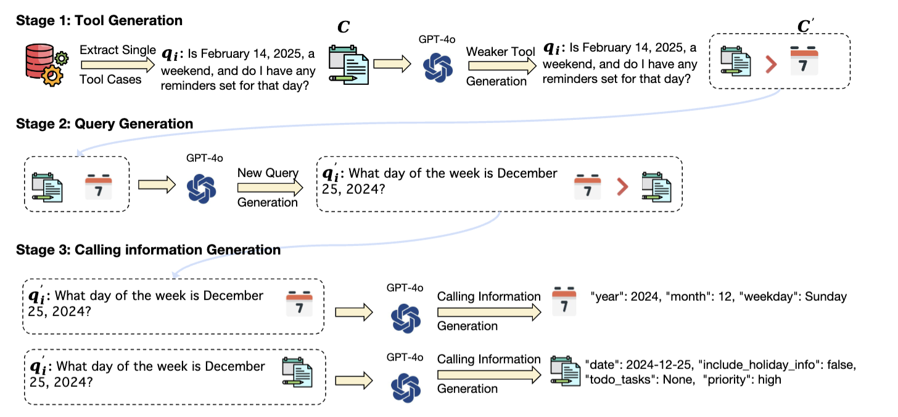
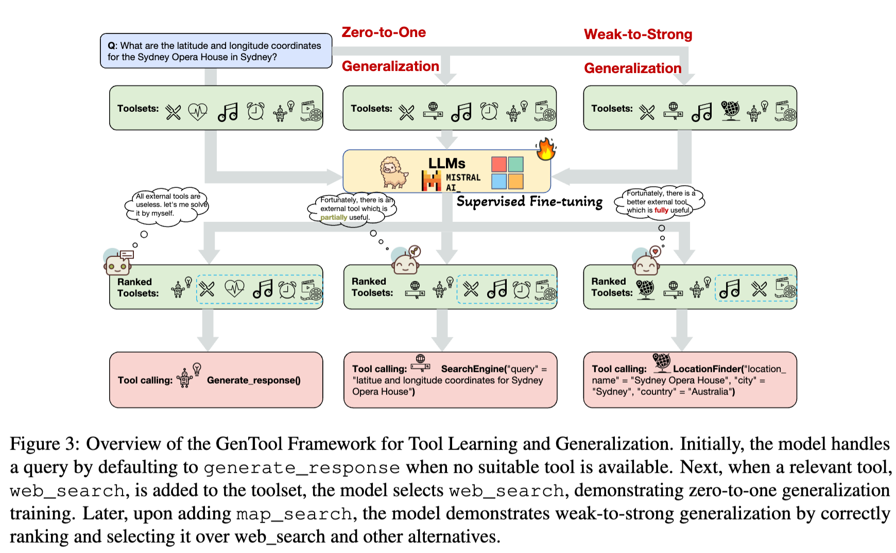

> He, J., Neville, J., Wan, M., Yang, L., Liu, H., Xu, X., Song, X., Pan, J.Z., Zhou, P. (2025). GenTool: Enhancing Tool Generalization in Language Models through Zero-to-One and Weak-to-Strong Simulation. arXiv preprint arXiv:2502.18990.

## 一、解决的问题

本论文主要解决模型在 `UnSeen Tool` 和 `UnSeen Query` 上的泛化能力，方法还是集中在训练数据的构造上。

## 二、方法

本论文主要通过 `Zero-to-One` 和 `Weak-to-Strong` 的方式来增强基座模型的泛化能力，方法介绍如下：

### 2.1 合成数据

合成数据的构建 Pipeline 如下所示：



背景：模型如果仅在现有的训练数据集上训练，通常和真实的场景存在 Gap，此时作者提出一个合成数据的方法来缓解此问题。

#### Stage 1: Tool Generation <div id="tool-generation" />

灵感来源于：同样是要完成一个任务，如果有一个 Strong Tool $C$ 和 Weak Tool $C`$，此时模型肯定要选择 Strong Tool $C$，所以在构建训练数据时，需要将 Strong Tool 和 Weak Tool 同时放在 tool-set 当中，让模型能够去选择对应的 Strong Tool。

那Strong Tool 和 Weak Tool 的区别是什么呢？举个栗子：
* Query: 纽约市最好的餐厅有哪些？有哪些菜系？
* Strong Tool能够查找出纽约最好的餐厅有哪些，也能够查找出纽约有哪些菜系。
* Weak Tool只能查找出纽约最好的餐厅有哪些，不能查找出纽约有哪些菜系。

那 Strong/Weak Tool 如何构造呢？

在原始训练数据集中的 Tool 皆为 Strong Tool（ground truth tool 能够解决 query 中的问题），于是使用 Prompt[<sup>weak tool prompt</sup>](#generate-weak-tool-prompt) 来生成对应的 Weak Tool 并加入到训练数据集中。

#### Stage 2: Query Generation

以上生成了 Strong Tool 和 Weak Tool，那 Query 也是需要进行泛化的，原因是在于原始 query 没办法 **很好** 的让模型具体选择哪个工具，此时需要使用 LLM 来生成 10 个 query：
* 能够完全被 Weak Tool 所解决。
* 部分只能够被 Strong Tool 所解决。

就那此 query 进行泛化：纽约市最好的餐厅有哪些？有哪些菜系？

```markdown
* 1. 纽约市最好的餐厅有哪些？
* 2. 纽约市有哪些餐厅？
* 3. 纽约市有哪些餐厅？有哪些菜系？
* 4. 纽约市有哪些餐厅？有哪些菜系？哪些菜系最好？
```

此时前两个就能够被 Weak Tool 所解决，后两个就能够被 Strong Tool 所解决。然后这些相似的 query 都加入到训练数据集中训练，进而能够让模型精准识别目标工具，进而提升模型的工具调用准确性。

这样在构建训练数据时，如果 Strong Tool 和 Weak Tool 都存在，那么模型就会优先选择 Strong Tool，如果只有 Weak Tool，那么模型在前两个 query 上就会选择 Weak Tool，在后两个 query 上就会选择 `generate_response` 这个拒答工具。

> 此部分在原始论文中没有体现，为个人在读 paper 的过程中根据经验推测而来，也欢迎各位参与讨论。

#### Stage 3: Calling Inforamtion Genration

因为 Strong Tool 和 Weak Tool 在参数上面有所不同，此时对应 Calling Information 也会有所不同，所以需要使用 LLM 来生成对应的 Calling Information，作者使用 GPT-4o 来生成对应的参数。

:::tip

在生成目标工具的 Calling Information 时，可在 Prompt 写死：只能够调用此工具，且 tool-sets 中只有一个目标工具，此时 GPT-4o 生成的 Calling Information 准确率基本上是 100%。

:::

### 2.2 训练方法

主要介绍了 Zero-to-One 和 Weak-to-Strong 的训练方法，具体架构图如下：



#### ToolSet 的构建

在每条训练数据中都会存在一个 tool-set 集合（k 个 tool），在本论文中作者设定 k=5，其中 1 个是目标工具，其他 4 个工具是通过 text-embedding-ada-00 Embedding 模型通过相似度计算而来的。

:::warning

作者没有提出 tool 的 Embedding 是如何进行计算的，在此先初步推算直接基于 Tool 的 OpenAPI Schema 字符串来得到 embedding，然后通过 cosine 来计算其相似度。

当然，出来除了基于 OpenAPI Schema 来得到 embedding，还可以将 tool 渲染成对应的语义文本prompt，进而来得到对应的 embedding。

:::

#### Zero-to-One

此方法的目的在于：当没有相关工具时，需要让模型知道 **无法完成此任务**。

方法介绍：
1. 一条正常的训练数据集，也包含目标工具，此时称之为 One。
2. 将目标工具从 tool-set 当中删掉，理论上大模型就不应该调用任何相关工具，然后默认调用 `generate_response` 工具来实现拒答。

:::tip 宗旨

让模型实现：知之为知之，不知为不知，是知也。

:::

所以，Zero 代表着没有相关的工具，One 代表着有相关的工具，一条正常的训练数据集扩充为两条训练数据，就这么简单。

#### Weak-to-Strong

此方法也很简单，在 [2.1 Tool Generation](#tool-generation) 也介绍了相关原理，其本质上就是：通过 LLM 来生成一个看起来满足，实际上不能满足完整需求的 Tool。

这样可以让模型更精细化的选择对应的工具。

## 三、总结

此论文主要针对于训练数据的构造上做了一些工作，特别是其中的 weak -> strong 还是比较有借鉴价值。

至于 Zero-to-One 的方法就是正常的拒答相关数据，属于基操了。

## 附录

### Table 10: 生成 Weak Tool 的Prompt <div id="generate-weak-tool-prompt" />

此 Prompt 主要用于根据用户的 query + Strong tool 来生成对应的 weak tool，具体内容如下所示：

```text
You are a professional tool creation assistant. Given a #user query#, a set of #existing tools#, your task is as follows:
1. Create a #new tool# to solve the #user query#.
2. The #new tool# you create should be less effective than the #existing tools# in answering the #existing problem#.
3. Effectiveness can be judged from the following perspectives:
    3.1 The match between the tool names and the problem.
    3.2 The length of the tool descriptions and their match with the problem.
    3.3 The names, descriptions, and number of tool parameters and their match with the problem.
    3.4 The tool’s returned results and descriptions and their match with the problem.
4. The format of the #new tool# should be the same as the tools in the #existing tools#.
Below are examples of inputs for #user query#, and #existing tools#, and outputs for the #new tool#:
Please generate #new tool# in JSON format based on the following #user query# and #existing tools#. Ensure the JSON
string format is correct and do not output anything else.
#user query#:
{user_query}
#existing tools#:
{ex_tools}
#new tool#
```
