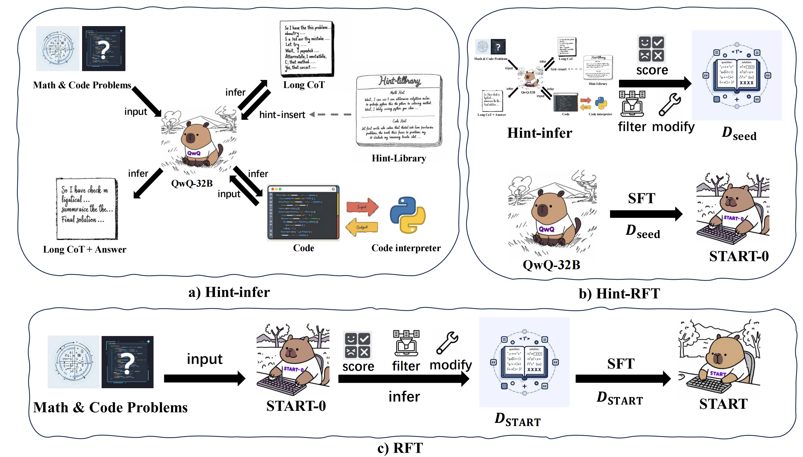
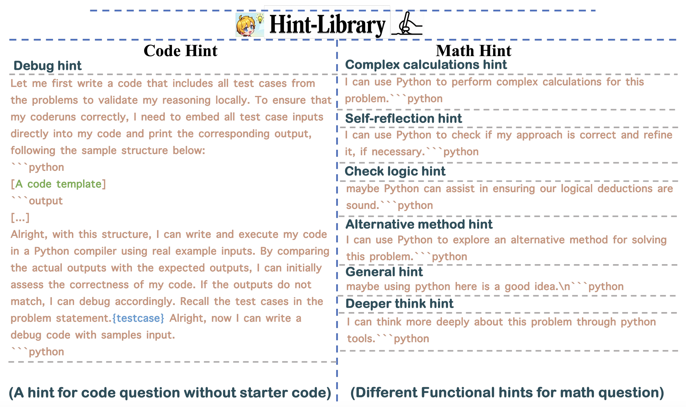
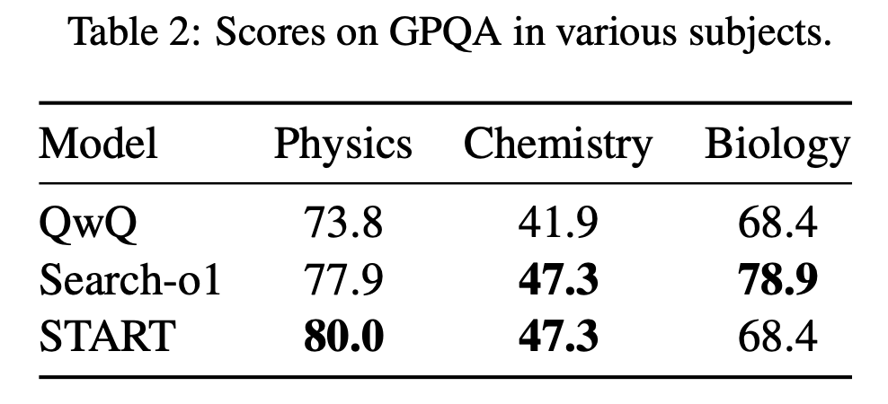
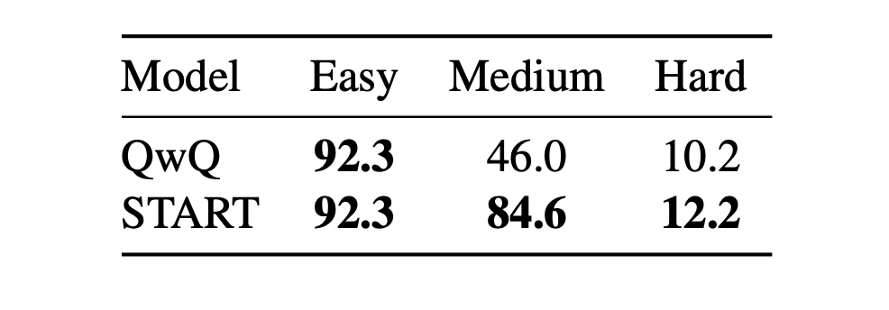

## 一、解决的问题

这篇论文主要解决了大语言模型在复杂推理任务中存在的幻觉和效率低下问题，提出了 START（Self-Taught Reasoner with Tools）模型，将长思维链（Long CoT）与工具集成推理（TIR）相结合，提升模型推理能力。

LLMs 复杂推理存在的问题：大语言模型在复杂推理任务中，长思维链方法虽然有一些效果，但依赖仅仅是依靠自身的不断反思机制来提升推理效果，这个方法的上线是十分有限的。

:::tip 人类面对复杂问题该如何解决

让我们假设一个场景：一个高中学生不借助任何外部工具，在面对一个复杂的数学问题时，仅仅凭借自己的长时间思考来心算，其实很难解决大部分的问题，更多的是需要差资料、在草稿纸上推导 & 计算，甚至是在网上差一些这类题目的相似解题思路，此时我相信解题的正确率会大大提升。

:::

所以大模型在面对复杂计算或模拟时仅仅是通过 Inter-Think 其实很容易产生幻觉。例如，OpenAI-o1 和 DeepSeek-R1 也存在此类问题。

这篇论文就是为了持续提升大模型在复杂问题上的推理能力。


## 二、方法介绍



<!-- truncate -->

### 2.1 Hint-Infer

基于大语言模型（LLMs）下一个词预测的特性，在推理过程中或结束时直接插入提示，激发模型继续深度思考和调用外部工具的能力。对于数学任务，插入基本提示和 Python 标识符；对于编码生成任务，使用精心设计的提示和代码模板。

示例 Hint 内容如下所示：



啥时候插入：在特定高频连接词（如 “Alternatively”“Wait”）后随机插入提示，这些词常表示模型开始“反思”或寻求新解决方案；在长思维链的停止标记前添加提示，让模型有更多思考时间且不干扰原推理过程，此时模型还会展现出顺序测试时间缩放效应，即思考时间增加，解题成功率提高。

:::warning 时延提醒

这种方法会大大增加整个模型的线上推理时间，因为当复用现有的推理框架，插入的操作是通过 `stop_words` 逻辑完成，此时再次将 query 抛给模型执行时，会进行多次 pre-filling 的过程，此时会比较耗时。

:::

比如在生成的过程中可能会插入以下 Hint 内容：

```prompt
Wait, I can use Python to check if my approach is correct and refine it, if necessary.

“‘python, Wait, I need to utilize Python code again to meticulously check to make sure I understand the question correctly as well as reasoning correctly.

“‘python and Wait, I can think more deeply about this problem through python tools.“‘python
```

### 2.2 Hint Rejection Sampling Fine-Tuning (Hint-RFT)

在微调之前会基于以上构建好的 Hint-Library 来对模型进行推理。

> 针对于垂类场景设计一套自己的 Hint Prompt，虽然方法优点扯，可是确实是能够提升最终的推理效果。

**数据准备**：

1. 会在现有的数学和代码数据上基于 QwQ 模型进行 Greedy-Inference 和 Hint-Inference ，此时会两份不带 Hint 和 带 Hint 的 query-response pairs 训练数据。
2. 在其中筛选出 Greedy-Inference 错误以及 Hint-Inference 结果正确的相关训练数据。
3. 将 Hint-Inference 中出现重复 Pattern （重复生成部分结果）的相关训练数据给剔除掉。

用以上数据在 QwQ 上面完成训练之后即可得到 $START_0$ 模型，此阶段的目的在于让模型能够学习到 Hint 工具的范式，让模型能够根据 Hint 的内容进行深入反思。

:::tip Hint Attention Mask

注意：在此阶段训练时，Hint 相关的内容是不参与到 loss 计算，可是内容还是需要被后面的 token 看到，也是

1. 训练过程中 Attention Mask 是正常的 Causal Mask 的内容。
2. Loss Mask 是需要将 Hint 的部分内容给 Mask 掉。

:::


### 2.3 Rejection Sampling Fine-Tuning

利用 $START_0$ 对所有训练数据进行拒绝采样微调，设置 temperature 为 0.6、top-p 为 0.95 进行 16 epoch 采样。

对采样得到的长 TIR 数据评分，过滤重复的回复模式，修改不合理内容（可能是让实习生进行标注修改的），每个问题最多保留一个 Response ，得到数据集 $D_{START}$ 。使用 $D_{START}$ 中的数据再次微调 QwQ，得到最终的 $START$ 模型，进一步增强训练数据的多样性和数量，提升模型性能。

## 三、Hint 的优点

Hint 在部分场景下起到了激活模型工具调用能力、引导推理方向、实现测试时间缩放以及辅助模型学习和优化的作用，对提升 START 模型在复杂推理任务中的性能至关重要。

### 3.1 激活工具调用能力

大语言模型在复杂推理任务中，直接通过常规提示难以调用外部工具。而 hint 的插入能够激发模型使用外部工具的能力，例如在数学推理中，简单插入带有 Python 标识符的基本提示，就能让模型按照提示编写合适的代码；在编码生成任务里，精心设计的 hint 和代码模板可激活模型在长思维链中自行执行候选代码测试用例的能力。

### 3.2 引导推理方向

hint 能够引导模型在推理过程中采用更有效的策略。在数学推理时，针对不同的推理环节，如反思、逻辑验证、探索新方法等，设计相应的 hint，使模型可以根据具体情况调整推理方向。在遇到复杂计算时，“Complex calculations hint” 提示模型使用 Python 进行复杂计算，辅助推理。

### 3.3 实现测试时间缩放

在模型推理过程中，于特定位置插入 hint 可以实现测试时间缩放。在 QwQ 模型推理结束前插入 hint，随着多次插入，模型的思考时间增加，同时解题的准确率也提高，这表明 hint - infer 是一种实现顺序测试时间缩放的有效方法。
### 3.4 辅助模型学习和优化

在 Hint - RFT 过程中，hint 发挥了关键作用。通过在推理过程中插入 hint，生成带有工具调用的推理轨迹，这些轨迹经过筛选、修改等处理后，用于微调模型（如从 QwQ 得到 START - 0 ，再得到 START），帮助模型学习如何更好地利用工具进行推理，提升模型在复杂推理任务中的性能。

## 四、实验效果指标

### 4.1 实验参数

* learning rate: 7e-6
* 128 global batch size
* cosine scheduler with 3% warmup steps
* 16k max sequence length, 3 epoch
* DeepSpeed Zero-3 训练
* 32k 的最大训练上下文（packing 到一起）
* 最多 6 个工具的使用
* 32 张 A100 的卡进行训练

### 4.2 实验指标





## 五、总结

1. 在推理的过程中仅仅使用 Python Code-Interpreter Tool 来支持在数学和 Code 上面的推理，局限性是非常大的。
2. 推理评估数据集那么多，本论文仅仅在 Math 和 Code 上面进行评估，有失偏颇，或许是 Python CI Tool 仅适合于这两个场景而已。
