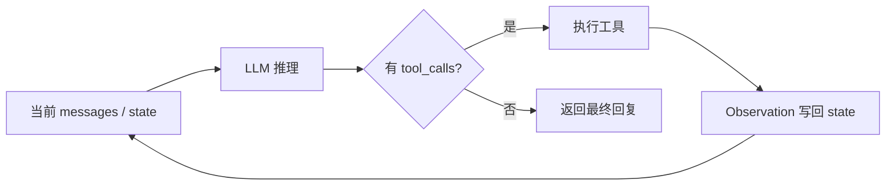

## 引言

如果把 Chatbot 和 Agent 的架构差异压缩成一句话，答案往往就是 **Agent Loop**：把 LLM 放进一个 `while` 循环里，让它反复「思考 → 行动 → 观察」，直到任务完成或触发终止条件。

各家框架——Claude Code、Cursor、Vercel AI SDK、LangGraph、smolagents——表面 API 千差万别，但剥开抽象层后，核心逻辑惊人地一致。Loop 本身已是「 solved problem」；真正决定 Agent 能否上线的，是 **Loop 外围的工程化**：上下文管理、安全护栏、错误分类、成本控制和优雅降级。

本文尝试把 Agent Loop 从概念到生产实践串成一条线，作为 Agent Handbook 中 [工作流](/docs/workflow) 与 [任务规划](/docs/planning-of-agent) 的补充阅读。

## 最小 Agent Loop

去掉框架包装，每个 Agent 本质上都在跑同一段伪代码：

```python
def run_agent(prompt, tools):
    messages = [{"role": "user", "content": prompt}]

    while True:
        response = call_llm(messages, tools)

        if response.has_tool_calls:
            messages.append(response)
            messages.append(execute_tools(response.tool_calls))
        else:
            return response.text  # 无 tool call → 终止
```

几个关键信号：

| 响应类型 | 含义 | 下一步 |
| --- | --- | --- |
| 含 `tool_calls` | 模型还需要更多信息或要执行动作 | 执行工具，把结果 append 到 messages，继续循环 |
| 纯文本回复 | 模型认为信息已足够 | 返回最终结果，退出循环 |

Tool Call 是 **continuation signal**（继续循环）；纯文本是 **termination signal**（结束）。模型通过是否发起工具调用来「决定」自己是否还需要再转一圈——这就是 Agent 与固定 Workflow 的根本分野。

Anthropic 在 [Building Effective Agents](https://www.anthropic.com/engineering/building-effective-agents) 中划了一条很实用的线：

- **Workflow**：开发者预定义控制流，LLM 在固定节点上被调用。
- **Agent**：模型在开放循环中动态决定下一步——调哪个工具、何时停止。

ReAct（[Yao et al., 2022](https://arxiv.org/abs/2210.03629)）把这套「推理与行动交织」的形式化得很清楚：每步生成 Thought → Action → Observation，Observation 写回上下文驱动下一步。这与本仓库 [任务规划](/docs/planning-of-agent) 一节中的 ReAct 描述一脉相承。

## 单轮循环里发生了什么

可以把每一轮迭代理解成一次 **状态转移**：



与「一次请求一次响应」的 Chat 不同，Agent Loop 是 **carry state between iterations**：对话历史、工具返回值、中间 todo、错误信息都会累积在 state 里，让第 N+1 轮与第 N 轮在相同模型、相同工具集下做出不同决策。

这里 state 是 **单次运行的 scratch space**（会话内状态），比跨会话的 Memory 更窄、更可变；二者在工程上往往分层管理，但 Loop 读写的就是 state。

## Loop 外围：真正值得工程化的部分

Loop 六行伪代码人人会写；难的是把它放进生产环境后还能 **可控、可观测、可止损**。下面按优先级列出实践中高频踩坑点。

### 1. 终止与护栏

仅靠「模型不再调工具」来结束循环，在真实任务里远远不够。至少需要：

- **最大迭代次数**（`max_turns` / `max_steps`）：常见取值 15–25，防止无限打转。
- **Token / 成本预算**：单任务硬上限，避免 runaway cost。
- **超时**：单工具调用与整任务都要有 wall-clock 限制。
- **Loop 检测**：对 `(tool_name, args_hash, result_hash)` 做指纹；连续重复相同失败模式时主动打断，而不是等模型自己「悟出来」。

很多框架在达到上限后要么直接失败，要么用 **graceful degradation**——例如 smolagents 在 `max_steps` 耗尽时会基于历史 synthesize 一个尽力回复，而不是静默截断。这是用户体验上的细节，却直接影响「Agent 是否可信」。

### 2. 上下文管理

每轮循环都会 append assistant 消息和 tool results，上下文长度近似 **线性甚至超线性** 增长。长任务里必须规划：

- **Compaction / Summarization**：接近窗口上限时压缩早期步骤，保留决策关键信息。
- **结构化 state**：把 todo、文件 diff、检索片段从 raw chat 里拆出来，避免重复塞满 transcript。
- **子 Agent / Task 工具**：子任务在独立 context 中执行，只把 1k–2k token 级摘要回传主循环（Claude Agent SDK 的典型做法）。

Anthropic 的 [Context Engineering](https://www.anthropic.com/engineering/claude-code-best-practices) 系列强调：在 Agent 场景下，**上下文设计往往比换更大模型更有效**。

### 3. 错误处理：尽量用代码，少用 LLM

一个常见反模式是：工具报错后把原始 stack trace 丢给模型，指望它「自己想明白怎么重试」。更稳妥的做法是 **在 harness 层分类错误**：

| 错误类型 | 处理策略 | 是否再问 LLM |
| --- | --- | --- |
| 瞬时故障（网络、429） | 指数退避重试 | 否 |
| 参数 / schema 错误 | 返回结构化修复提示 | 可选，一次 |
| 语义不匹配（查无此文件） | 把 observation 写回，让模型 replan | 是 |
| 不可恢复（权限拒绝、预算耗尽） | 终止并上报 | 否 |

LLM 推理贵且慢；能用确定性逻辑兜住的，就不要再占一轮循环。

### 4. 工具设计优先于 Prompt 微调

当 Agent 表现不佳时，排查顺序建议：

1. **工具描述与 schema**——是否说清何时用、返回什么、失败时长什么样。
2. **Observation 格式**——模型能否从返回里读到 actionable 信息。
3. **System / developer prompt**
4. **模型选型与编排框架**

Underhyped 等实践总结里反复出现同一句：**Tool descriptions and error handling tend to matter more than model choice or prompt tweaks.** 这与 Function Call 文档里「工具即 Agent 的手脚」的直觉一致。

### 5. 可观测性

生产级 Loop 至少要能回答：

- 当前第几轮？累计 token / 费用？
- 每轮调了哪些工具、耗时多少、是否重试？
- 终止原因是「模型完成」「触顶」「loop 检测」还是「用户取消」？

没有这些信号，就无法做 eval、回归和成本归因。Session 可恢复（`session_id` + 持久化 messages）也是长任务场景的标配。

## Agent Loop vs Workflow：怎么选

并非所有任务都需要开放 Loop。Anthropic 的建议仍然务实：**先用 LLM API + while 循环 + 几个函数试起来**，再考虑 LangGraph 等重型编排。

| 场景 | 更合适的模式 |
| --- | --- |
| 步骤可预知、分支有限（审批流、ETL） | Workflow / 有向图 |
| 目标开放、路径依赖中间结果（修 bug、调研、多步推理） | Agent Loop |
| 需要强保证、低方差 | Workflow 为主，局部嵌 Loop |
| 探索性编码助手 | 全 Loop，重护栏 |

本仓库 [工作流](/docs/workflow) 文档中的 Planning → Execution → Feedback → Reflection，可以看作在 Workflow 层叠加上 Loop：整体骨架由人定，局部执行仍可能是 ReAct 式小循环。

## 从 Loop 到「Agentic Engineering」

把 Agent 想成 **游戏主循环** 而非 **单次函数调用**，会更容易理解一系列产品行为：

- 模型决定何时停、何时委托子 Agent——**agency 来自循环结构**，不是来自更大的参数规模。
- Cursor / Claude Code 的「继续」「compact」「权限弹窗」——都是 Loop harness 的一部分。
- 近期 Harness Self-Evolution（见 [Disentangling Agent Self-Evolution](/paper-reading/self-evol/disentangling-agent-self-evolution)）讨论的是 **循环外围组件**（prompt、skills、tools、memory）如何迭代，而不是换掉 Loop 本身。

因此 **Agent Loop Engineering** 的核心命题是：

> 用尽可能简单的 while 循环交出控制权，把工程精力投入到 state、工具、护栏和可观测性上。

## 动手清单

若你正准备实现或审查一个 Agent，可按此 checklist 过一遍：

1. 最小 Loop 是否能在 50 行内跑通一个真实任务？
2. `max_turns`、超时、成本上限是否已在代码层强制，而非写在 prompt 里「请不要太久」？
3. 工具失败是否有分类处理，而非一律抛给模型？
4. 长任务是否有 compaction 或子 Agent 策略？
5. 是否有 loop detection 防止相同错误动作重复？
6. 日志能否还原每一轮的 tool trace 与终止原因？

## 总结

- **Agent Loop** = LLM + tools + `while`：有 tool call 就继续，无则结束。
- **ReAct** 提供了 Thought–Action–Observation 的经典叙事；工程上关键是 state 如何在轮次间累积与裁剪。
- **难点不在 Loop，而在 Loop 之外**：上下文、护栏、错误路由、工具接口与可观测性。
- 先简单 Loop，再按需引入 Workflow / 多 Agent；避免一上来就用图编排解决本可用十个工具函数搞定的问题。

## 延伸阅读

- [ReAct: Synergizing Reasoning and Acting in Language Models](https://arxiv.org/abs/2210.03629)
- [Anthropic — Building Effective Agents](https://www.anthropic.com/engineering/building-effective-agents)
- [Anthropic — Claude Code Best Practices](https://www.anthropic.com/engineering/claude-code-best-practices)
- 本仓库：[什么是 Agent](/docs/what-is-agent)、[任务规划](/docs/planning-of-agent)、[工作流](/docs/workflow)
