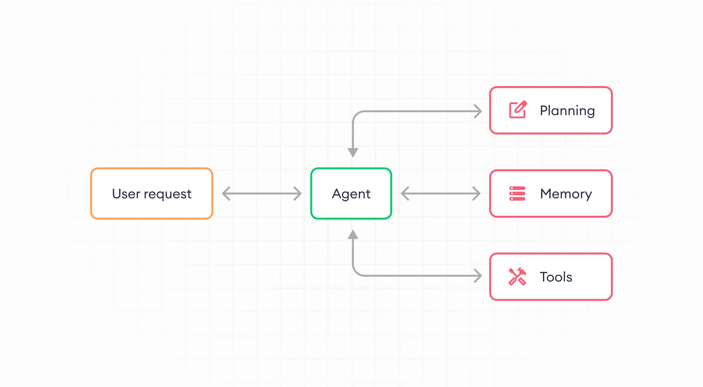

# 什么是Agent

相信大家对 `Agent` 的概念并不陌生，已然有无数软文介绍过，在此我简要介绍一下：Agent 是一个能够调用外部工具、拥有长期记忆以及根据已有信息做有效任务规划的智能体。

简要的架构图如下所示：

> 图片来源：https://www.superannotate.com/blog/llm-agents

让我们想象一个最简单的场景：北京今天的天气怎么样，并给一些旅游建议。

此时Agent会做规划：先调用查天气的工具，然后根据工具返回的结果给出一些旅游建议。

其中先调用工具然后再回复这个能力属于任务规划，模型能够调用查天气的工具属于与外部工具交互的能力，最后在得到天气结果之后再回复，这属于基于历史记忆来做内容生成的能力。

这仅仅是一个非常简单的应用场景，再来个复杂的场景：一位老师可能想基于学生成绩生成一份查漏补缺的建议报告。

老师首先需要给出所有学生的试卷得分细节，

## Memory

Agent中的记忆是智能体在处理任务、与用户交互以及从环境中获取信息时，能够存储和回忆这些信息的能力。这种记忆机制对于Agent理解环境、做出决策和从经验中学习至关重要。Agent中的记忆可以分为短期记忆和长期记忆两种类型，每种类型都有其特定的功能和实现方式。

### 短期记忆（Short-Term Memory, STM）

短期记忆主要负责处理当前任务相关的信息，包括会话上下文信息、临时变量、任务状态等。这些信息在Agent执行当前任务时非常关键，用于理解用户意图、跟踪任务进度和生成准确的回答。短期记忆的实现方式通常包括以下几种：
* 提示工程（Prompt Engineering）：通过设计合适的提示，引导Agent在对话中记住关键信息，如用户提问和之前的响应，从而实现上下文理解。
* 内部状态管理：Agent在内部维护一个状态表示，用于存储当前任务的状态信息，如已选择的选项、处理中的变量等。

### 长期记忆（Long-Term Memory, LTM）
长期记忆则用于存储历史数据和经验，为Agent提供知识基础。长期记忆可以包括事实、知识库、用户偏好、历史交互记录等，这些信息对于实现个性化服务和智能推荐至关重要。长期记忆的实现方式主要包括以下几种：

* 向量数据库：通过向量数据库进行外部向量存储和快速检索，实现长期记忆的保留和回忆。这种方式可以高效地存储和检索大量信息，支持Agent进行复杂的推理和决策。
* 知识库：构建结构化的知识库，包含各种领域的知识和规则，用于回答用户问题和提供推荐。知识库的内容可以抽象总结沉淀作为长期记忆的内容，提升模型的智能与个性化服务能力。
* 机器学习模型参数：通过训练机器学习模型（如推荐算法），将用户的历史行为和偏好作为长期记忆存储在模型的参数中。这种方式可以使Agent更加精准地理解用户需求，提供更加个性化的服务。

### 记忆管理
除了短期记忆和长期记忆的实现方式外，Agent还需要进行记忆管理，包括记忆的生成、存储、检索和遗忘等过程。这些过程共同构成了Agent的记忆机制，使其能够在处理复杂任务时更加智能和高效。

* 记忆生成：Agent在感知和处理外部环境信息时，会根据任务需求生成相应的记忆条目。这些条目可能包括原始信息的存储、信息摘要或更高层次的抽象表示。
* 记忆存储：生成的记忆条目需要被存储在适当的介质中，以便后续检索和使用。对于短期记忆，通常存储在内部状态中；对于长期记忆，则可能存储在向量数据库或知识库中。
* 记忆检索：当Agent需要回忆某个信息时，会从存储介质中检索相应的记忆条目。这个过程可能涉及复杂的计算和匹配算法，以确保检索的准确性和效率。
* 记忆遗忘：为了节省存储空间和避免冗余信息干扰决策过程，Agent需要遗忘一些不重要或不相关的信息。遗忘机制的设计需要考虑信息的时效性和重要性等因素。

综上所述，Agent中的记忆是智能体处理任务、与用户交互和从环境中获取信息时不可或缺的能力。通过合理设计和实现短期记忆和长期记忆机制以及进行有效的记忆管理，可以使Agent更加智能、高效地完成任务并提供优质的服务。

详细内容请看 [记忆模块](./01-memory.md)。

## Planing

Agent中的任务规划是指Agent根据任务目标、环境和自身能力，对复杂任务进行分解、组织、设定实现步骤的过程。这一过程是Agent高效执行复杂任务的关键组成部分，它涉及对任务的全面分析、子任务的划分、执行路径的规划等多个方面。以下是Agent中任务规划的详细解释：

### 定义

任务规划是Agent基于已知的知识和规则，以及从环境中收集的数据，对复杂任务进行拆解、组织、设定实现步骤的过程。它帮助Agent组织思维、设定目标，并确定实现这些目标的具体行动方案。

### 核心内容

任务分析：Agent首先需要对任务进行全面的分析，理解任务的目标、约束条件和执行环境。
子任务划分：将复杂任务拆分为多个更小、更易于管理的子任务。这些子任务之间可能存在依赖关系，需要按照一定的顺序或并行执行。
路径规划：为每个子任务规划执行路径，确定实现子任务的具体步骤和方法。这包括选择合适的工具、调用外部API等。
资源分配：根据任务需求和Agent的能力，合理分配资源，如计算资源、存储资源等。

### 方法与框架

ReAct框架：此方法强调在执行下一步行动时加入大模型的思考过程，并将思考过程、执行工具及参数、执行结果放入提示词中，以提升模型的反思能力和问题解决能力。
其他方法：如Zero-Shot（零样本提示）、Few-Shot（小样本提示）、COT（思维链提示）等，这些方法通过不同的提示策略引导模型进行逐步推理和任务拆解。

### 重要性

任务规划是Agent高效执行复杂任务的关键。通过合理的任务规划，Agent可以将复杂任务分解为多个简单子任务，降低执行难度；同时，通过路径规划和资源分配，确保任务能够按照预期目标顺利执行。此外，任务规划还有助于Agent在执行过程中进行自我反思和优化，提高任务执行的质量和效率。

总而言之，Agent中的任务规划是一个涉及任务分析、子任务划分、路径规划和资源分配等多个方面的复杂过程。通过合理的任务规划，Agent能够高效执行复杂任务，并在执行过程中不断优化自身表现。

## Tool Use

Agent中的工具调用是指智能代理（AI Agent）在执行任务过程中，根据任务需求自动选择和执行适当的工具或服务的能力。在现代AI和机器学习领域，智能代理的概念已经广泛应用于多个场景，从自动化系统到智能家居，再到智能客服等。工具调用是智能代理核心能力之一，它使得代理能够处理更复杂、更具有适应性的任务。

### 定义

* 工具定义：在AI Agent的上下文中，工具指的是模型可以调用的任何功能，它们允许Agent与外部数据源交互，通过拉取或推送信息到该源。这些工具可以是API、数据库、外部程序、第三方服务等。
* 调用过程：智能代理在执行任务时，会根据当前的状态和任务需求，从可用的工具集合中选择合适的工具进行调用。调用过程可能涉及参数配置、数据传递、执行监控和结果处理等多个环节。

### 重要性

工具调用目前是Agent中的基础能力之一，重要性无可厚非，于是从以下几个方面来展开描述工具调用的重要性：

* 扩展执行范围：通过调用外部工具，智能代理能够执行更多种类的任务，从而扩展其执行范围。
* 提高适应性：不同的任务可能需要不同的工具来处理，智能代理能够根据任务需求灵活选择工具，提高其在不同环境下的适应性。
* 增强性能：一些外部工具可能具有比智能代理本身更强大的处理能力，通过调用这些工具，智能代理能够完成更复杂、更高效的任务。

### 应用场景

现在绝大多数公司都在做商业落地，其中工具调用能够扩展 Agent 与外界进行交互的能力边界，具体场景如下所示：

* 智能家居：智能代理可以根据用户的语音指令调用不同的家居设备（如灯光、空调、窗帘等），实现智能家居的自动化控制。
* 智能客服：智能代理可以调用知识库、对话管理模块和文本生成工具等，与用户进行自然语言交互，提供客服支持。
* 数据分析：在数据分析领域，智能代理可以调用数据库查询工具、数据可视化工具和机器学习模型等，自动完成数据分析任务并生成报告。

Agent中的工具调用是智能代理在执行任务过程中自动选择和执行适当工具的能力，它对于扩展智能代理的执行范围、提高适应性和增强性能具有重要意义。
