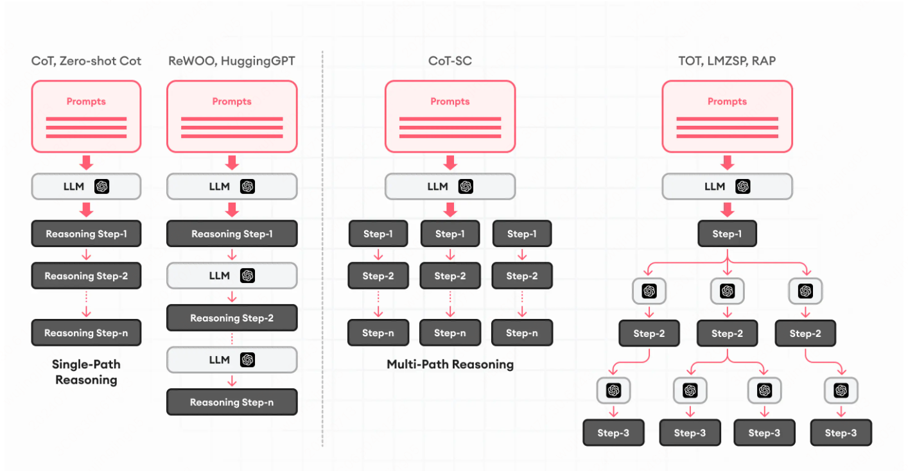

# 任务规划

任务规划是需要将一个复杂的问题拆分成多个简单的子问题，然后每个子问题也是可以继续规划进而让其对问题继续拆分，知道问题都被解决。

任务规划通常包含以下两个阶段：任务拆分和任务反思。

### 任务拆分

任务拆分就是根据当前问题尝试将其拆分多个子问题，你可以认为输入是一个问题，输出是一些todo list，然后每个todo都需要下一个Agent 去完成。

在任务拆分和任务执行的过程中，通常会使用 CoT 的相关技术来提升对于问题的的理解力，尽量将其模块化之后可以更好的生成 todo list。

当然，还有 Tree of Thought 可以对每个子问题进行递归拆分，直到问题被完全解决。

以上为常规任务拆分的方法，通常分为single-path和multi-path。

### 任务反思

Agent 创建完任务之后，在实际执行的过程中需针对于实际执行结果进行反思，如果能够发现一些问题，或者可以进一步优化任务，这样才能够更智能的完成人类的任务。

其中如何在执行过程中如何针对于实际执行结果进行反思呢？其方法主要有两种：ReAct、Reflexion。

* [ReAct](https://arxiv.org/abs/2210.03629): 在每次执行的过程中会将当前Thought、Action、Observation 输入到历史消息当中，此时由 LLM 决定接下来是否要调用某工具、是否要结束直接回复用户。
* [Reflexion](https://arxiv.org/abs/2303.11366)：
