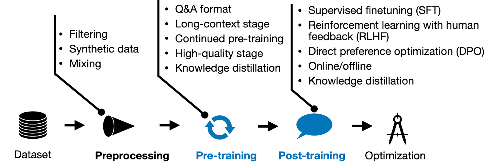

## 训练流程

一个能满足上线要求的模型，需要经历多阶段的打磨，通常包含以下几个阶段：

> 图片来源于：[New LLM Pre-training and Post-training Paradigms](https://magazine.sebastianraschka.com/p/new-llm-pre-training-and-post-training)

上图仅仅展示了部分阶段，让读者从整体上有一个大概得认知，在后续的介绍中会详细每阶段的方法，同时随着时间的推移，每个阶段都会衍生出训练效果更好，训练效率更高的方法。

### 数据前处理阶段

此阶段旨在为模型的提供高质量的训练数据，进而提升模型训练后的效果。

此阶段通常包含如下阶段：

* **数据准备**：使用开源高质量数据集、爬虫爬取不同网站数据、现有人类知识（各种电子书）、基于有监督数据构建训练数据、使用当前高质量业务数据构建领域数据。
* **数据筛选**：为了提升数据的质量，需要使用Rule-Based和LLM-Based的方法来对数据进行筛选。
* **合成数据**：使用LLM来合成相关数据也是一个非常火热的方向，且成本低效果好。
* **数据混合**：LLM需要基于大规模多领域的数据进行训练，此时对不同领域的数据进行混合配比是提升模型效果一个关键因素。[1,](#data-mixing-laws)[3](#hallucinations-of-finetune)

:::info 数据质量至关重要[4](#investigating-information-quality)

在各个阶段中，大模型训练效果与数据质量和多样性特别敏感。

:::

### 模型预训练阶段

大模型的预训练相关知识点非常多，其中包括：

* 数据构建
* 分布式训练
* 长文本能力提升
* 训练方法
* 继续预训练

:::info GLM Long：如何将 LLM 的上下文扩展至百万级

为了提升GLM的长文本能力，从预训练到最后的对齐阶段都添加了相关训练进行训练，进而稳固不同阶段对于长文本能力的敏感性，具体可参考[2](#glm-long)
:::

### 有监督微调

SFT 阶段旨在牵引预训练阶段涌现出的多种能力，会重点训练成：chat 类型模型和 instruction 类型模型。

chat 类型模型会在大量对话相关数据集上训练，进而让模型能够更友好的对话能力，此类数据的构建通常来源于真实数据。

instruction 类型模型会在大量指令数据集上面训练，让模型具备更好的指令遵循的能力，此类数据的构建可通过LLM来生成高质量数据。[5](#self-play-with-execution-feedback)

### 对齐

对齐本质上也是有监督微调，只不过从作用上来说是为了更精细化的控制模型的生成效果，让其更符合人类的偏好。

在对齐阶段，相关方法比较多，其中包括：

* PPO: Proximal Policy Optimization Algorithms [6](#ppo)
* DPO: Direct Preference Optimization: Your Language Model is Secretly a Reward Model [7](#dpo)
* KTO: Model Alignment as Prospect Theoretic Optimization [8](#kto)
* ...

## 参考资料

* [1] [Data Mixing Laws: Optimizing Data Mixtures by Predicting Language Modeling Performance](https://arxiv.org/abs/2403.16952) 

* [2] [GLM Long：如何将 LLM 的上下文扩展至百万级](https://mp.weixin.qq.com/s/Rs2o8K3Hb-I103eDgNBhVQ) 

* [3] [Does Fine-Tuning LLMs on New Knowledge Encourage Hallucinations?](https://arxiv.org/abs/2405.05904) 

* [4] [Towards Trustable Language Models: Investigating Information Quality of Large Language Models](https://arxiv.org/pdf/2401.13086) 

* [5] [Self-play with Execution Feedback: Improving Instruction-following Capabilities of Large Language Models](http://arxiv.org/abs/2406.13542) 

* [6] [Proximal Policy Optimization Algorithms](https://arxiv.org/abs/1707.06347) 

* [7] [Direct Preference Optimization: Your Language Model is Secretly a Reward Model](https://arxiv.org/abs/2305.18290) 

* [8] [KTO: Model Alignment as Prospect Theoretic Optimization](https://arxiv.org/abs/2402.01306) 
