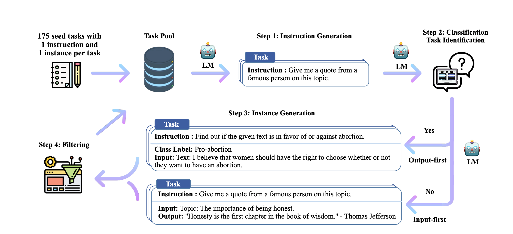

import Hl from '@site/src/components/Highlight';

## 介绍

在大模型预训练阶段，数据准备是一个至关重要的环节，它涵盖了多个方面的内容，以确保模型能够学习到高质量、多样化的数据特征。具体来说，数据准备包含以下几个关键步骤和阶段：

| 步骤 | 阶段 | 描述 |
| --- | --- | --- |
| 数据收集 | 通用数据收集 | 从各种公开资源如网页、书籍、科学论文、代码等中收集数据，帮助模型学习到丰富的知识和语言模式。 |
|  | 专用数据收集 | 针对特定领域或任务，收集该领域内的专业数据，如医疗相关的文献、病例报告等。 |
| 数据预处理 | 质量过滤 | 通过启发式规则、分类器规则等方法去除低质量及有害数据，如过滤掉点赞数过少的用户评论、去除含有有毒或隐私内容的文本。 |
|  | 去重 | 使用精确匹配或近似匹配（如哈希算法）等方法去除重复数据，确保训练数据的唯一性。 |
|  | 敏感内容过滤 | 进一步过滤掉包含有毒内容、隐私信息等敏感数据，以保护用户隐私和避免模型学习到不良内容。 |
|  | 格式统一 | 将收集到的数据统一转换为模型训练所需的格式，如jsonl、txt、csv等。 |
| Data Scheduling | 数据混合 | 根据经验或代理小模型的测试结果，确定不同来源数据在训练集中的混合比例，以增加数据多样性。 |
|  | Data Curriculum | 按照一定的顺序安排预训练数据进行模型训练，如先使用通用数据进行预训练，再使用特定领域的数据进行微调。 |
| 有标注数据 |  | 在训练阶段融入一些有标注相关数据，如文本分类、问答、槽位填充抽取等，以提升数据的多样性，同时提升上下文信息抽取的能力。 |
| 数据增强 |  | 通过同义词替换、随机插入、随机删除、回译等方法扩充数据，增加模型对相似文本的理解能力，进而提升模型的泛化性。 |

预训练阶段旨在让大模型学习到基础的理解和生成相关的能力，而这些能力皆来自于预训练中的数据，此阶段的数据决定了模型的效果，所以相关数据集的规模、不同领域的数据配比以及数据质量对于模型训练的效果至关重要。

## 数据收集

数据准备的第一个阶段是：搜集相关数据。

在大模型预训练阶段的数据收集过程中，这是一个复杂且关键的任务，它涉及到多个方面以确保收集到高质量、多样化的数据。

### 数据集类型

在模型训练的不同阶段有不同类型的数据，其中主要包括：

* 预训练数据：此类数据主要为无监督的文本数据，如网页、书籍、学术论文、代码等。
* 微调
    * 指令微调数据
        * 包含不同种类的传统NLP任务，比如文本分类、知识问答、信息抽取、文本摘要等，其中P3和FLAN两个数据集为相关热门数据集。
        * 人类对话数据集，旨在提升模型对话基础能力，可以包含日常对话、问答、头脑风暴、任务解答等不同类型的对话数据，其中 ShareGPT、OpenAssistant、Dolly 等数据集为热门数据集。
        * 合成数据：此类数据通常是基于LLM在指定指令上面生成而来的数据集，旨在生成包含特定功能，此类方法通常应用于垂类业务领域，可以定向引导 & 提升 模型在业务场景下的效果，其中 Self-Instruct-52K、Alpaca、Baize等数据集为热门数据集。
    * 对齐微调数据集
        * 对齐的目的旨在提升模型在安全、隐私、法律、认知等层面的能力，让其回复更符合特定偏好。
        * 热门数据集有HH-RLHF、SHP、PKU-SafeRLHF、Stack Exchange Reference、Sandbox Alignment Data。

### 数据来源

在预训练阶段，数据收集的来源广泛多样，主要包括：

* 互联网公开数据：这是最常见的数据来源之一，包括网页内容、社交媒体帖子、在线论坛讨论、学术论文、开源数据集等。这些数据通常可以通过爬虫技术、API接口等方式获取。
* 企业内部数据：对于特定行业或领域的大模型，企业内部数据往往具有更高的价值和针对性。这些数据可能包括用户行为记录、交易数据、产品使用日志等。
* 第三方数据提供商：有些专业的数据提供商会收集和整理特定领域或行业的数据，并提供给需要的企业或个人。这些数据通常具有较高的准确性和可靠性。

在SFT阶段，数据量不会非常大，数据通常是有标注数据：

### 公开的数据集

以下是关于不同文本语料库或数据集的相关信息：

| 名称 | 描述 | 语种 |
| :---: | :---: | :---: |
| [Pile](https://pile.eleuther.ai/) | 一个用于大语言模型训练的多样性大规模文本语料库，由22个不同的高质量子集构成，包括Common Crawl、Wikipedia、OpenWebText等。 | 英文 |
| [Common Crawl](https://commoncrawl.org/) | 世界上最大的公开网页数据集之一，每月抓取数十亿个网页，涵盖了广泛的语言、地区和主题。 | 英文 |
| [C4](https://research.google/tools/datasets/c4/) | Google发布的一个大规模的预训练数据集，包含了约750GB的文本数据，是从互联网上爬取的网页内容经过清洗和过滤后的结果。 | 英文 |
| [Project Gutenberg](https://www.gutenberg.org/) | 收录了超过60,000本公有领域的电子书，涵盖文学、历史、科学等多种类型。 | 英文 |
| [BookCorpus](https://yknzhu.wixsite.com/mbweb/) | 包含了从英文小说中抓取的约10,000本电子书的文本，主要用于自然语言处理任务。 | 英文 |
| [CLUECorpus2021](https://github.com/CLUEbenchmark/CLUECorpus2021) | CLUECorpus2021是一个用于中文语言理解的评测基准，包含了多个子任务的数据集，如文本分类、命名实体识别等，适合用于预训练中文大语言模型。 | 中文 |
| [Chinese Wikipedia](https://dumps.wikimedia.org/zhwiki/) | 中文维基百科是一个包含丰富知识的中文语料库，包含大量的文章和条目，可用于大语言模型的预训练。 | 中文 |
| [新闻数据集](https://github.com/sobert/chinese-news-dataset) | 包含大量中文新闻文本的数据集，涵盖了多个新闻领域的文章，适合用于预训练中文大语言模型，以提高模型对新闻文本的理解能力。 | 中文 |
| [网络文本数据集](https://github.com/brightmart/text_classification) | 包含从网络上爬取的中文文本数据集，涵盖了多个领域的文本内容，如小说、新闻、科技等，可用于预训练中文大语言模型。 | 中文 |
| [大规模中文语料库](https://github.com/brightmart/nlp_chinese_corpus) | 一个大规模的中文语料库，包含了多种类型的文本数据，如新闻、小说、科技文章等，适合用于预训练中文大语言模型。 | 中文 |

此外，还有许多其他领域的数据集，如图像领域的ImageNet、MS COCO等，以及金融和经济领域的Quandl等，这些数据集同样可以用于训练特定领域的大模型。

## 数据前处理

大模型前处理也包含很多子模块，通常使用pipeline 的方式来处理相关数据，其中技术概览如下：

### 提升质量

由于训练数据通常来源于互联网大量的文章，包含很多噪声和垃圾数据，此时就需要将其进行过滤，去除低质量或有害数据。

通常有两种方法识别文本中的脏数据：
* 分类方法

    此类方法要训练一个分类器来判别文章中是否包含脏数据，模型的输出通常只需要 0、1 就行，故此类模型还是比较好训练。

    可是也会存在一些False Negative的情况，会将高质量的数据给判断成脏数据。

* 启发式方法

    什么是启发式的方法？就是依赖开发者的经验来设定一些规则来筛选数据，提升数据的质量，Bloom、Gopher等模型的数据前处理也是用此类方法。

    其中主要的方法包含：

    * 语言过滤：如果预期此模型只支持 A，B，C三类语言，此时其它语言类型的数据就需要被移除。
    * 评估过滤：使用一个评估指标来判断文本是否符合预期（比如：用小模型给文本计算一个ppl 数值），根据此值来判断数据的质量。
    * 语法过滤：可以根据文本的语法正确性、某词语的出现频率、文本的长度等来过滤文本。
    * 关键词过滤：可以设定一些敏感、存在暴力倾向的词语、特殊内容（比如 html 标签等）等关键词对文本进行过滤。

> 在海量的无监督文本上面筛选并提升目标领域的质量是一个非常浩瀚的工程，是距离大模型最近，也是最没有任何技术含量的工程。

### 文本去重

如果预训练文本中存在重复的文本，此时将会降低文本的多样性，可能会导致模型训练的不稳定性，影响模型的效果 [5](#scaling-laws-and-learning-from-repeated-data)，所以文本中重复的内容是需要删除的。

可是现在预训练文本动辄几百G的文本，要对其进行去重也是一个大工程：如果用传统的pair-wise的方法来对比去重，此时时间复杂度太高，为不可取方案。

当然文本类型数据有长有段，有的仅仅是一两句话的聊天数据，有的是篇幅很长的小说文章，此时也有两种去重粒度：

1. 在句子级别：应该删除重复单词/短语内容，否则模型在生成的时候也很可能会出现重复文本，此类现象通常是不符合预期的。
2. 在文档级别：为了评估不同文档的相似度，此时通常使用 n-gram 的方式来计算和删除相似文本。当然还有其他的方式来判别不同文本的相似度，比如训练分类模型、构建 Embedding 模型，可是成本往往就比较高了。

### 安全隐私保护

数据集当中很可能会存在大量的私人信息，比如：电话号码、邮箱、家庭住址等信息，这些信息虽然是公开的，也是也不应该被训练到模型当中去，此外也可能会存在是基于用户query 生成的内容，其中更可能会出现用户隐私性问题。

很直观的方法就是：用regex将部分数据给替换掉或者直接删除相关文本。

### 文本分词（Tokenization）

文本分词是文本前处理过程中的关键一步，这个是为了将文本的字符拆分成 int 数据（每个单元 token 需要映射到词表某一个 ID ），这一步是所有模型预训练必经之路，其中也有很多方法。

:::tip 文本分词

想要将一段文本转化为模型可识别的输入，通常的过程：句子 -> Token -> ID。

* 句子：为原始自然语言文本，比如：我爱你中国。
* Token：将一段文本拆分成一个个的 token 片段，比如：[我, 爱, 你, 中国]。
* ID：将 token 映射到词表中的某一个 ID，比如：[1761, 2345, 1234, 3456]。

:::

* **Byte-Pair Encoding（BPE）Tokenization**

    BPE算法通过迭代合并训练语料库中最常见的字符对（或子词对），来构建一个更紧凑、更有效的词表。这种方法旨在找到一个最优的字符组合方式，使得整个数据集中不同单词的字符组合数量尽可能少，同时保持词汇的语义意义。

    这个方法算是目前最常用的，测试下来实践最有效的方法。

* **WordPiece tokenization**

    WordPiece算法通过迭代合并高频字符对或子词对来构建子词词汇表，并使用该词汇表对文本进行分词。这种方法既保留了高频词汇的完整性，又能够将低频词汇拆分成有意义的子词单元，从而提高了模型对复杂语言现象的处理能力。在大语言模型中，WordPiece分词方法被广泛应用，如BERT、DistilBERT等模型均采用了这种分词技术。

> TODO(wj-Mcat): 此处由于篇幅有限，后续会添加更多关于不同分词方法的详细介绍。

其中为了提升模型的质量，可以训练一个[质量分类小模型](https://github.com/modelscope/data-juicer/blob/main/tools/quality_classifier/README_ZH.md#%E8%AF%84%E4%BC%B0%E8%B4%A8%E9%87%8F%E5%88%86%E7%B1%BB%E5%99%A8)，输出仅仅是true、false，在现阶段而言这类数据还是比较好准备。

其中阿里开源了一款数据预处理的工具：[data-juicer](https://github.com/modelscope/data-juicer)，旨在加速训练大模型过程中数据预处理的过程。

### 数据质量的重要性

数据质量重要性不言而喻，就看：llama2-3的结构没有什么变化，就仅仅只是调整了训练数据量和数据质量，在不同领域上面就有非常大的提升。这足以说明大模型中的数据质量很大程度上决定了模型的效果。[6](#investigating-info-quality-of-llm)

TODO(wj-Mcat): 阅读 [How to Improve Data Quality in a Modern Data Ecosystem](https://www.telm.ai/blog/the-dilemma-of-modern-data-stacks/) 来继续丰富此章节的内容

## Data Scheduling

在大模型预训练阶段，Data Scheduling 是一个至关重要的环节，它直接影响到模型的学习效果和训练效率 [2](#data-management)。

Data Scheduling 是指在大模型预训练过程中，根据特定的策略和方法，合理安排和分配训练数据的过程。由于大模型预训练需要处理海量的数据，因此 Data Scheduling 不仅关乎数据的选取和使用顺序，还涉及到数据的混合比例、数据增强等多个方面。通过合理的 Data Scheduling ，可以使得模型在训练过程中更加高效地学习通用特征和知识，为后续的任务提供良好的基础。

现有大模型的预训练相关数据中的配比如下所示：

 Ratios of various data sources in the pre-training data for existing LLMs. [4](#survey-of-llm) 

### Data Scheduling 方法

* 数据增强

    数据增强是一种**通过变换已有数据来生成新数据**的方法，可以增加训练数据的多样性和数量。在大模型预训练中，常用的数据增强方法包括同义词替换、回译、随机删除或替换单词等。

    此类方法的数据增强通常可包含传统NLP方法，也可以使用LLM来生成相似文本，只不过成本会比较大。

* 数据混合比例

    在大模型预训练中，通常会使用来自不同数据源的数据进行训练。这些数据源可能包括网页文本、书籍、学术论文、代码等。为了平衡不同数据源对模型的影响，需要设置合适的数据混合比例。例如，LLaMA-1 模型的预训练数据就包括了超过80%的网页数据、6.5%的代码密集型数据、4.5%的书籍数据以及2.5%的科学数据。

* 数据课程（**Data Curriculum**）

    训练数据中应尽量增加数据的多样性，不应在同样领域的数据上构建过多的数据，进而在这个任务上过拟合，影响了其它领域上的能力。 [7](#pretrainer-guide-to-train-data)

    此外，不同领域的数据配比也至关重要，通常的做法是使用一个小型代码模型在固定配比的数据集（此数据集的数量也是有 scaling law 算出来的）上面进行预训练，如果有比较好的正收益，此时大概率在大模型上面也会存在有一定的正收益。

    最后，还想说一个话题：如何提升在特定领域上的能力，比如说 FunctionCall 的能力。结论就是特殊的功能就需要用特殊的数据来训练。大模型中绝大多数的能力都来源于预训练，当然也有一部分是涌现出来的，不过为了进一步提升涌现出来的能力，在训练数据中添加一部分相关数据可以有效提升目标垂类能力。

* 数据课程（Data Curriculum）[8](#data-curriculum-learning)

    数据课程指的是在训练过程中，按照一定顺序使用不同难度或不同特性的数据。这种策略有助于模型从简单到复杂逐步学习，提高训练效果。例如，可以先使用较为通用的数据对模型进行初步训练，然后再使用特定领域或高难度的数据进行微调。

    Data Curriculum 这个方法主要应用在 Continue Pre-Training 阶段，也主要是一些垂类模型会使用此类训练方法，比如：Code 模型（CodeLLama）或者 长文本模型（LongLLama）。

    大家想要详细了解 Data Curriculum 在大模型中的应用，可移步至：[阶梯化数据训练方法](../09-topics/data-curriculum.md)

## 数据标注

大模型在SFT（Supervised Fine-Tuning，监督微调）阶段的有标注数据主要通过以下几种方式获得：

### 公开数据集

公开数据集是AI大模型训练数据的重要来源之一。这些数据集通常由学术机构、政府组织或企业公开发布，涵盖了各种类型的数据，如图像、文本、音频、视频等。对于自然语言处理（NLP）领域的大模型，如GPT系列，它们的SFT数据可能包含从公共文本数据集（如Common Crawl、BookCorpus等）中抽取并经过标注的样本。

### LLM-Based Data Generation

近年来，随着大模型技术的发展，一种新兴的数据生成方式是利用大模型自身来生成有标注数据。例如，通过引导式生成（Instruction Following）的方法，让大模型根据给定的指令生成相应的输入和输出对，并自动进行标注。这种方法可以在短时间内生成大量数据，但需要注意的是，生成的数据可能存在偏差和噪声，需要进行后续的处理和筛选。

#### [Self-Instruct](https://arxiv.org/abs/2212.10560)

旨在通过一些种子 Seed Instruct 来让模型不停的自我脑 -> 筛选 -> 泛化，进而快速生成高质量的训练数据，在 Self-Instruct 方法当中。

当前绝大部分的模型训练（包含 Pre-Training, Post-Training 两个阶段）都会使用基于模型的方法来生成训练数据，现在也有很多相关的工作。

综上所述，大模型在SFT阶段的有标注数据主要来源于公开数据集、众包或专业标注服务、企业内部数据、合作伙伴共享数据以及使用大模型生成数据等多种方式。在实际应用中，企业会根据自身的需求和资源情况选择合适的数据来源和标注方式。

## 参考文章

* [1] [Data-Juicer: A One-Stop Data Processing System for Large Language Models](https://github.com/modelscope/data-juicer) 

* [2] [Data Management For Training Large Language Models: A Survey](https://arxiv.org/abs/2312.01700) 

* [3] [Datasets for Large Language Models: A Comprehensive Survey](https://arxiv.org/pdf/2402.18041) 

* [4] [A Survey of Large Language Models](https://arxiv.org/pdf/2303.18223) 

* [5] [Scaling Laws and Interpretability of Learning from Repeated Data](https://arxiv.org/abs/2205.10487) 

* [6] [Towards Trustable Language Models: Investigating Information Quality of Large Language Models](https://arxiv.org/pdf/2401.13086) 

* [7] [A Pretrainer's Guide to Training Data: Measuring the Effects of Data Age, Domain Coverage, Quality, & Toxicity](https://arxiv.org/abs/2305.13169) 

* [8] [Curriculum Learning: A Survey](https://arxiv.org/abs/2101.10382) 
