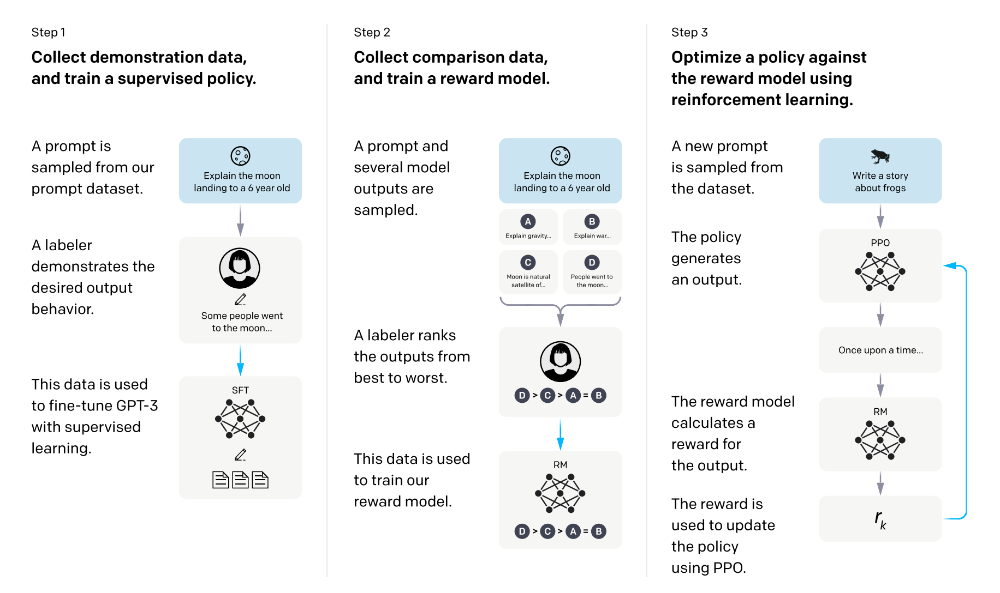
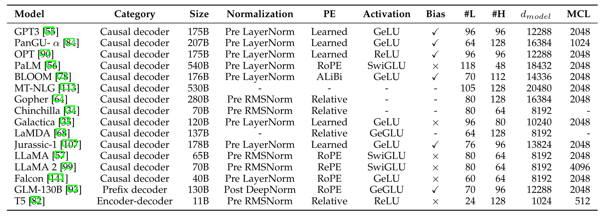
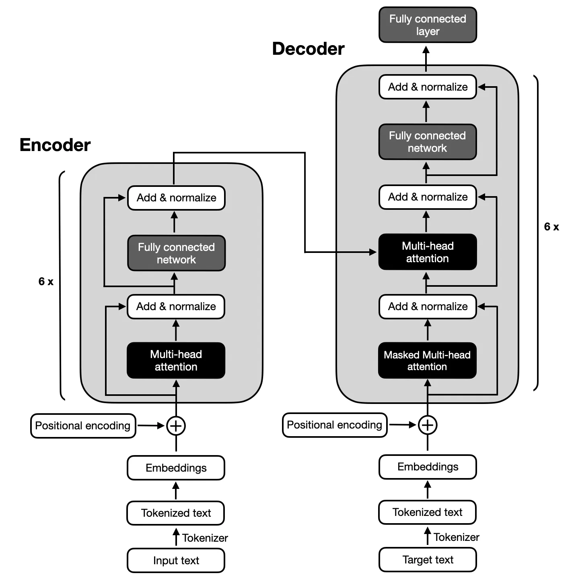
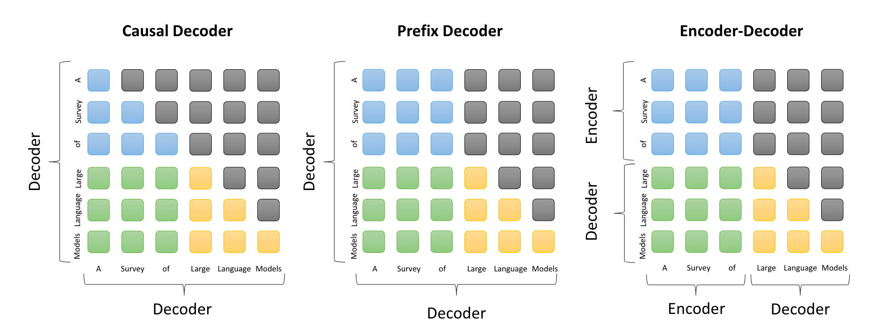

## 介绍

大语言模型在预训练阶段包含的内容相当丰富且复杂，主要围绕大规模无标签文本数据的处理和模型训练展开，当然此篇内容主要围绕 `decoder-only` 类别模型围绕展开介绍。

语言模型（Language Model）很早就出现了，可是大语言模型（**Large** Language Model）在2022年才开始爆火，通常指至少为十亿级别的模型参数。

大语言模型展示了令人出乎意料的自然语言理解能力和解决复杂任务（通过文本生成）的能力。为了快速了解这些大型语言模型是如何工作的，本部分将介绍它们的基本背景，包括规模法则、涌现能力和关键技术。

预训练阶段旨在让大模型学习到基础的理解和生成相关的能力，所以相关数据集的规模、不同领域的数据配比以及数据质量对于模型训练的效果至关重要。

## Scaling Laws

大语言模型预训练中的Scaling Law是一个描述系统性能如何随着模型规模、训练数据量以及计算资源等因素的增加而变化的规律，Scaling Law是一种数学表达，它揭示了系统性能与其规模（如参数量、训练数据量、计算量等）之间的幂律关系

在大语言模型的预训练中，Scaling Law起到了至关重要的作用。随着模型规模的不断扩大、训练数据的不断增加以及计算资源的不断投入，模型的性能往往会得到显著提升。OpenAI、Google DeepMind等研究机构通过实验验证了这一规律，并将其应用于指导大语言模型的设计和训练。

### **核心公式与推论**

1. **KM缩放规律**：由OpenAI团队在2020年提出，揭示了模型性能L与模型参数量N、训练数据集大小D以及训练计算量C之间的幂律关系。具体公式如下：
   - $$ L(N) = (\frac{N_c}{N})^{\alpha_N} $$
   - $$ L(D) = (\frac{D_c}{D})^{\alpha_D} $$
   - $$ L(C) = (\frac{C_c}{C})^{\alpha_C} $$

   其中，$ L(\cdot) $ 表示交叉熵损失，$ N_c $、$ D_c $、$ C_c $ 是常数，$ \alpha_N $、$ \alpha_D $、$ \alpha_C $ 是幂律指数。这些公式表明，当其他因素固定时，模型性能与某个因素呈现幂律关系。

2. **Chinchilla缩放规律**：由Google DeepMind团队提出，旨在指导计算最优训练。他们通过优化损失函数 $ L(N, D) $ 在约束条件 $ C \approx 6ND $ 下的值，导出了模型大小N和数据大小D的最优分配比例。

### 结论与启示

1. **模型性能与规模的关系**：随着模型参数量、训练数据量和计算量的增加，大语言模型的性能通常会得到显著提升。但这种提升并非无限制的，当达到一定规模后，性能提升的速度会逐渐放缓。

2. **资源分配策略**：根据Scaling Law，可以合理地分配模型参数、训练数据和计算资源，以在有限的预算内获得尽可能好的模型性能。不同研究团队对于模型和数据重要性的看法可能存在差异，这需要在具体实践中进行权衡。

3. **未来发展方向**：Scaling Law不仅适用于语言模型，还可能适用于其他模态以及跨模态的任务。随着技术的不断进步和数据的不断积累，未来大语言模型的性能有望得到进一步提升。

大语言模型预训练中的Scaling Law是一个重要的经验性规律，它揭示了系统性能与规模之间的幂律关系。通过理解和应用这一规律，可以指导大语言模型的设计、训练和资源分配，推动自然语言处理领域的持续进步和发展。

### 应用场景

#### 效果可预测性

首先，对于大型模型来说，严格检查各种训练技巧或变体是不可行的，如果从小型模型中获得的经验也能应用于大型模型，那将非常有帮助。例如，可以训练小型代理模型，为大型模型找到最佳的数据混合计划[1](#doremi)

随着训练时长的增加，训练过程中可能会出现很多不稳定的因素：
1. loss 突然激增，出现不稳定的情况
2. 训练收益放缓（loss 趋于平稳）
3. 如果在数据集上面继续训练的话，很可能会出现收益递减的情况，所以要有一个监控机制。

基于 scaling law 规律，在不同size 模型上的效果表现存在一定的关联性，此时就可以用小模型的训练来监控大模型的训练过程。

#### 数据混合

当所有的数据都准备好了，也满足scaling laws 的公式，此时如何进一步优化模型训练的效果，此时就只有基于有限数据做一些 ***调整***，进而让其在发挥出最大的数据效果，此时通常使用 **数据混合** 方法。

**数据混合**方法中最关键的为不同领域数据配比，而此比例永远是一个谜，不同数据之间可能会存在 ***正相关、负相关以及不相关*** [2](#data-mixing-laws) 等关系，如何验证大语言模型在此比例下的训练有正效益，此时便可使用小模型对其进行模拟，进而得出最优混合配比策略。

:::warning 提醒

当然这个也不一定是正确的，因为目前谁也不知道 ground truth 的方法是什么，只有通过小型代理模型来做先验训练进而得出一些经验，此时再来指导大模型进行训练。

:::

### Domain能力预测

检验 LLM 训练是否收敛通常使用loss、ppl 等来衡量，可是loss 的下降和对应领域能力的提升吗？比如说数学和代码的能力。

GPT-4 技术报告 [3](#gpt4-report) 中提到不同领域的能力是可以通过 Scaling Laws 预测出来的，比如说 coding。不过这仅仅是实现的一个现象，并不代表这就是真理。

在训练过程中，甚至还会出现效果衰减的情况，如何 early stop 策略也是一个黑盒。

当然还有一些能力是无法用scaling law 来预测的，比如： in-context-learning 能力，这个一定程度上是因为模型的 size 到了一定的程度之后就会涌现。

## LLM 能力的涌现

大模型能力的涌现只在大模型中发生 [4](#emergent-abilities-of-llm) ，当模型的规模到达一定的阈值之后，模型会涌现出一些能力，这些能力是 LLM 无法预测的，此外还和一些复杂任务相关联，比如说数学、代码等需要逻辑推理相关的能力。

而我们评估大模型的能力通常会评估它的通用能力。

### 上下文学习

上下文学习（In-Context Learning）能力是 LLM 的一项重要能力，它允许模型在给定的上下文中进行推理和预测，根据用户给的上下文内容给出一个符合预期的回复，这些内容通常是大模型没有学习过的。

在GPT系列模型中，175B GPT-3 模型通常展现出较强的ICL能力，但GPT-1和GPT-2模型则不然。同时此能力还与特定的下游任务有关，例如 13B GPT-3模型在算术任务（如三位数的加减法）上能够展现出ICL能力，但175B GPT-3模型甚至在 Persian QA 任务上表现不佳。

### 指令跟随

指令跟随（Instruction Following）是指模型能够理解和执行给定指令的能力。

真实场景中的指令多种多样，大模型是不可能将所有的指令都学习到，在现代社会中，无论是工作场所、家庭生活还是日常社交，指令跟随能力都是一项至关重要的技能，也一定程度上体现出模型的智能性和定制性。

指令数据可以来源于 QA任务、分类任务、信息抽取任务、结构化生成等任务，当指令类型和数据集变多，模型到达一定的size（与scaling law 有关，可是不是一个绝对的数值）后即可表现出优秀的zero-shot 的能力。

### 任务推理

复杂的任务通常是需要有较强的推理能力，比如要解决一个数学问题、写一段逻辑复杂的代码、通过组装不同的工具来解决一个复杂的问题等。这个推理的过程通常会使用思维链（Chain-of-Thought）的方式进行推理，进而提升大模型对复杂任务的解决能力。

这种推理能力也是大模型涌现出来的能力之一，人们推断这是来源于代码数据训练而来 [5](#chain-of-thought-prompting) ，同时此项能力当模型规模越大，相对比不用CoT的Prompt策略而言，性能也会得到显著提升。

当然这个只是一个常规看法，不同模型在不同任务上的表现也不太一样，不一定能 100% 应用于所有场景。

## 提升LLM的效果

随着大模型的应用面越来越广，对其能力的要求也是越来越高，分别有：代码生成能力、指令跟随、格式化输出、推理能力、工具调用以及长上下文能力。

GPT-3为了提升以上能力，分别从以下方面做了优化：

### 大量代码训练数据

OpenAI于2021年7月推出了Codex [6](#evaluation-large-language-model) ，这是一个在GitHub代码的大型语料库上进行微调的GPT模型。研究表明，Codex可以解决非常困难的编程问题，并且在解决数学问题方面也有显著的性能提升 [7](#neural-network-math-problem)。

代码数据除了提升复杂代码生成的能力，也会提升对于复杂问题的推理能力，特别是提升基于思维链的推理能力 [8](#llm-text-generation)。

### 人类偏好对齐

OpenAI对人类对齐的相关研究可以追溯到2017年（或更早）：[Learning from human preferences](https://openai.com/index/learning-from-human-preferences/)，文章中介绍了一种基于强化学习方法让模型从人类的标注反馈中学习到相关知识。

这篇博客发布不久就继续发布了 PPO [9](#neural-network-math-problem) 方法，它现在已成为从人类偏好中学习的基础强化学习算法。

在2022年又发布了InstructGPT [10](#instruct-gpt) 用于改进GPT-3模型的人类对齐方法，它正式建立了一个三阶段的人类反馈强化学习（Reinforcement Learning from Human Feedback，RLHF）算法

## 模型架构设计

当数据都准备好了，要想将模型真正训练起来，此时需要考虑主体模型架构、预训练目标函数、训练配置等。

以下是主流模型的架构及其配置：

### 主体架构类型

* **Encoder-Decoder 架构**

   最原始的 [《Attention Is All You Need》](#vanilla-transformer) 中的模型架构是 Encoder-Decoder 架构，架构图如下所示：

   

* **Encoder 架构**

   在LLM（大语言模型）领域，encoder-only类型的模型主要指的是那些仅包含编码器部分，没有解码器的模型。这类模型的代表是BERT及其变体（如RoBERTa、ALBERT等）。以下将详细分析encoder-only类型模型的优缺点：

   * 优点

      1. **高效的编码能力**：

         Encoder-only模型专注于对输入序列进行高效的编码和表示学习，能够捕捉丰富的上下文信息，非常适合于理解和分析文本的任务，如文本分类、情感分析等。

      2. **计算效率高**：

         相较于encoder-decoder架构，encoder-only模型在推理阶段通常具有更高的计算效率，因为它不需要进行解码过程，直接输出编码后的表示即可。

      3. **易于训练**：

         由于结构相对简单，encoder-only模型在训练过程中往往更容易收敛，训练成本相对较低。

      4. **强大的表征学习能力**：

         通过大规模预训练，encoder-only模型能够学习到高质量的文本表征，这些表征在多种下游任务中表现出色，具有广泛的适用性。

      5. **双向注意力机制**：

         Encoder-only模型通常采用双向注意力机制（如BERT中的Transformer编码器），这使得模型能够同时考虑输入序列的前后文信息，从而生成更加准确的文本表示。

   * 缺点

      1. **生成能力受限**：

         由于缺乏解码器部分，encoder-only模型在生成文本或序列时存在局限性。它们通常无法直接用于生成任务，如文本生成、机器翻译等，需要通过额外的解码器或微调策略来实现生成功能。

      2. **对长序列处理能力有限**：

         虽然随着技术的发展，encoder-only模型对长序列的处理能力有所提升，但相较于decoder-only或encoder-decoder架构，它们在处理极长序列时仍可能面临挑战。这主要是因为双向注意力机制在处理长序列时计算复杂度较高。

      3. **预训练与下游任务的不完全一致性**：

         在某些情况下，encoder-only模型在预训练阶段学到的知识可能无法完全适应下游生成性任务的需求。这可能需要额外的适应或微调步骤来弥补这一差距。

      4. **上下文理解方式的局限性**：

         尽管encoder-only模型通过双向注意力机制能够捕捉丰富的上下文信息，但这种理解方式在某些任务中可能不如decoder-only模型那样直观和有效。decoder-only模型通过自回归的方式逐步生成文本，能够更自然地模拟人类写作过程。

* **Decoder 架构**

   LLM（Large Language Model）中Decoder-only类型的模型，以其独特的架构在自然语言处理领域取得了显著成就，尤其是以GPT系列为代表的模型。以下是Decoder-only类型模型的优缺点分析：

   * 优点

      1. **模型复杂度低**：

         Decoder-only架构去除了编码器部分，仅包含解码器，使得模型结构更加简化，参数数量和计算复杂性显著降低。这种简化的设计使得模型在训练过程中更容易处理大规模数据，提高了训练效率和模型的泛化能力。

      2. **上下文理解能力强**：

         在Decoder-only架构中，解码器可以直接利用输入序列进行解码，无需经过编码器的转换过程。这种直接的上下文理解方式使得模型能够更好地捕捉和利用输入序列的细节信息，从而生成更加准确和连贯的文本。

      3. **语言能力强**：

         Decoder-only架构通过自注意力机制等手段对输入序列进行编码和解码，从而在语言能力上具有显著优势。这种架构使得LLM能够更好地理解和生成自然语言文本，无论是语法、语义还是语境层面都能达到较高的准确度。

      4. **预训练效率高**：
         在预训练阶段，Decoder-only架构的LLM可以利用大规模的无监督文本数据进行高效预训练。这种预训练方式不仅提高了模型的泛化能力和性能，还使得模型能够更好地适应各种自然语言处理任务。

      5. **灵活性高**：

         Decoder-only架构的模型具有更强的灵活性，可以处理多种不同类型的文本生成任务，如聊天机器人、内容创作、问答等，无需针对每一种任务进行专门的训练或调整。

      6. **参数量适当时zero-shot性能强**：

         实验表明，在参数量不太大时，Decoder-only模型具有更强的zero-shot性能，即无需任何标注数据即可直接应用于新任务。

   * 缺点

      1. **无法处理双向信息交互任务**：

         Decoder-only架构的模型无法进行编码，因此无法处理一些需要双向信息交互的任务，如文本分类、情感分析等。在这些任务中，通常需要同时考虑输入序列的整体信息，而Decoder-only模型只能基于先前的输出生成新文本。

      2. **长期依赖问题**：

         Decoder-only模型在处理长序列时可能面临长期依赖问题，即在长文本中维持上下文一致性和相关性可能表现不佳。这是因为模型在生成新文本时主要依赖于先前生成的文本，而不是直接从原始输入中提取信息。

      3. **可能出现“幻觉”**：

         Decoder-only模型在生成文本时更易出现“幻觉”现象，即生成与输入事实不符的文本。这是因为模型在生成新文本时主要依赖于先前生成的文本和自身的知识库，而不是严格基于输入序列进行推理。

      4. **训练难度相对较大**：

         Decoder-only架构的训练难度相对较大，因为每个位置在预测下一个Token时接触的信息更少，预测难度更高。然而，随着模型规模的增大和数据量的增加，这种训练难度可以在一定程度上得到缓解。

* **Attention 对比**

   以上三种类型的架构基座方法都是基于 Transformer 架构，其中最主要的区别在于 Attention，其区别所示图如下：
   
   

   
comparison of the attention patterns in three mainstream architectures

   其中：
   * Causal Decoder Attention：解码阶段每一个token都只能看到之前的所有token（当然你也可以控制前面的tokens，哪些要学，哪些不要学），所以是一个下三角矩阵。
   * Prefix Decoder Attention: 在prefix阶段，每个token 都可以互相**看得到**，在decode 阶段，便是一个 Causal Decoder Attention，具体内容和形式可见上图。此Attention 应用与 Decoder-Only 的模型。
   * Encoder-Decoder Attention：此内容和作用和 Prefix Decoder Attention 相同，只不过面向的模型架构不一样，此 Attention 应用与 Encoder-Decoder 架构。

* **Mixture of Expert(MoE)**

   除了常规的以上架构，今年的MoE架构也备受关注，每个输入的神经网络权重子集被稀疏激活：选择部分 Expert Weight参与计算，此时算是一种激活的方式。此时便可以减少计算量，提高模型吞吐。

   MoE 是一种灵活的模型架构，可以在保持恒定计算成本的同时扩展模型参数，通过增加专家数量或总参数大小，可以观察到显著的性能提升。 [12](#unified-scaling-laws-for-moe)

   目前已经有多种模型都是基于MoE 的架构，如下所示：

* **新架构**

   Transformer 的生成效率其实比较第，无法实现并行生成，此时为了持续优化 Decoder-Only 架构并保持模型架构的技术领先型，此业界也是出现了多种新架构：

   | 模型名称  | 描述    |
   |-----|--------|
   | SSM 系列模型  | 参数化状态空间模型，旨在提高处理长输入时的效率，通过递归生成输出和并行编码整个句子来实现。比如：Mamba, Jamba, Zamba [13](#unified-scaling-laws-for-moe) |
   | Hyena  | 采用长卷积的模型，旨在提高处理长输入序列的效率，支持递归生成输出和并行编码整个句子，利用FFT等技术加速。 |
   | RWKV  | 类似Transformer的架构，但融入了递归更新机制，提高了处理长输入的效率，支持递归输出生成和并行编码，可利用FFT等技术加速。|
   | RetNet  | 另一种类似Transformer的架构，也采用了递归更新机制，旨在提高长输入序列的处理效率，支持递归输出和并行编码，可利用Chunkwise Recurrent等技术加速。|

虽然很多模型主体还是基于 Transformer [11](#vanilla-transformer) 主体架构，可为了提升模型的训练、推理效果和性能，不同模型做了一些工作。接下来我将详细介绍不同细节方法上的区别。

### Normalization 系列方法

训练不稳定性是预训练大型语言模型（LLMs）时面临的一个挑战性问题。为了缓解这一问题，标准化是一种广泛采用的策略，用以稳定神经网络的训练。

当前用的主流 Normalization 的方法如下所示：

以下是以markdown table的形式对不同方法进行的介绍：

| 方法名称 | 方法详细介绍 |
| --- | --- |
| [LayerNorm14](#layernorm) | 在早期研究中，[BatchNorm15](#batch-normalization) 是一种常用的归一化方法。然而，它难以处理可变长度的序列数据和小批量数据。  因此，引入了 [LayerNorm14](#layernorm) 进行逐层归一化。具体来说，LayerNorm 计算每一层所有激活值的均值和方差，以便对激活值进行重新居中和重新缩放。 |
| [RMSNorm16](#rms-layernorm) | 旨在提高 LayerNorm (LN) 的训练速度，RMSNorm 仅使用激活值总和的均方根（RMS）对激活值进行重新缩放，而不是使用均值和方差，其中代表模型为 Llama1-3。 |
| [DeepNorm17](#deepnorm) | 由Microsoft 提出，用于稳定深度Transformer 的训练，将DeepNorm 作为残差连接，Transformer 可以扩展到1000层，这显示了其在稳定性和良好性能方面的优势。[GLM-130B18](#glm-130b) 已经采用了这种方法。 |

这些归一化方法在深度学习模型的训练中起着重要作用，每种方法都有其独特的优势和适用场景。

除了以上常识外，开发过模型底层架构的同学可能对 Normalization 的位置可能也是熟悉：Pre-LayerNorm、Post-LayerNorm 以及 Sandwich-LayerNorm。

以下是这三种方法的对比：

以下是对您提供内容的翻译，并按照您的要求以markdown表格形式呈现不同方法：
| 方法名称 | 方法详细介绍 |
| --- | --- |
| Post-LayerNorm | Post-LayerNorm 被用于原始的 [Transformer11](#vanilla-transformer)，位于残差块之间。  然而，现有研究发现，由于输出层附近的大梯度[267]，带有 Post-LayerNorm 的 Transformer 训练往往不稳定。因此，Post-LayerNorm 很少单独应用于现有的 LLM，除非与其他策略结合使用（例如，在 [GLM-130B18](#glm-130b) 和 Llama  中将 Post-LayerNorm 与 Pre-LayerNorm 结合）。 |
| Pre-LayerNorm | 与 Post-LayerNorm 不同，Pre-LayerNorm [268] 在每个子层之前应用，并在最终预测之前增加一个额外的 LN。与 Post-LayerNorm 相比，带有 Pre-LayerNorm 的 Transformer 在训练中更加稳定。但是，它表现不如带有 Post-LayerNorm 的变体 [269]。尽管性能有所下降，大多数 LLM 仍然采用 Pre-LayerNorm，因为训练稳定性较高。然而，一个例外是当训练超过 100B 参数的模型时，在 GLM 中发现 Pre-LayerNorm 不稳定 [93]。 |
| Sandwich-LN | - 基于 Pre-LayerNorm，Sandwich-LN [255] 在残差连接之前增加了额外的 LN，以避免 Transformer 层输出中的值爆炸问题。然而，已经发现 Sandwich-LN 有时未能稳定 LLM 的训练，并可能导致训练崩溃。 |

## 参考文章

* [1] [Doremi: Optimizing data mixtures speeds up language model pretraining](https://arxiv.org/abs/2305.10429) 

* [2] [数据混合定律：通过预测语言模型表现优化数据配比](https://open-moss.com/cn/data-mixing-laws/) 

* [3] [OpenAI, “Gpt-4 technical report,”](https://arxiv.org/abs/2303.08774) 

* [4] [Emergent abilities of large language models](https://arxiv.org/abs/2206.07682) 

* [5] [Chain-of-Thought Prompting Elicits Reasoning in Large Language Models](https://arxiv.org/abs/2201.11903) 

* [6] [Evaluating Large Language Models Trained on Code](https://arxiv.org/abs/2107.03374) 

* [7] [A Neural Network Solves, Explains, and Generates University Math Problems by Program Synthesis and Few-Shot Learning at Human Level](https://arxiv.org/abs/2112.15594) 

* [8] [Pretrained Language Models for Text Generation: A Survey](https://arxiv.org/abs/2105.10311) 

* [9] [Deep reinforcement learning from human preferences](https://arxiv.org/abs/1706.03741) 

* [10] [Training language models to follow instructions with human feedback](https://arxiv.org/pdf/2203.02155) 

* [11] [Attention Is All You Need](https://arxiv.org/abs/1706.03762) 

* [12] [Unified Scaling Laws for Routed Language Models](https://arxiv.org/abs/2202.01169) 

* [13] [Zamba: A Compact 7B SSM Hybrid Model](https://arxiv.org/html/2405.16712v1) 

* [14] [Layer Normalization](https://arxiv.org/abs/1607.06450) 

* [15] [Batch Normalization: Accelerating Deep Network Training by Reducing Internal Covariate Shift](https://arxiv.org/abs/1502.03167) 

* [16] [Root Mean Square Layer Normalization](https://arxiv.org/abs/1910.07467) 

* [17] [DeepNet: Scaling Transformers to 1,000 Layers](https://arxiv.org/abs/2203.00555) 

* [18] [GLM-130B: An Open Bilingual Pre-trained Model](https://arxiv.org/abs/2210.02414) 
