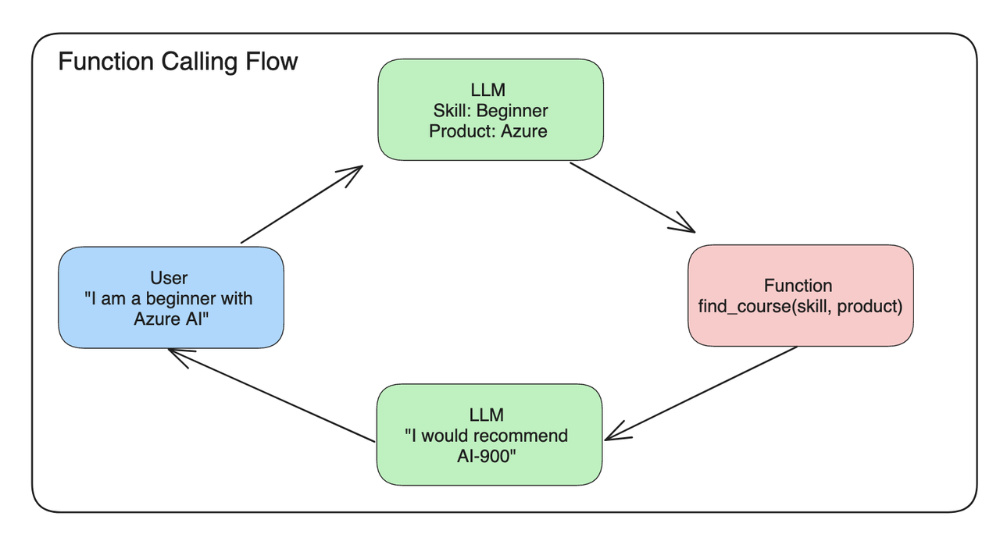
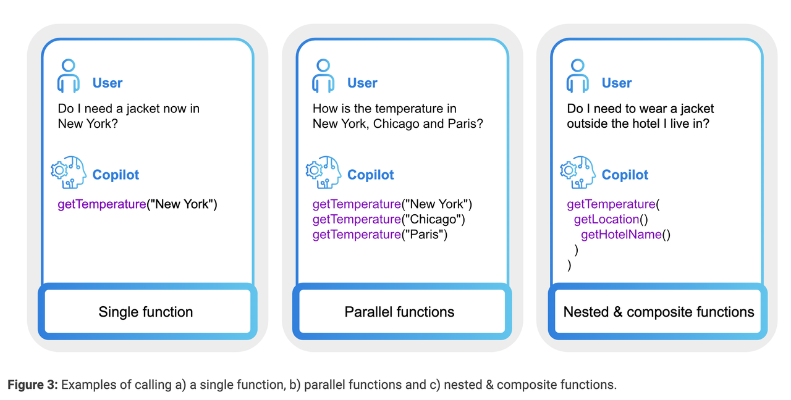
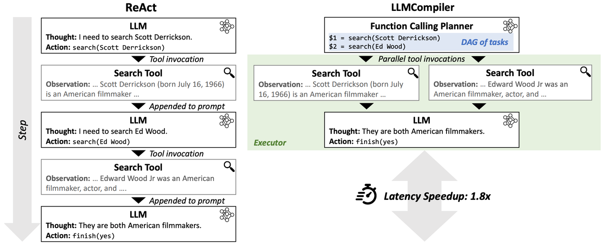
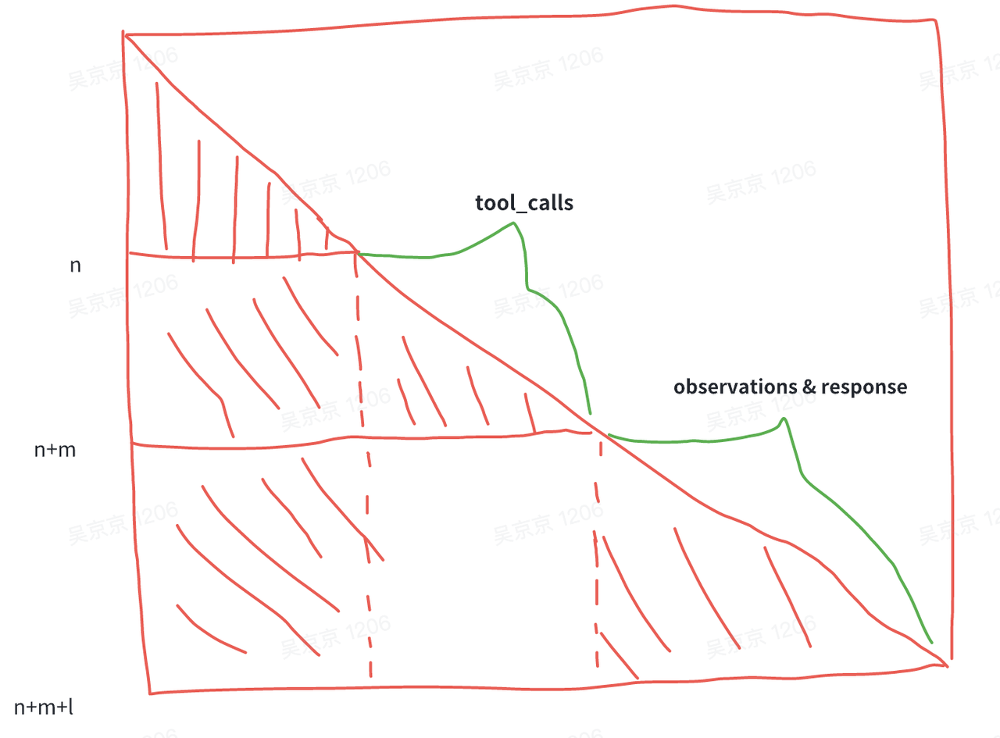

## 一：Function Call 介绍
随着ChatGPT等通用大模型的出现，它们可以生成令人惊叹的自然语言，使得机器能够更好地理解和回应人类的需求，但在特定领域的任务上仅靠通用问答是无法满足日常工作需要。随着OpenAI推出了Function Call功能，工具调用能力越来越作为开源模型的标配。

那什么是 FunctionCall 呢？顾名思义就是大模型能够判断应该调用哪个Function（API、Method）以及对应的参数，这个极大程度上提升了大模型在特定领域上的知识能力，弥补大模型能力上的不足，比如以下例子：

1. 现在北京时间是什么时候？
2. 帮我查一下北京现在的天气？帮我查一下昨天百度股票收盘价是多少？
3. 在机器空闲的时间请帮我跑一下 LLama 的 CE，并把报告发到飞书群（群号：12345678）中，并艾特 XXX 注意消息内容。
以上例子都是真实能够实现的例子，也是现实生活中接触最多最有价值的例子。

### 1.1 原理

FunctionCall 会根据用户的 query 判断是否要调用预定义的函数、如何编排这些函数的调用、如何抽取函数之间的输入参数，整体功能介绍图如下所示：




根据上图可以看出，一个完整的FunctionCall 调用的流程当中需要有以下步骤：
1. LLM 根据用户的 query 来判断：要调用哪个工具（find_course）以及工具的入参（skill=beginner, product=azure）。
2. 调用并执行该工具（find_course）获得输出（AI-900）
3. 将用户对话历史和工具调用信息和工具返回结果等关键信息输入给 LLM，得到最终回复结果（**I would recommend AI-900**）。

当然为了实现这些功能，肯定是需要从训练数据上做一些处理的，这个在下面的章节中会介绍。

基于 OpenAI SDK FunctionCall 的调用示例如下所示：

```python
response = client.chat.completions.create(
    model=deployment,    
    messages=messages,    
    functions=functions,    # 工具定义信息
    function_call="auto"    # 自动调用某工具
)
print(response.choices[0].message)    
```

如果调用了某工具信息，此时返回的信息如下所示：

```json
{
  "role": "assistant",
  "function_call": {
    "name": "search_courses",
    "arguments": "{\n  \"role\": \"student\",\n  \"product\": \"Azure\",\n  \"level\": \"beginner\"\n}"
  }
}
```

> 代码摘自：[Integrating with function calling](https://github.com/microsoft/generative-ai-for-beginners/blob/main/11-integrating-with-function-calling/README.md?WT.mc_id=academic-105485-koreyst)

### 1.2 类型



> 图片来自于：[https://nexusflow.ai/blogs/ravenv2](https://nexusflow.ai/blogs/ravenv2)

从 Function Call 如何编排的角度出发，其类别主要分为四类：
- Single Function：每次只执行一个方法，这是最简单的情况，并且开源 function call 的数据大部分都是这种情况。
- Parallel Functions：可并行执行某些函数，从而减少执行多个函数整体的执行时间。
- Nested Functions：嵌套函数，某个函数依赖某些函数执行的结果。
- DAG Functions：拓扑图结构的函数，符合真实场景下的执行结果。
  - An LLM Compiler for Parallel Function Calling 提出将 Nested Function 和 Parallel Functions 编译成一个拓扑结构的依赖关系


    - 观点：在当前看来，大模型需要根据工具的返回结果来判断接下来要调用的工具类型和参数，直接一下子所有的执行路径都给规划出来，可能不太恰当。
    - 创新点：
    - 可以对出错的 node 进行反思

### 1.3 开源模型对于 Function Call 的支持情况

以下判断是根据官方文档描述所得，和客观真实数据或许有一定的偏差，

| 模型名称                                      | 类型        |
|-----------------------------------------------|-------------|
| ChatGLM3                                      | Single FC   |
| QWen2                                         | Single FC   |
| Trelis/Llama-2-7b-chat-hf-function-calling-v2 | Parallel FC |
| Nexusflow/NexusRaven-V2-13B                   | Parallel FC |

### 1.4 使用场景

Function Call 到底有哪些应用场景呢？
- Conversational Agent：用于创建复杂的聊天机器人，通过调用外部API或外部知识库并提供更相关和有用的知识来辅助回答复杂的问题。
- NLU：它可以将自然语言转换为结构化JSON数据，从文本中提取结构化数据，并执行命名实体识别、情感分析和关键字提取等任务。
- Math Problem Solving：可用于定义自定义函数，以解决需要多个步骤和不同类型的高级计算的复杂数学问题。
- API Integration：它可以用于有效地将LLM与外部API集成，以获取数据或根据输入执行操作。这可能有助于建立QA系统或创造性助理。一般来说，函数调用可以将自然语言转换为有效的API调用。
- Information Extraction：函数调用可有效地用于从给定的输入中提取特定信息，例如从文章中检索相关的新闻报道或引用。

### 1.5 示例代码

以下是使用 zhipuai-sdk FunctionCall 的示例代码，其中远程插件由 AI Studio API Hub 提供。

```python
from zhipuai import ZhipuAI
client = ZhipuAI(api_key="") # 请填写您自己的APIKey
response = client.chat.completions.create(
    model="glm-4-alltools",  # 填写需要调用的模型名称
    messages=[
        {
            "role": "user",
            "content":[
                {
                    "type":"text",
                    "text":"帮我查询2018年至2024年，每年五一假期全国旅游出行数据，并绘制成柱状图展示数据趋势。"
                }
            ]
        }
    ],
    stream=True,
    tools=[
    {
        "type": "function",
        "function": {
            "name": "get_tourist_data_by_year",
            "description": "用于查询每一年的全国出行数据，输入年份范围(from_year,to_year)，返回对应的出行数据，包括总出行人次、分交通方式的人次等。",
            "parameters": {
                "type": "object",
                "properties": {
                    "type": {
                        "description": "交通方式，默认为by_all，火车=by_train，飞机=by_plane，自驾=by_car",
                        "type": "string"
                    },
                    "from_year": {
                        "description": "开始年份，格式为yyyy",
                        "type": "string"
                    },
                    "to_year": {
                        "description": "结束年份，格式为yyyy",
                        "type": "string"
                    }
                },
                "required": ["from_year","to_year"]
            }
        }
      },
      {
        "type": "code_interpreter"
      }
    ]
)

for chunk in response:
    print(chunk)
```

该工具返回的结果是：

```python
ChatCompletionChunk(
    id="cdaad83d-8970-4866-951f-3849de03f85b",
    choices=[
        Choice(
            delta=ChoiceDelta(
                content=None,
                role="assistant",
                tool_calls=[
                    ChoiceDeltaToolCall(
                        index=None,
                        id="call_X2__H_xN3LmUMaxb79gxV",
                        function=ChoiceDeltaToolCallFunction(
                            arguments='{"from_year":"2018"," to_year":"2024"," type":"by_all"}',
                            name="get_tourist_data_by_year",
                        ),
                        type="function",
                    )
                ],
            ),
            finish_reason="tool_calls",
            index=0,
        )
    ],
    created=1719801738,
    model="glm-4-alltools",
    usage=CompletionUsage(prompt_tokens=438, completion_tokens=48, total_tokens=486),
    extra_json=None,
    status="requires_action",
)
```


以上结果包含了调用的工具名称、工具的输入参数，此时开发者需要调用本地的 get_tourist_data_by_year 工具，并（假设）得到结果： [100,100,200,200,300,400]，此时你需要将结果再次提交给模型来得到最终的润色结果，示例代码如下所示：

```python
from zhipuai import ZhipuAI
client = ZhipuAI(api_key="") # 请填写您自己的APIKey
response = client.chat.completions.create(
    model="glm-4-alltools",  # 填写需要调用的模型名称
    messages=[
        {
            "role": "user",
            "content":[
                {
                    "type":"text",
                    "text":"帮我查询2018年至2024年，每年五一假期全国旅游出行数据，并绘制成柱状图展示数据趋势。"
                }
            ]
        },
        {
              "role": "assistant",
              "content":"arguments='{\"from_year\":\"2018\",\" to_year\":\"2024\",\" type\":\"by_all\"}', name='get_tourist_data_by_year'"
        },
        {
              "role": "tool",
              "content": "[100,100,200,200,300,400]"
          }
    ],
    stream=True,
    tools=[
    {
        "type": "function",
        "function": {
            "name": "get_tourist_data_by_year",
            "description": "用于查询每一年的全国出行数据，输入年份范围(from_year,to_year)，返回对应的出行数据，包括总出行人次、分交通方式的人次等。",
            "parameters": {
                "type": "object",
                "properties": {
                    "type": {
                        "description": "交通方式，默认为by_all，火车=by_train，飞机=by_plane，自驾=by_car",
                        "type": "string"
                    },
                    "from_year": {
                        "description": "开始年份，格式为yyyy",
                        "type": "string"
                    },
                    "to_year": {
                        "description": "结束年份，格式为yyyy",
                        "type": "string"
                    }
                },
                "required": ["from_year","to_year"]
            }
        }
      },
      {
        "type": "code_interpreter"
      }
    ]
)

for chunk in response:
    print(chunk)
```

并能够得到最终润色结果。

> 以上示例代码为简单的单工具调用。

## 二：FunctionCall 发展由来

自从 ChatGPT 出来之后，Prompt Enginerring 就变得非常热火，有很多方法都可以帮助开发者让 LLM 输出指定内容的情况下，从而让 LLM 来辅助完成特定任务：

### 2.1 Zero-Shot Prompt

```text
Classify the text into neutral, negative or positive. 
Text: I think the vacation is okay.
Sentiment:
```

### 2.2 Few-Shot Prompt

使用 few-shot case 来让模型输出指定内容，生成的内容会相对稳定很多。

```text
This is awesome! // Negative
This is bad! // Positive
Wow that movie was rad! // Positive
What a horrible show! //
```

### 2.3 Prompt Chain

可是上述方法通常只能够解决一种问题，没办法根据用户来自适应解决对应问题，比如说DocumentQA ，每个用户的 Document 可能都不太一样，此时就需要设计一套 Prompt 模板，其还能嵌套另外的 Prompt 内容来动态调整prompt 的内容：

```text
Given a set of relevant quotes (delimited by <quotes></quotes>) extracted from a document and the original document (delimited by ####), please compose an answer to the question. Ensure that the answer is accurate, has a friendly tone, and sounds helpful.

<quotes>
Chain-of-thought (CoT) prompting[27]
Generated knowledge prompting[37]
Least-to-most prompting[38]
Self-consistency decoding[39]
Complexity-based prompting[41]
Self-refine[42]
Tree-of-thought prompting[43]
Maieutic prompting[45]
Directional-stimulus prompting[46]
Textual inversion and embeddings[59]
Using gradient descent to search for prompts[61][62][63][64]
Prompt injection[65][66][67]
</quotes>

{{document}}
```

> prompt 嵌套 prompt 能够动态调整 prompt 的内容，自适应不同的场景，完成复杂场景下的功能。

### 2.4 ReAct Prompt

> Paper: [ReAct: Synergizing Reasoning and Acting in Language Models](https://arxiv.org/abs/2210.03629)

用于生成 Reasoning 和 特定 Action 的框架。

```text
query = Who is Olivia Wilde's boyfriend? What is his current age raised to the 0.23 power?

> Entering new AgentExecutor chain...

I need to find out who Olivia Wilde's boyfriend is and then calculate his age raised to the 0.23 power.
Action: Search
Action Input: "Olivia Wilde boyfriend"
Observation: Olivia Wilde started dating Harry Styles after ending her years-long engagement to Jason Sudeikis — see their relationship timeline.

Thought: I need to find out Harry Styles age.
Action: Search
Action Input: "Harry Styles age"
Observation: 29 years

Thought: I need to calculate 29 raised to the 0.23 power.
Action: Calculator
Action Input: 29^0.23
Observation: Answer: 2.169459462491557
 
Thought: I now know the final answer.
Final Answer: Harry Styles, Olivia Wilde's boyfriend, is 29 years old and his age raised to the 0.23 power is 2.169459462491557.

> Finished chain.
```

关键信息描述：
- 通常包含多个 thought-action-observation 步骤
- 用于实现不同的任务，如分解问题、提取信息、执行常识/算术推理、指导搜索公式和合成最终答案。
- 能够将一个复杂的任务拆解成不同的子任务
- 并且将历史 Reasoning 的过程保存到 prompt 中，也是有 prompt chain 的作用。
- 在 Observation 阶段，允许与外部知识库或者外部函数进行通讯，从而获取外部信息，并将其添加到prompt 当中，从而辅助完成对应内容。
整体框架：

|     阶段     	|                               说明                               	| 是否必须 	|
|:------------:	|:----------------------------------------------------------------:	|:--------:	|
|    Thought   	| CoT 的过程，用来思考到底要使用哪些工具呢？                       	|    否    	|
|    Action    	| 决定调用哪个工具，通常为工具的名称                               	|    是    	|
| Action Input 	| 调用该工具的输入参数，当前主流为 JSON 数据类型                   	|    是    	|
|  Observation 	| 工具的输出内容                                                   	|    是    	|
| Final Answer 	| 模型根据工具的历史调用信息得到最终润色输出，以自然语言回复给用户 	|    否    	|

```text
双模型方案
介绍：一个模型最工具的编排调用，一个模型做工具的最终润色
优点：
  - 减少数据标注和模型训练的工作量，最终的润色阶段（Final Answer）可以不用训练，甚至直接使用线上未训练的模型。
  - 如果用更小的模型做工具编排，此时可以减少整体耗时。
缺点：
  - 针对于复杂场景下，通常两个模型都是需要训练，此时模型训练、模型推理的成本翻倍。
  - 整体工程架构变得更复杂，增加维护的成本。
```

### 2.5 Function Call

OpenAI 对于 `Function Call` 的定义：`Learn how to connect large language models to external tools`.

#### 2.5.1 如何与外部工具进行交互

在与外部工具进行交互之前需要解决几个问题：
1. 该用哪些工具？（Action）
2. 工具所需要的输入数据有哪些？（Action Input）
3. 调用工具并获得对应输出之后如何给出最终的回复呢？

这些信息都描述在OpenAPI.yaml 文件当中，在调用 LLM 时，会将这个信息构建到 system prompt 当中：告诉 llm 
- 你能够调用哪些 tool
- 每个 tool 的作用是啥：让 LLM 根据 用户的 query 来判断调用哪个 tool 
- 每个 tool 的输入输出数据有哪些？

```yaml
openapi: 3.0.1
info:
    title: 单词本
    description: 个性化的英文单词本，可以增加、删除和浏览单词本中的单词，背单词时从已有单词本中随机抽取单词生成句子或者段落。
    version: "v1"
servers:
    - url: http://127.0.0.1:8081
paths:
    /add_word:
        post:
            operationId: addWord
            description: 在单词本中添加一个单词
            requestBody:
                required: true
                content:
                    application/json:
                        schema:
                            $ref: "#/components/schemas/addWord"
            responses:
                "200":
                    description: 单词添加成功
                    content:
                        application/json:
                            schema:
                                $ref: "#/components/schemas/messageResponse"
components:
    schemas:
        addWord:
            type: object
            required: [word]
            properties:
                word:
                    type: string
                    description: 需要添加到单词本中的一个单词
        messageResponse:
            type: object
            required: [message]
            properties:
                message:
                    type: string
                    description: 回复信息
```

#### 2.5.2 EB Agent 的输出示例

以下是使用 EB Agent 在使用 Function call 的过程中打印出的日志信息，相信你可以从中分析出一些蛛丝马迹。详细可见：EB Agent: 使用 RemoteToolkit 调用本地 RESTFul API 服务。


```text
INFO - [Run][Start] FunctionAgent is about to start running with input:
添加一个单词“red”到我的单词本
INFO - [LLM][Start] ERNIEBot is about to start running with input:
 role: user
 content: 添加一个单词“red”到我的单词本 
INFO - [LLM][End] ERNIEBot finished running with output:
 role: assistant
 function_call: 
{
  "name": "FastAPI/0.1.0/add_word_add_word_post",
  "thoughts": "用户想要添加一个单词到单词本，我需要调用添加单词的工具完成此操作",
  "arguments": "{\"word\":\"red\"}"
} 
INFO - [Tool][Start] RemoteTool is about to start running with input:
{
  "word": "red"
}
INFO:     127.0.0.1:57213 - "POST /add_word?version=0.1.0 HTTP/1.1" 200 OK
INFO - [Tool][End] RemoteTool finished running with output:
{
  "message": "单词添加成功",
  "prompt": "请避免使用\"根据提供的内容、文章、检索结果……\"等表述，不要做过多的解释。"
}
INFO - [LLM][Start] ERNIEBot is about to start running with input:
 role: function
 name: FastAPI/0.1.0/add_word_add_word_post
 content: {"message": "单词添加成功", "prompt": "请避免使用\"根据提供的内容、文章、检索结果……\"等表述，不要做过多的解释。"} 
INFO - [LLM][End] ERNIEBot finished running with output:
 role: assistant
 content: 单词“red”已成功添加到您的单词本中。 
INFO - [Run][End] FunctionAgent finished running.
单词“red”已成功添加到您的单词本中。
```

#### 2.5.3 待解决的问题

- 绝大多数模型都没有 Parallel Function call 的能力。
- Multi Function-Call 和 Parallel Function Call 的训练数据很难构造，特别是针对于 ToB 场景。

## 三：Prompt 范式 & 微调原理

首先，国内的两个带 tool 能力的大模型，finetune 的数据构造过程都不一样，所以需要有针对性的调整。在此我将介绍如何 finetune 一个 通用 的Function call 模型。

:::success 微调脚本

以下是qwen2 和 chatglm3 function_call 相关的 finetune 前处理的相关代码，仅供参考：
- qwen function_call finetune： [function_call_finetune_examples.py](https://github.com/QwenLM/Qwen/blob/main/examples/function_call_finetune_examples.py)
- chatglm3 function_call finetune：[finetune_chatmodel_demo](https://github.com/THUDM/ChatGLM3/blob/main/finetune_demo/finetune_hf.py)
:::

function_call 的训练和常规chat 相关数据区别主要是在数据构造上面，需要有一定的格式，比如说ReAct 模板中的 Thought、Action、Action Input、Observation以及多工具编排等格式，这些格式上面的范式是需要经过 finetune 之后才能够得到的。

所以 function_call 的 finetune 主要是偏向于数据上面的工程。

### 3.1 ReAct 训练数据模板

:::warning
ReAct 是最早的一篇关于 LLM 和 Tool 训练推理相关的 paper（当然此方法此前已经在 langchain 社区大规模应用了），此后衍生出的方法也是越来越多。
:::

原始 Prompt：

```text
{{system_prompt}}

{{tool_spec}}

{{query}}

-----for tool in tools:
Thought：为了完成用户的查天气的需求，我需要调用 weather 工具。
Action: weather
Action Input: {"location": "北京", "time": "今天"}
Observation: {"weather": "23°"}

Thought: 好了，我知道最终回复了，我接下来需要回复用户最终答案了。
ASSISTANT：北京今天的天气是 23°。
```

其中模型在训练过程中，只需要针对于 Assistant 回复的相关内容是需要参与 Loss 计算，其余内容是不需要。具体来说需要参与 loss 计算的内容包含：Thought、Action、Action 以及 ASSISTANT 等几个模块。


于是有以下注意点：
1. system_prompt、tool_spec、Observation 是不可学习的，其他的内容都是可学习的。
2. 在判断是否要调用工具的时候，通常是需要：
  *. 先进行思考（CoT）对用户的额内容进行分析，进而规划编排工具调用。
  *. 然后给出调用工具的名称和输入参数。
  *. 待外部已经执行完工具之后，再将工具的返回消息和历史消息一起按照 ReAct 的模板塞入给大模型进行下一轮的思考。


### 3.2 Qwen2 的数据构造

通过实际玩 qwen2 中的示例时，可发现其中的示例如下所示：

```text
<|im_start|>system
You are a helpful assistant.<|im_end|>

{{tool_spec}}

<|im_start|>user
你好<|im_end|>
<|im_start|>assistant
Thought: I now know the final answer.
Final Answer: 你好！很高兴见到你。有什么我可以帮忙的吗？<|im_end|>
<|im_start|>user
搜索一下谁是周杰伦<|im_end|>
<|im_start|>assistant
Thought: 我应该使用Google搜索查找相关信息。
Action: google_search
Action Input: {"search_query": "周杰伦"}
Observation: Jay Chou is a Taiwanese singer.
Thought: I now know the final answer.
Final Answer: 周杰伦（Jay Chou）是一位来自台湾的歌手。<|im_end|>
<|im_start|>user
搜索一下他老婆是谁<|im_end|>
<|im_start|>assistant
Thought: 我应该使用Google搜索查找相关信息。
Action: google_search
Action Input: {"search_query": "周杰伦 老婆"}
Observation: Hannah Quinlivan
Thought: I now know the final answer.
Final Answer: 周杰伦的老婆是Hannah Quinlivan。<|im_end|>
<|im_start|>user
Answer the following questions as best you can. You have access to the following APIs:

google_search: Call this tool to interact with the 谷歌搜索 API. What is the 谷歌搜索 API useful for? 谷歌搜索是一个通用搜索引擎，可用于访问互联网、查询百科知识、了解时事新闻等。 Format the arguments as a JSON object. Parameters: [{"name": "search_query", "description": "搜索关键词或短语", "required": true, "schema": {"type": "string"}}]

image_gen: Call this tool to interact with the 文生图 API. What is the 文生图 API useful for? 文生图是一个AI绘画（图像生成）服务，输入文本描述，返回根据文本作画得到的图片的URL。 Format the arguments as a JSON object. Parameters: [{"name": "prompt", "description": "英文关键词，描述了希望图像具有什么内容", "required": true, "schema": {"type": "string"}}]

Use the following format:

Question: the input question you must answer
Thought: you should always think about what to do
Action: the action to take, should be one of [google_search, image_gen]
Action Input: the input to the action
Observation: the result of the action
... (this Thought/Action/Action Input/Observation can be repeated zero or more times)
Thought: I now know the final answer
Final Answer: the final answer to the original input question

Begin!

Question: 用文生图工具画个可爱的小猫吧，最好是黑猫<|im_end|>
<|im_start|>assistant
Thought: 我应该使用文生图API来生成一张可爱的小猫图片。
Action: image_gen
Action Input: {"prompt": "cute black cat"}
Observation: {"image_url": "https://image.pollinations.ai/prompt/cute%20black%20cat"}
Thought:
<!-- *** -->
 我现在可以作答了。
Final Answer: 您的要求已成功实现：一张可爱的小猫图片已经生成，请访问这张图片查看详情：https://image.pollinations.ai/prompt/cute%20black%20cat
```

可以反推Qwen2 的 FunctionCall 训练数据格式为：

```text
<|im_start|>system
You are a helpful assistant.<|im_end|>

{{tool_spec}}

<|im_start|>user
{{query}}<|im_end|>

<|im_start|>assistant
Thought: ...
Action: ...
Action Input: {"search_query": "周杰伦"}
Observation: ... {json output} ...
Thought: I now know the final answer.
Final Answer: 周杰伦（Jay Chou）是一位来自台湾的歌手。<|im_end|>
```

首先，Qwen2 是直接应用了 ReAct 的原始模板，然后再结合 qwen2 自身的一些 special token 融合起来，个人认为主要有效优缺点：

优点：
- 沿用 ReAct 相关概念，整个模板简单易懂。
- 能够沿用Qwen 模型基座整体数据格式规范。
缺点：
- 每次只能够实现单工具的调用，无法实现 Parallel Function Call等功能。
- 在模型输出工具参数之后需要停止，此时没有 special token，就只能以 Observation: 作为 stop words，此时一旦 Action Input 中也存在此参数，就会导致整个模型停止，存在一定的风险。
- 浪费token：`<|im_start|>assistant  ->  <|assistant|>`，Action Input 以及其参数（json 数据内容）I

### 3.3 GLM3 的数据构造

通过阅读 GLM3 的 Github 代码推测可知，其相关训练数据格式如下所示：

```text
<|user|> {query}
<|assistant|>{thought}
<|assistant|>{tool_name}
` ` `python
tool_call(arg1=.., arg2=..)
tool_call(arg1=.., arg2=..)
` ` `
<|observation|>
{...}
<|assistant|>
final response ...
<|user|>
```

相对 qwen2 的格式改进了不少，从内容上面还是包含 ReAct 当中的四要素：Thought、Action、Action Input、Observation，只不过放在不同的地方去处理了。个人认为有以下几个优缺点：

优点：
- 支持一次调用多工具（单工具）
- 简化了相关的 token

缺点：
- 当在工具调用的情况下，如果用户将 \<|assistant|> 设置为 stop_words，此时整个推理将无法工作。然后在非工具调用的情况下，用户可以将 \<|assistant|> 设置为 stop_wrods。  这个设置就显得非常的尴尬，也不太好意思告诉用户，就只能让用户自己去塘坑。
- 无法实现 真正意义上的 Parallel Function Call。

## 四：高级话题

### 4.1 Parallel Function Call 
顾名思义，就是并行调用多个工具，此时可理解为：
- 并行调用同一个工具
- 并行调用不同的工具



> 图片来源于：An LLM Compiler for Parallel Function Calling

最核心的主要有两点：造相关工具并行调用的数据、改造训练的模板，就 GLM3 的训练格式而言，可以这样改造：

```html
<|user|> {query}
<|assistant|>{thought}
<|assistant|>tool_call
` ` `python
tool_call_0(arg1=.., arg2=..)
tool_call_1(arg1=.., arg2=..)
` ` `
<|observation|>
{...}
<|assistant|>
final response ...
<|user|>
```

```html
<|user|> {query}
<|assistant|>{thought}
<|assistant|>
` ` `python
tool_name(arg1=北京, arg2=..)    # A
tool_name(arg1=深圳, arg2=..)    # B
` ` `
<|observation|>
{ 气温：5 度}        # A output
{ 气温：7 度}        # B output
<|assistant|>
final response ...
<|user|>
```

可是这里面还存在一个问题：多工具调用的过程中，工具是如何知道工具调用的参数和 observation 中的内容是一一对应的呢？
其中一个办法是：给不同的数据加一个 id 用来标识，于是训练数据就变成了。

```html
<|user|> {query}
<|assistant|>{thought}
<|assistant|>
` ` `python
tool_name_0(arg1=.., arg2=..) <|id|>11
tool_name_1(arg1=.., arg2=.., id=22)  <|id|>22
` ` `
<|observation|>
{ id=22, tool_output = { ... }}        # B output
{ id=11, tool_output = { ... }}        # A output
<|assistant|>
final response ...
<|user|>
```

此时就会在训练和推理过程中都加入id 的 相关控制，而且训练过程中id 肯定是不需要学习的，此时就会对训练和推理的过程中造成非常大的困扰。

这个问题在GLM4 当中也存在这个问题，于是我在想如何解决此问题呢，我抠破脑袋想出了如下解决方案：

```html
<|user|> {query}
<|assistant|>{thought}
<|assistant|>
` ` `json
[{
    "name": "tool_name_0",
    "arguments": {
        "arg1": ...,
        "arg2": ...,
    }
}]
` ` `
<|observation|>
工具 tool_name_1<index=1> 的输出为：{...}   # B output
工具 tool_name_0<index=0> 的输出为：{...}   # A output
<|assistant|>
final response ...
<|user|>
```

优点：
- 不用担心 parallel function call 不同工具的顺序问题（减少工程测工作量）
- 通过 index 来描述此数据对应着 tool_calls 中的哪个工具
- 使用自然语言，observation 中的结果更易于理解，减少 LLM 训练过程中的学习难度。

缺点：
- 方法看起来比较 low ，不高级

### 4.2 工具澄清

啥叫工具澄清呢？
假如用户提供的信息不完整（比如用户询问：天气咋么样？），此时 LLM 已经识别到要调用哪个工具（调用 weather 工具），可是还缺少部分参数，此时应该让让大模型主动向用户询问相关具体参数。
可是，这对于训练过程中的模板构造却是一个问题，比如示例模板如下所示：

```html
<|user|> 天气怎么样？
<|assistant|>用户想要查询天气，我应该调用调用 weather 工具，可是缺少相关参数，我接下来应该主动询问用户的联系方式。
<|assistant|>
` ` `python
llm_argument_clarify("询问用户的地点")
` ` `
<|observation|>
询问用户的地点
<|assistant|>
final response: 请问您想要查询天气的地点是哪里呢？
<|user|>
```

以上不同方式都需要推理测进行干预，不过个人认为最好的模式是：

```html
<|user|> 天气怎么样？
<|thought|> 用户想要查询天气，我应该调用调用 weather 工具，可是缺少相关参数，我接下来应该主动询问用户的地址信息。
<|assistant|>
请问您想要查询天气的地点是哪里呢？
<|user|>
```

那总结来看，为了解决以上 Parallel Function Call 工具和结果对应以及 工具澄清相关的问题，或许以下的内容是一个可参考的方案：

```html
<|user|> 天气怎么样？

{{tool_spec}}

<|thought|>用户想要查询天气，我应该调用调用 weather 工具，可是缺少相关参数，我接下来应该主动询问用户的联系方式。
<|assistant|>tool_calls
` ` `json
[{
    "name": "tool_name",
    "arguments": {
        "location": "北京"
    }
},{
    "name": "tool_name",
    "arguments": {
        "location": "深圳"
    }
}]
` ` `
<|observation|>
***工具<tool_name>***
工具 tool_name，输入参数为：{location="北京"},其对应输出为：{温度：5 度}   # B output
***工具<tool_name>***
工具 tool_name，输入参数为：{location="深圳"},其对应输出为：{温度：7 度}   # A output
<|thought|>
我知道最终答案了，接下来可以直接回复用户
<|assistant|>
xxx 的天气是 yyy
<|user|>
```

在训练的时候：observation 的参数是看不到 assistant tool_calls 的信息，此时就可以解决以上问题，只不过会导致训练和推理的时候数据构造不一样的问题



- tool_calls 和 observations 的 position_id 是需要从 n 开始。
- 此处的 attention_mask 与 PPO 的 attention_mask 一致
- Flask Attention
- 浪费 token

此时生成 tool_calls 的消息格式为：

```html
<|user|> 天气怎么样？
<|thought|>用户想要查询天气，我应该调用 weather 工具，可是缺少相关参数，我接下来应该主动询问用户的联系方式。
<|assistant|>tool_call
` ` `json
[{
    "name": "tool_name",
    "arguments": {
        "arg1": ...,
        "arg2": ...,
    }
},{
    "name": "tool_name",
    "arguments": {
        "arg1": ...,
        "arg2": ...,
    }
}]
` ` `
<|observation|>
```

在推理的时候，不需要构建 assistant tool_calls 的消息内容，而是直接将整体的消息放到 observation 当中：

```html
<|user|> 天气怎么样？

// no tool_spec

<|thought|>用户想要查询天气，我应该调用 weather 工具，可是缺少相关参数，我接下来应该主动询问用户的联系方式。
<|observation|>
工具 tool_name，输入参数为：{...},其对应输出为：{...}   # B output
工具 tool_name，输入参数为：{...},其对应输出为：{...}   # A output
<|thought|>
我知道最终答案了，接下来可以直接回复用户
<|assistant|>
xxx 的天气是 yyy
<|user|>
```

## 训练数据的构造技巧

### 泛化性的提升技巧


