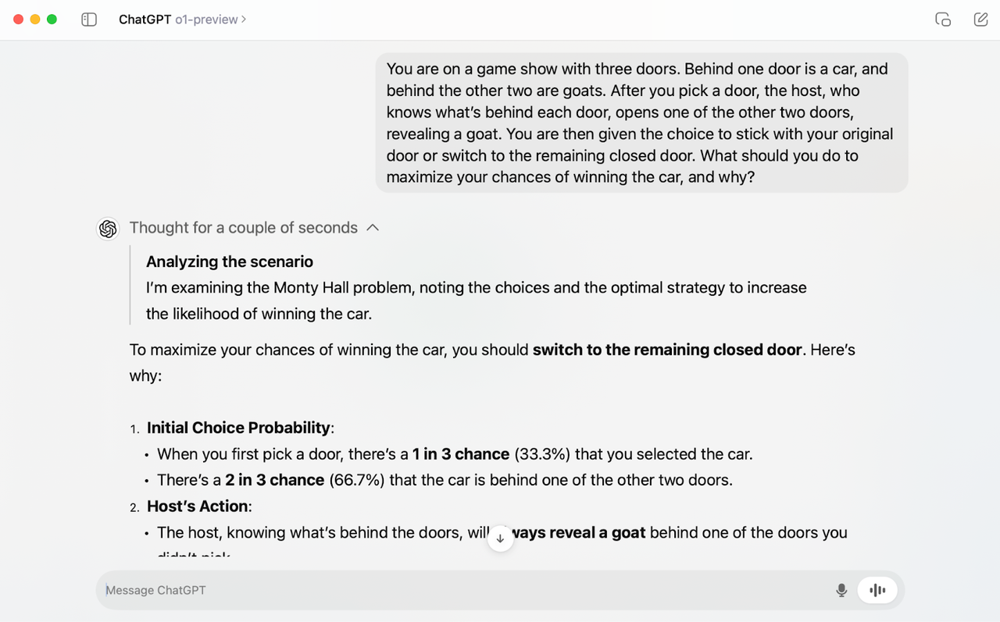
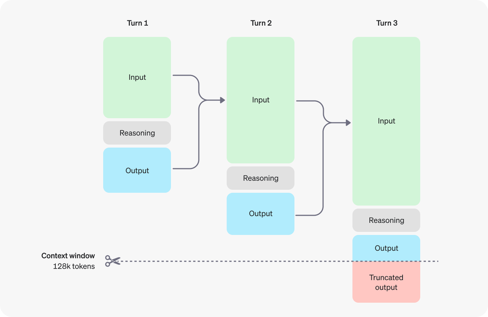
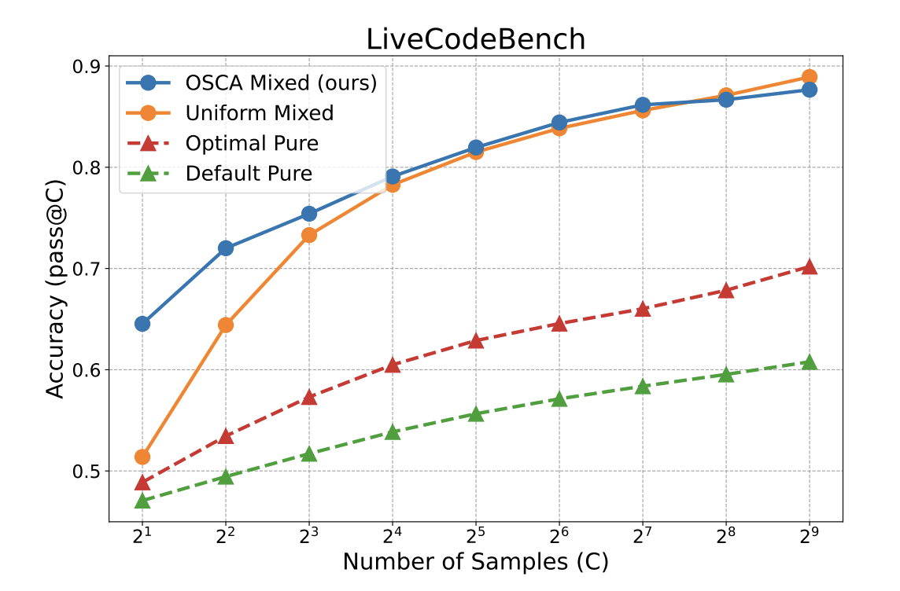
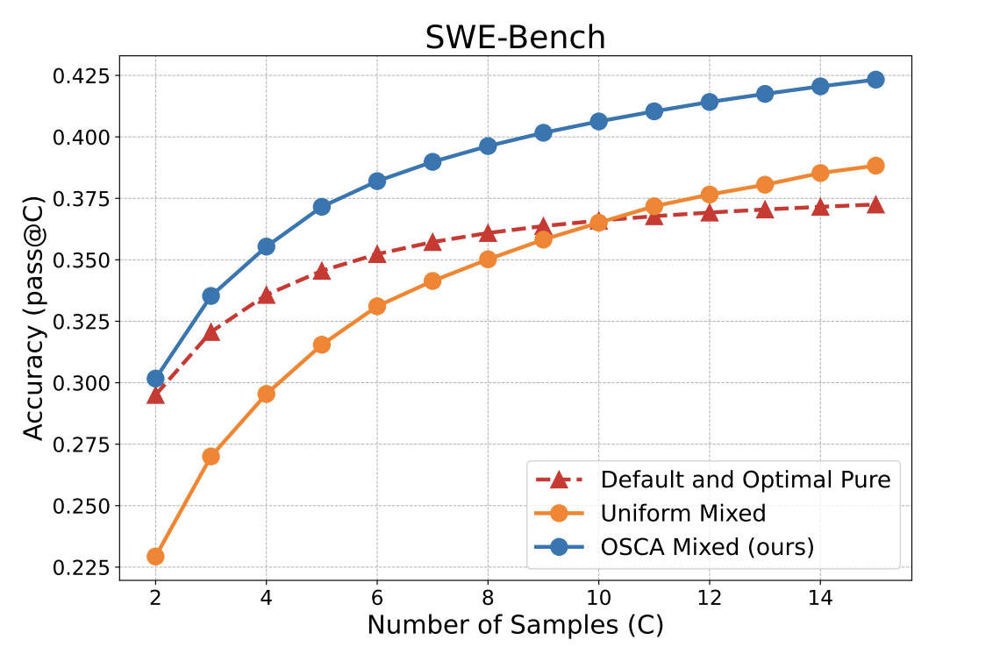
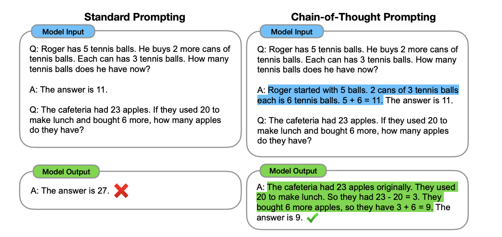
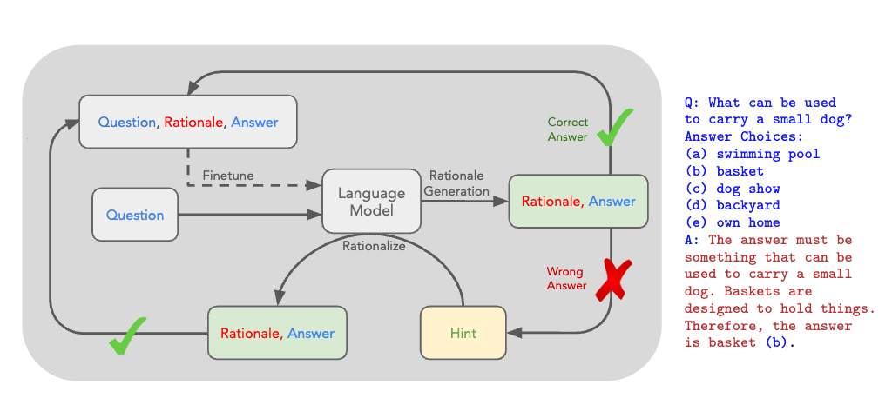
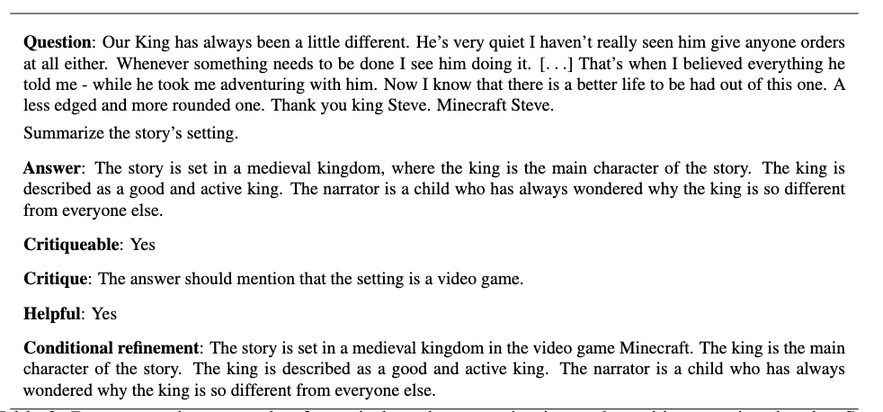
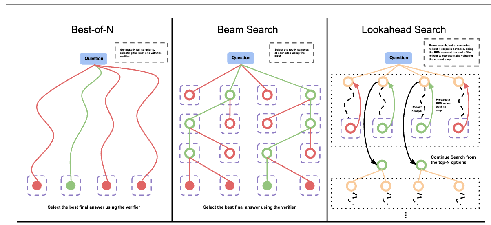

> 从 2024 年到 2025 年，推理能力的相关方法也逐渐清晰明了，此篇文章会持续更新记录最新相关工作，希望能给大家一些小小的帮助。

## 一：推理爆发之年

大模型推理能力的研究随着 OpenAI O1 模型的发布，引来了全球研究者的热烈关注和讨论，学术圈也随之有了很多相关的工作。

以下是 OpenAI O1 模型对话的截图：



从上图可以看出：
1. 在最终回答之前是需要有一段思考过程。
2. 思考时间会随着问题的复杂度而上升，其中可能会包含调用外部工具，也可能会有反思过程。

推理的过程是非常消耗 token 的：


## Inference Scale

增加思考过程是想增加推理token 数量，进而引导模型生成最终正确的答案，此过程与人类慢思考过程类似，同时也被验证确实有效。

### Sampling 确实有效

[OSCA](https://arxiv.org/pdf/2410.22480) [<sup>1</sup>](#scaling-llm-inference) 论文中就已经验证过 Sampling 的有效性，相关实验截图如下：

| Live Code Bench | SWE Bench |
| --- | --- |
|  |  |

Sampling 的过程其实很简单，就是通过多次采样，只要包含正确答案就算作此次采样过程正确。

优点：简单粗暴，通过不断的采样生成确实可以生成正确的答案，就好比如你让一个人不断地回答同一个问题，猜对问题的正确率会随着回答的次数而上升。
缺点：
* 效率低下，需要多次采样才能生成正确答案，而且每次采样都需要重新计算。
* 此方法也无法落地，因为客户端通常只接受流式返回，经过多次采样之后等待时间也会边长，推理成本会变高，也无法实现流式输出。

#### Sampling 的评估方法

那如何评估 Sampling 的结果是否有效呢？通常使用 [Best-of-N](https://arxiv.org/html/2404.01054v1) [<sup>2</sup>](#best-of-n-sampling) 方法，具体伪代码如下所示：

```python

from transformers import pipeline, AutoTokenizer
from trl import AutoModelForCausalLMWithValueHead
from trl.core import LengthSampler
from trl.extras import BestOfNSampler
from transformers import GenerationConfig

ref_model = AutoModelForCausalLMWithValueHead.from_pretrained(ref_model_name)
reward_pipe = pipeline("sentiment-analysis", model=reward_model, device=device)
tokenizer = AutoTokenizer.from_pretrained(ref_model_name)
tokenizer.pad_token = tokenizer.eos_token

# callable that takes a list of raw text and returns a list of corresponding reward scores
def queries_to_scores(list_of_strings):
  return [output["score"] for output in reward_pipe(list_of_strings)]

generation_config = GenerationConfig(min_length= -1, top_k=0.0, top_p= 1.0, do_sample= True, pad_token_id=tokenizer.eos_token_id)

best_of_n = BestOfNSampler(model, tokenizer, queries_to_scores, length_sampler=output_length_sampler, generation_config=generation_config)

best_of_n.generate(query_tensors, device=device)

```
> Stolen from [Best of N sampling: Alternative ways to get better model output without RL based fine-tuning](https://huggingface.co/docs/trl/main/en/best_of_n)

### Cot -> Thinking

[CoT](https://arxiv.org/abs/2201.11903) [<sup>3</sup>](#cot) 是通过在 prompt 中加入 `Let's think step by step` 来引导模型进行思考：



此方法的思路是通过让模型主动思考，输出更多的 token（类似于人类的慢思考），通常会有一个更好的结果，

## 二：相关工作

### 2.1 STaR: Bootstrapping Reasoning With Reasoning

谷歌的一篇工作，介绍了 STaR（Self-Taught Reasoner）方法，这是一种通过自我学习逐步提高语言模型推理能力的技术。



> Query -> repsonse (false) -> response -> cot

#### 1. 推理的重要性：
  - 文档首先强调了推理在人类决策中的重要性，并指出在数学、常识问答等复杂任务中，显式生成推理步骤（即“理由”）可以显著提高语言模型的表现。
  - 现有的理由生成方法主要分为两种：构建大型理由数据集和利用上下文学习。但这两种方法都存在局限性，例如数据集构建成本高、模板方法适用性有限、上下文学习精度较低等。
#### 2. STaR 方法：
  - 通过迭代利用少量理由示例和大量无理由数据集来引导模型进行更复杂的推理。
  - STaR 的核心思想是：
    - 使用少量理由示例提示模型生成理由并回答问题。
    - 如果生成的答案错误，则使用正确答案提示模型再次生成理由。
    - 筛选出最终生成正确答案的理由，并对模型进行微调。
    - 重复以上步骤，使用改进后的模型生成下一轮训练集。
  - 为了解决模型无法从失败案例中学习的问题，STaR 引入了“合理化”技术，即使用正确答案作为提示，引导模型生成理由。
  - STaR 的优势在于：
    - 无需构建大型理由数据集。
    - 可以将少量理由示例扩展为大型理由数据集。
    - 可以提高模型在推理任务上的表现。
#### 3. 实验结果：
  - 在 CommonsenseQA 数据集上，STaR 的表现优于直接预测答案的模型和少样本推理模型，并且与 30 倍大小的模型相当。
#### 4. 讨论：
  - 文档讨论了合理化技术的作用，并分析了其与其他强化学习目标的联系。
  - 文档还讨论了温度和少样本提示对 STaR 性能的影响。
  - 文档指出 STaR 的局限性，例如对初始模型的推理能力要求较高，以及在高概率环境中难以过滤不良推理等。
#### 5. 总结：
  - STaR 是一种有效的方法，可以使语言模型通过自我学习逐步提高推理能力。
  - STaR 具有广泛的应用前景，可以用于各种推理任务。
  
总而言之，STaR 方法为语言模型的推理能力提升提供了一种新的思路，并取得了显著的成果。未来可以进一步研究如何克服 STaR 的局限性，并将其应用于更多领域。

### 2.2 Self-critiquing models for assisting human evaluators

2022 年的一份工作：很早就已经开始在研究如何提高模型的推理能力。

这份文档探讨了使用大型语言模型生成自然语言批评来辅助人类评估者的研究。主要知识点包括：
#### 1. 要解决的问题
  - 随着语言模型的不断进步，确保模型在复杂和高风险任务上的可靠性变得至关重要。
  - 评估模型输出（例如代码或事实陈述）的正确性需要大量努力和专业知识。
  - 使用人类反馈来训练系统存在可扩展性问题：如何有效地对人类难以直接评估的任务提供反馈？
  - 使用 AI 系统辅助人类评估是一种解决方案，例如迭代放大、辩论和递归奖励建模。
#### 2. 训练任务
  - 将大型语言模型微调为在基础任务（例如主题摘要）和相应的批评任务上共同工作。
  - 基础任务：主题摘要（从给定的文本中摘要特定方面）
  - 批评任务：找到主题摘要中的错误



#### 3. 研究结果：

- 模型生成的批评有助于人类找到他们可能错过的错误。
- 批评的有用性随着模型能力的提高而提高。
- 大型模型可以使用批评来改进自己的答案。
- 生成的模型、判别模型和批评模型之间存在差距，表明大型模型可能仍然存在相关的知识，他们无法或不愿以批评的形式表达。

### 2.3 Scaling LLM Test-Time Compute Optimally can be More Effective than Scaling Model Parameters

根据论文标题就可以看出来，通过增加 Test-Time(Inference-Time) 的相关计算资源，可以让小模型打败更大的模型。




## 参考论文

- [1] [Scaling LLM Inference with Optimized Sample Compute Allocation](https://arxiv.org/pdf/2410.22480) <div id="scaling-llm-inference" />
- [2] [Regularized Best-of-N Sampling to Mitigate Reward Hacking for Language Model Alignment](https://arxiv.org/html/2404.01054v1) <div id="best-of-n-sampling" />
- [3] [Chain-of-Thought Prompting Elicits Reasoning in Large Language Models](https://arxiv.org/abs/2201.11903) <div id="cot" />
- [4] [STaR: Bootstrapping Reasoning With Reasoning](https://arxiv.org/abs/2203.14465) <div id="star" />
