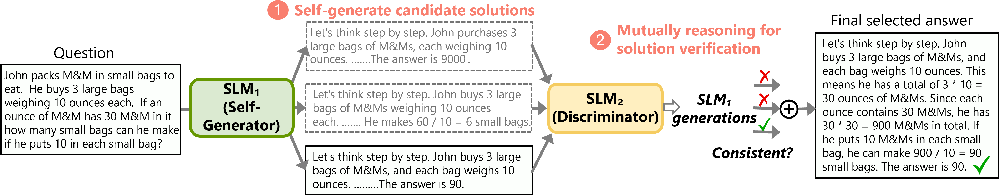

> 此文章内容持续更新

## O1 模型介绍

### 官方推荐 [Prompting](http://platform.openai.com/docs/guides/reasoning/advice-on-prompting) 技巧

由于官方的模型已经是基于 CoT 数据上训练过，此时模型已自带 Deep Think 的能力，此时对模型有以下要求：

1. 尽量保持 Prompt 简单。
2. 不要添加任何 CoT 的相关指令。
3. 使用一些分隔符来让不同概念之间保持清晰的语义，进而让模型更好的理解。比如：`***`、`<input>`、`<output>` 等。
4. 在 RAG 的相关应用当中，尽量保持上下文的内容足够简短且足够重要。

通常情况下，CoT 是需要在 Prompt 当中指定的（比如：你需要先思考 XXX 然后再分析 YYY，最后输出答案）。可是O1 模型的 CoT 的模板并不是由用户指定的，而是根据用户的问题来变动的，也就是说：模型可以根据用户的不同问题，进行不同的 CoT 模板，所以此前需要有一个动态 CoT Instruction 的内容。

`动态 CoT Instruction` 的内容旨在根据用户的问题来生成一个`后续该如何思考`的指令。

我相信思考过程肯定不是所有的thought path 都是线性的，在思考的实际测试过程中，不同点之间可能是没有依赖关系，互不影响，此时从工程和用户体验的角度肯定需要基于并行的方式来执行部分思考。

个人认为O1 模型就是OpenAI 针对于 Reasoning 场景做了一个 overfit 的模型，且具备一个强推理模式和能力的模型。

## Self-Play

什么是 Self-Play 呢？

## 训练阶段

根据目前网上的资料猜测，O1 模型基于 RL（强化学习）、CoT（思维链）等关键技术，此时对训练整体流程的遐想如下所示：

> 此图片来源于外网一位大佬

可以确定的是，O1 模型在训练阶段是加入了强化学习、CoT（我猜测是 ToT）的相关技术。

* O1 模型尝试将问题拆分成多个子问题，然后不同子问题并行思考执行（可以用类 DPO 的训练方式来训练），此时就需要有一个模型对任务拆分进行打分。当然思考的路径很长，都将其展示到用户端有些不太合适，此时就需要针对于当前的思考 path 进行 summary（OpenAI 官网上的thought 内容也是 summary 出来的）
* 

以前 CoT 仅仅是一个 Prompt 的策略，目前也逐渐将其引入到 Training 当中，进而增加在不同领域的推理能力。

> Large language models such as o1 are pre-trained on vast text datasets … and o1-mini is a smaller model optimized for STEM reasoning during pretraining.

从 OpenAI 以上的文本中可以推断：O1-mini 和 4o 在 pretraining 阶段是相同的，然后 O1-mini 在特定 reasoning 的数据集上进行 Post-Train（Continual pre-training），最后在 SFT 阶段也加入了 RL 的相关数据，最终得到此 O1 模型。

## rStar：或许是一个简易版本的 O1 模型

微软提出的一个基于小模型解决复杂推理的 Self-Play 训练方法，此方法被看作是 O1 模型的简单版本。

本论文聚焦于 SLM（Small Language Model）解决复杂推理问题，首先作者们认为 SLM 必须使用 multi-step 的方式来提升效果，推理时将问题拆分成一个个子问题，然后逐个细分解决，使用了蒙特卡洛树搜索的方法来试下。方法架构图如下所示：

方法：
1. 用蒙特卡洛树搜索（Monte Carlo Tree Search，MCTS）算法在一组决策空间当中选择对应的 Action，然后让模型沿着此路径进行生成。
2. 用另外一个能力相当的模型（Reward Model）对其进行打分，只有满足要求的路径才会被纳入到最终答案当中。

rStart Github Repo：[zhentingqi/rStar](https://github.com/zhentingqi/rStar)

## Let's Verify step by step

可用来基于小模型来构建一个决策树。

1. 

## 推理阶段

O1 模型根据用户的 query 拆分成多个子问题，然后并行推理执行（工程推理加速方法），然后每个 path 也会有一个 reward model 对其进行打分，

## 总结

* O1 模型不支持 FC、JSON Mode，所以感觉此模型是为纯 Reasoning 任务训练的模型。
* O1 模型背后***应该是***一个 Agent，可能会包含多个模型、ToT 方法、Reward Model 等内容。

* 对于一个垂类模型，只需要在增加其训练数据即可实现复杂的推理：内化到模型当中；对于一个通用模型，要增强其推理能力，要适配所有应用场景，唯有针对于不同奇葩数据的领域构建训练数据才行。可是如果让大模型能够自我解析，自我推理，通过 Prompt 即可实现复杂的推理。

## 相关方法

### Prompting Method

## 参考资料

* [[] ](sdfsdf)
* [[1] A Survey on Self-play Methods in Reinforcement Learning](http://www.arxiv.org/abs/2408.01072)
* [[2] Self-Play Fine-Tuning Converts Weak Language Models to Strong Language Models](https://arxiv.org/pdf/2401.01335)
* [[3] Training intelligent adversaries using self-play with ML-Agents](https://unity.com/cn/blog/engine-platform/training-intelligent-adversaries-using-self-play-with-ml-agents)
