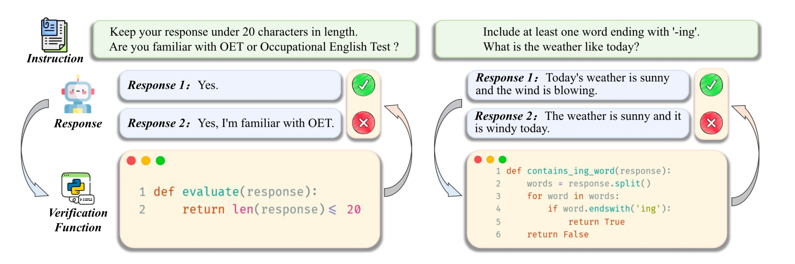

## Self-play with Execution Feedback：Improving Instruction-following Capabilities of Large Language Models

此论文旨在提升提供一个创建高质量指令跟随数据集的方法，进而提高在不同方法中指令学习的能力。

## 为什么有这个方法呢？

如果你遇到以下情况：
1. 如果你是某厂大模型数据组的牛马，业务方提交过来的想训入模型的数据质量就像一坨 💩 ，此时你很想打回去，不要让 💩 来污染你精心呵护的模型，此时你就需要有一些合入标准（就好比如 CI 一样可以保证提交的每一行代码符合公认的标准），而这个标准就是一个比较重要的手段。
2. 你还是某厂大模型的数据组的牛马，只不过此时你要自己构建一些高质量的数据来训练你的大模型，你可以通过复杂 Multi-Agent 的方式来保证你的数据质量，可是这个会让你构造数据的成本直接翻倍；此时为了在你设定的指令场景下又比较高的数据质量，此时可以写一段 hard-code 代码来保证其效果，
3. Instruction Follwoing 目前是业务中的关键需求，本质上是理解并执行用户的指令，是衡量一个模型能否满足业务落地的核心能力，所以，这个方向的研究对于当前阶段至关重要。

## 方法介绍

此方法核心思想是使用代码来校验instruction following 的数据集是否有效，进而提升数据质量。

它的核心方法介绍示例图如下所示：

方法步骤为：
1. 用 LLM 生成某领域内的 Instruction 指令，同时此类数据要保证能够使用代码来进行校验。
2. 再用 LLM 针对于已生成好的 Instruction 指令生成一份校验代码，然后用此校验代码来验证生成的Instructions 指令数据是否能符合预期。
3. 重复1和2两个步骤。
4. 最后用LLM 基于校验通过后的指令数据生成 Response，这些数据可以用来做SFT 的训练。那些失败的数据可以基于 feedback-based rejection sampling 的方法来整理成负例，同时也可以生成正例数据，此时针对于同一个instruction指令，可以将这些数据整理DPO 的数据来训练。

细节步骤架构图如下所示：

### 种子 Instruction 数据构建

作者们构建了一批种子数据来作为演化 Instruction 的初始数据集。

### Self-Instruction

基于上面的种子数据不断演化，从而生成不同领域的 Instruction 数据，从数据的多样性和数据的质量两个层面来提升生成数据的效果。

> 大模型的效果绝大程度取决于数据的质量，而数据的质量取决于数据集的多样性和数据集的质量。

### Automatic Quantity Cross Verification

在本论文当中，作者使用LLM 对生成的数据生成单测代码进行校验，如单测通过说明生成的数据符合预期，此时便说明此数据的质量符合预期，可以纳入到SFT或DPO 的训练当中来。

## 总结

此论文尝试使用生成代码的方式来对指令数据进行质量校验，从而提升指令数据的质量。