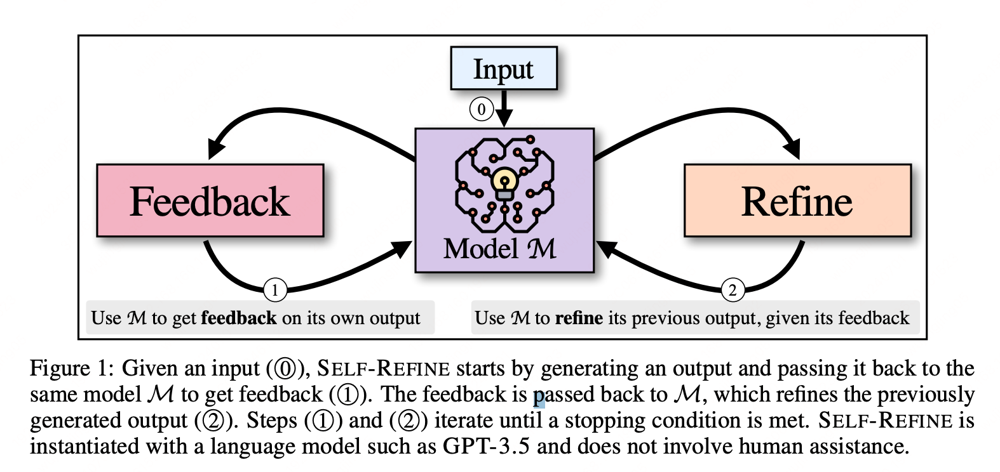

给大家分享一篇覆盖非常全面的 Prompt Survey 论文，适合周末读完，

> https://arxiv.org/abs/2406.06608

这篇论文探索了58种纯文本提示技术的结构化理解和分类，以及其他模态的40种技术。

📌 论文确定了58种基于文本的提示技术，并将其分为6大类：

* In-Context Learning：从提示中的示例/指令中学习
* Zero-Shot Learning：零样本 - 无示例提示
* Chain-of-Thought：思维生成 - 提示LLM阐述推理过程
* Decomposition：任务拆解，将复杂问题拆分为多个简单问题
* Ensembling：融合多种不同的信息并生成最终回复。
* Self-Criticism：让模型来评估模型的输出，如果不太好就需要重新解决。

整体方法分类图为：

[](./imgs/the-prompt-report-structure.png)

好了，我接下来将会给大家一一讲解上述内容，希望能够帮助大家能够更好的理解和应用Prompt相关技术。

## 为何 Prompt Engineering 如此重要

从现在招聘JD中即可看出一些端倪：Prompt Engineering 已在各大公司广泛应用，主要能够为各大业务赋能，我罗列出如下几点：

### 提升大模型性能和效果

通过设计和优化模型的输入提示（Prompt），能够显著提高AI的性能和效果。这种优化使得大模型在执行特定任务时更加准确、可靠。

一个会写Prompt的工程师，能够让大模型更精准的理解并完成各类复杂的任务，然后输出指定格式的内容，进而实现与现有系统进行对接，这点对于接入现有系统而言至关重要，推荐大家了解一下JSON Mode，目前主流厂商的API 当中都会加上这个功能。

### 广泛的应用场景

由于大模型现在啥都能干，完全颠覆了传统的NLP 范式，现在只需要通过编写Prompt即可完成传统的：文本分类、命名实体识别、对话系统、机器翻译、文本摘要等任务。而每个人而任务都需要编写有针对性的Prompt，即可引导模型生成更准确、更符合要求的输出。

:::tip 科技是第一生产力

以前三个工程师两个月才能完成的任务，现如今只需要使用大模型，一个 Prompt Engineer 一两天即可完成，这是一件非常颠覆性的事情，本人也非常感叹科技带来的革命性改变。

:::

图像识别与智能推荐：在图像识别和智能推荐系统中，Prompt Engineering同样发挥着重要作用。通过优化Prompt，可以提高图像识别的准确性和推荐系统的个性化程度。此外在推荐系统当中已经有一些尝试了，这是一个非常新的方向，建议老铁们可以冲一冲。

跨领域应用：随着不同领域对AI技术的需求增加，Prompt Engineering有望在更多领域得到应用，如医疗、金融、教育等，帮助这些领域更好地利用AI技术解决复杂问题。你看最近百川也是入局了大模型医疗，这是一个造福人类的方向，也希望能够在这个方向上能够做出一些颠覆性的工作，让人们看病、诊病、康复更加简单科学，进而延长人类的寿命。

### 模型的可解释性和可控性

Prompt Engineering有助于提高大模型的可解释性。通过设计和优化Prompt，可以更好地理解模型的内部工作原理，从而增强人们对AI技术的信任和接受度。CoT 中的 Thought 就是一个非常具备可解释性的内容，能够让我们看到大模型是如何推理的，如果有任何问题，我们可以有针对性的优化 Instruction，进而不断地提升应用效果。

通过精心设计的Prompt，可以更加精准地控制大模型的行为和输出，使其更加符合用户的期望和需求。

### 推动自然语言编程的发展

随着Prompt Engineering技术的不断进步，自然语言编程的应用空间变得更加广阔，用户可以通过自然语言指令与大模型进行交互，实现各种复杂的任务和功能。

:::tip 未来人机交互

未来人机交互都将会是通过自然语言来完成，你只需要告诉机器人你的诉求，他就可以完成指定任务，甚至能够自我更新，自我进化，不断满足你的各类需求。

:::

Prompt Engineering 使得开发人员能够更加高效地利用大模型进行开发工作，减少了对传统编程语言的依赖，降低了开发门槛和成本。

### 应对大语言模型的挑战

Prompt Engineering有助于缓解大语言模型中存在的幻觉问题（即生成并不存在的信息或事实）。通过优化Prompt设计和通过RAG相关技术，可以让模型的输出更加真实、准确。

随着大语言模型能力的不断增强，编写高质量的Prompt变得越来越重要。Prompt Engineering使得开发人员能够更好地发挥大语言模型的优势，实现更加复杂的任务和功能。

说了这么多，你能理解Prompt Engineering为何如此重要了吧。快学起来 ！！！

## Prompt 介绍

### 什么是Prompt

简单来说，就是你给LLM的输入。可是为了让LLM完成人们不同种类的任务，就需要不同类型的Prompt（具体方法下面会介绍）。

### Prompt 的构成

通常为了完成一个复杂的任务，其 Prompt 当中包含以下内容：

* Instruction：就是你想让LLM 帮你完成任务的各种指令，比如：`当用户咨询你天气时，你需要调用 get_weather 工具然后回复用户真实的天气信息`。
* Examples：如果不给examples，那就是zero-shot，效果可能会不太好。面对复杂任务，我们还是建议在Prompt 当中适当的增加高质量的examples（few-shot）进而让LLM 更精准的遵循你的指令。
* Output Format：你可以控制LLM的输出格式，比如输出markdown、json、yaml 等相关格式，进而更好的用编程语言进行读取加载，进而实现与现有系统进行对接。
* Style Instruction：和Instruction 不一样的是，这个主要是对于输出做整体的要求，比如：输出内容俏皮可爱、输出言简意赅等。
* Role：通常你可以在Prompt 设置一个agent 的角色，进而提升LLM 的输出内容质量，更符合人类的偏好，比如：**假设你是一个段子手，请用风趣幽默的话语来回答用户的各种问题**。
* User Info：在对话的过程中，可以将用户的最新信息动态的添加到 Prompt 当中，进而实现更加精准的对话状态控制，比如用户的姓名为：XXX，用户的所在地为：YYY，用户是否有购买意愿：无购买意愿，......等等。
* System Info：可以添加一些系统信息，比如当前北京实现，Agent的介绍信息等。

### Prompt 相关的术语

因为 Prompting 相关的技术目前处于早起，相关术语正在快速发展，不确定未来会不会出现新的相关术语，在此我先罗列出目前出现的最新术语，提供大家参考：

* Prompting：包含 prompt + LLM generating + parse response 等多个过程。
* Prompt Chain：包含多个Prompting 的过程，是 Prompt Workflow 或 Multi-Agent 的关键部分。
* Prompt Engineering：主要介绍通过prompt 来完成某指定任务的过程，可以认为这是Prompt Engineer（提示词工程师）的工作内容；
* Exemplar：主要是对于一个任务的输入和输出的示例，进而让模型更精准的理解用户的用途，更稳定的输出指定格式的内容。
* Agent：智能体的概念就比较复杂，最简单的Agent就是：Prompt + LLM，提前编写好Prompt，然后包装成一个应用与外界进行对话，此时就是一个Agent。当然内部可以包含非常复杂的逻辑，甚至一个Agent可以嵌套另外一个Agent，这都是可以的。

## In-Context Learning

### 什么是 In-Context Learning

简单来说，就是提供具备一定信息量的上下文，让模型能够精准的学习关键知识，遵循相关指令。。

确切来说，就是编写具备一定引导性的Instruction、提供高质量的Examples、提供足够的外部知识提升大模型在目标任务上的能力。而这一切过程都没有模型的参数更新，仅仅是通过调整Prompt的内容即可完成。

:::tip 其实 Prompt Engineering 一点都不 Low

可能对于一直做LLM Finetune的算法工程师而言，Prompt Engineering 没啥关键技术，非常的Low，可是这就好比如模型训练过程中的 gradient descent 背后的技术就是：链式求导，哪些学数学的小伙伴肯定也是觉得很low，不过不得不承认，链式求导之后进行参数更新对于模型训练而言，至关重要。

:::

In-Context Learning 算是大模型目前最基础的能力之一了，其中Instruction Tuning分支就严重依赖于此能力。如果大家感兴趣的话，我可以写一篇文章来详细介绍此能力。

### Few-Shot Prompting

是不是看起来非常熟悉呢？以前有一个 Few-Shot Learning的NLP 方向，本质上也是给少量的几个case，然后训练模型基于此来学习领域内的知识。

而Agent时代的 Few-Shot 就是prompt 当中添加少量的case 来提升大模型在目标领域的理解能力。

比如当你想用大模型开发一个计算机的功能，并以中文回复，此时也可以在其中添加部分few-shot examples，示例如下所示：

```text
2+2: 四
4+5: 九
8+0:
```

当然，这个是最简单的examples 的例子，当功能变得更加复杂，此时 Examples 也需要写的更加复杂，那此时对Examples 的编写也有一定的要求：

* Example 的质量至关重要

认真编写覆盖你业务场景下的 examples 能够有效提升Prompt的效果，可是也不要加太多，如果超过了20个，效果就会降低。

* Example 的顺序也是有讲究的

在一些具体任务上，不同的 Example 顺序能够产生 -50% - 90%+ 的效果。

关于这点的话，还是比较玄学，不过有一定的前置条件：examples 的数量比较多时此问题才会特别明显。目前没有啥解决方案，必须得你不断的测试调整才能够在目标领域上缓解此问题。

* Example 的类别尽量均匀

如果你是做一个二分类的任务，有10个example 是关于0类别，有2个example是关于1类别，此时大模型的效果就肯定更偏向于1类别，由此可见，Few-Shot Examples 的类别分布要尽量均匀，此时才能够让模型有更高质量的输出。

此时如果一两个example已经能够解决70%的任务，想要继续提升效果，此时就需要针对于那些hard-case 编写高质量的example，进而提升效果瓶颈。

* Example 的格式

Example 的格式也会影响模型的效果，其中最常见的格式为：

```prompt
Q: {question}
A: {answer}
```

当然，针对于不同的任务应该有不同的输入输出格式，而大模型很擅长根据Instruction 和 Examples 输出指定格式的内容。

你也可以尝试多种不同的输入输出格式来测试效果，这也是Prompt Engineering中的重要一个环节。

* Example 的分布

如果你的Few-Shot Examples 能够更贴近测试中的Case，此时生成的效果也会更好。

此外，你也可以增加 Examples 的分布情况，尽量覆盖不同的边界情况，此时生成的效果也会更好。

总之，你给的 Examples 与真实场景更贴近，覆盖的范围更广，生成的效果就会更好。

### 动态选择 Few-Shot Examples

如果你针对于目标场景下有很多的Examples（假设有100个case），此时是否一股脑儿将其全部塞入到 Prompt 当中吗？

非也非也，上文也讲过：
* 如果一个Examples 的数量超过20个，反而会降低模型生成的效果。
* 如果 Examples 的分布与真实输入场景越接近，此时模型生成的效果会越好。

于是，Examples 的选择如果动态起来，此时效果会越好。那如何选择Examples 也有相关的方法：

#### K-Nearest Neighbor（KNN）

方法很简单，可以针对于 所有的Examples 建索引，然后根据query 来召回出最相近的一批Examples，然后塞入到 Prompt 当中，即可提升模型的效果。

可是此方法有一个缺点：Examples 都是相似的，分布太集中，可能会影响模型的泛化性。

#### Self-Generated In-Context Learning

在Zero-Shot场景中，此方法能够有一定的提升效果，可是也存在一定的风险：一旦动态生成的 Examples 不符合目标领域效果，此时会将模型的生成内容给带偏，大大降低目标领域上的效果。

在实际开发过程中，如果能编写一些 Examples 就尽量写，而且也不是很复杂，也能够更稳定的控制好模型的输出效果，此方法不太建议大家使用。

#### 更复杂的Prompt 方法

比如说：LENS、UDR以及Active Example Selection 等方法利用了 embedding、retrieval以及强化学习等相关技术来筛选Examples，这样能够让Examples有更好的效果。

:::warning

这些复杂的方法我后续会详细展开给大家讲解介绍。

:::


## Zero-Shot Prompt

相比于Few-Shot，此类别中是没有提供任何Examples，此时模型没有任何先验知识可以参考，那如何提升模型效果呢？

> 个人感觉 Zero-Shot的方法可以使用在Few-Shot 上面，进而让Few-Shot的效果上升一个档次。

### Role Prompting

编写角色说明，此时能够让模型能够站在某个角色的立场上有更符合目标偏好的输出。比如：

```prompt
你是一个可爱旅游导员，擅长使用俏皮可爱的话语来给大家介绍不同的景点，在面对旅客的刁难，你总是会用撒娇的方式来向用户表达歉意，然后给出一定具有建设性的建议给旅客。
```

以上的角色描述其实是在整体层面来规范输出风格，基本上属于 Prompt Engineering中的基操了。

### Emotion Prompting

如果模型的输出不太稳定时，此时可以加入一下强调描述词，进而增加输出内容的稳定性。

比如你想让模型输出 JSON 格式的内容，可随机性就是很大，此时可通过以下描述词来提升效果：

```prompt
求求你了，一定要输出JSON格式的内容！！！
重要的事情说三遍：你一定要输出JSON 格式的内容！你一定要输出JSON 格式的内容！你一定要输出JSON 格式的内容！
```

类似于以上的prompt可以增加输出的稳定性。

听起来很扯，可是大模型时代的编程就是如此。

### System2 Attention

不知道大家读过《思考快与慢》这本书没，可以大致了解下：人通常有两种思考方式，一种是快思考，可以认为是人的本能反应，另外一种是慢思考，就是经过缜密的思考之后的结果。

而这个对于大模型解决复杂问题有非常明显的提升效果。

此方法就是通过：在生成之前先慢思考，仔细分析用户的问题并重新调整 Prompt 之后再让模型来输出，这样可以生成有针对性的思考内容，进而提升整体效果。

:::tip 思考快与慢

有一点需要注意，重新prompt 可以认为是一个 Rewrite Agent，然后最后的生成也可以认为是一个Agent，所以用到了Agent Workflow的相关方法。

:::

### Rephrase and Response(RaR)

这个方法没有修改整体的Prompt，而是修改用户的Question。

在生成之前，对用户的Question进行重写，然后将其拆分成多个相关的问题，让模型来生成，此方法能够有效提升用户Question 的质量，进而让模型有更好的输出。

### Re-Reading（RE2）

在Instruction 中可以写上：在生成正式回答之前请再认真阅读用户的问题，据作者说可以有效提升在复杂问题上的效果。

### Self-Ask

对于一个复杂问题，模型通常无法直接回答，此时可让模型决定：是否要对齐问题进行拆解成多个子问题，然后依次回答对应子问题，等最终都回答完毕后，再回答最终问题。

其实这个方法也算是任务拆解，只不过问题呗拆解之后，还是自己来解决此问题，没有使用外部工具，甚至独立的LLM 来解决。

## Chain-of-Thought 相关技术

CoT 相关技术我相信大家都早已听说过，本质上还是让模型多思考一点，经过缜密的思考之后得到的答案也会更加准确，这个与上面介绍的System2原理类似，也是借鉴人类的思考方式。

:::tip 人类其实是大模型的训练数据

大模型从人类的文字中学习，此时也潜在的学习了人类的思考方式，是不是有点后背发凉

:::

好了，不闲聊了，开始正式介绍 CoT 的相关技术吧。

首先就是来介绍一下原始的论文，作者仅仅在Prompt 当中添加了“let's think step by step”就可以提升在不同任务上的效果，可以看出让模型多思考一会儿（让子弹飞一会儿）是非常有效的trick，而后续无数的研究者都证实了此方法有效。

### Zero-Shot CoT

像原始论文中仅仅加入了：“let's think step by step”就是属于Zero-Shot 方法，可是除了这句话，还有其它的sentence可以让模型有更好的思考方式。

:::tip 人是如何思考？大模型是如何思考？

写到这里，突然感觉其实CoT就是在让模型如何思考。上升到更上层的维度，思考方式对于人而言至关重要，大决定了一个人的命运，小到如何有效解决一个问题。

所以大模型的思考方式也是一个非常有趣的话题，当然这个除了你告诉他如何思考之外，也取决于背后LLM的思考能力，是否有训练过多种思考方式（与训练数据集相关）。

:::

这里也有一起其它的方法能够让模型有不同的思考：

```prompt
你需要一步一步的思考并解决此问题，最终保证你真的解决了此问题。

首先，你需要从不同层面且具备一定逻辑性的思考这个问题。
```

Zero-Shot CoT 的方法应用也是非常广泛，同时非常吸引人，因为：构造Examples 也需要一定的成本（虽然我并不觉得 Examples 的构造有多复杂）。

* Step-Back Prompting

此方法主要是让模型在开始Reasoning之前先生成几个更上层的问题和概念，然后回答它，此时能够让模型获得更全面的整体信息，进而提升回答的效果。

* Thread-of-Thought Prompting

这个方法相对比其它方法，也是换汤不换药：让LLM从不同角度来思考（给予模型不同的思考方式），进而提升模型的效果。

关键Prompt 如下所示：

```prompt
Walk me through this context in manageable parts step by step, summarizing and analyzing as we go.
```

* Tabular Chain-of-Thought

这个更TM有意思，让模型以Markdown的方式来输出，进而提升模型的结构化推理能力。

大家可自行编写适应与你们自己任务的Prompt，目标就是让思考过程 markdown 化。

:::tip 老铁你们说，这个想法能发一篇论文吗？

在这里脑暴一下，我如果让思考过程以json 的方式来输出，效果会不会更好呢？是否有资格发一篇论文呢？

:::

### Few-Shot CoT

顾名思义，这个是在Prompt当中添加一些Examples 来提升CoT 的效果，那如何实现呢：在Example当中添加Thought 的数据，这样，模型就可以借鉴一些“思考”，进而进行更稳定的思考。

Example 中的思考可以是人手写的，也可以是模型动态生成的。

所以Few-Shot CoT 的目标就是提高Thought 的准确性。

* Contrastive CoT Prompting

通常我们会添加一些正确的思考内容，可是作者提出，我们同时也需要给出一些错误的思考方式，今日提升思考正确性。

简单来说，我们不仅仅要提供“我们应该这样思考”，还要提供“我们不应该那样思考”，这样LLM的思考效果才会更好。

:::tip 实在是不想读了

论文中还介绍了一些其他Few-Shot CoT 的方法，我这边没有写，因为在我看来，这TM全部是都是注水论文，没有任何实用价值，免得脏了您的眼，所以我就没有写，如果你们感兴趣的话，可以亲自去读一读 `2.2.3.2 Few-Shot CoT`这个章节。

:::

## Decomposition-任务拆解

此类方法的核心思想是：将复杂问题拆解成一个个简单的问题来解决。这个跟CoT的思考非常类似，可是又不太一样：CoT 是在一次生成中完成，可是任务拆解会分为多次模型执行，这样不同任务之间是互不影响的，实践证明这是可以有效提升模型解决复杂问题的能力。

### Least-to-Most Prompting

此方法分为三个阶段：
1. 将用户的问题拆解为多个子问题，同时并不解决他们。
2. 将上一个阶段中的子问题用分步并行执行的方式来解决。
3. 汇总以上内容，并生成最终答案。

此方法在多种不同的任务当中均有非常明显的效果提升，比如符号推理、数学推理等。

### Decomposed Prompting

这个方法与 `Least-to-Most Prompting` 方法类似，区别在于：此方法用了外部工具来解决需要计算、需要外部知识的子问题。

这个效果肯定好啊，这个也印证了吴恩达的Agent Workflow的方法论。

### Plan-and-Solve Prompting

这个方法的Prompt为：`首先，让我们来思考用户的问题；然后，制定任务来解决；最后，让我们挨个儿解决这些任务。`

这个相对于Zero-Shot CoT 具备更好的推理能力。

:::note

个人感觉主要的提升有两点：
* 将任务拆分成独立可执行的子任务，有效的屏蔽了不同子任务之间在生成的时候干扰信息。
* 在执行不同子任务的时候，可以利用外部工具来解决具体问题，进而提升整体效果。

:::

### Tree-of-Thought

和上面的方法相比，此方法可以将某个子问题再次拆解成不同的子问题，进而可以解决非常复杂的问题。

优点是：在针对于特别特别特别复杂的问题时，我相信这个行之有效的。
缺点是：特别特别特别复杂的问题，在实际应用当中不会出现，而且此方法甚至会大大提高模型回复的时延，进而降低使用体验。

### Program-of-Thoughts

核心思想是：用生成代码来解决用户的问题。

最简单的case 就是：当用户询问：3^12是多少时，此时可以生成一段python来解决此问题。

此方法是代码解释器的基础思想，也是能够用程序解决用户复杂问题的关键方法之一。

## Ensembling

> 准备针对于这个取一个比较好的中文名字，可是想不出来，如果各位老铁有比较好的推荐，请在下面评论区回复，非常期待各位老铁的互动。

此方法的核心思考是：使用多个不同的 prompt（Agent） 来解决同一个问题，最后将答案融合起来，生成最终答案。通常情况下，为了让答案更加准确，可能会有使用投票的方式选择相同答案最多的那一方，可是 Emsembling 方法可以能够减少这种方法带来的部分扰动，进而提升答案的准确性。

:::tip Multi-Agent

Multi-Agent 就是这种范式。

:::

在这个方向有很多优秀的工作，接下来我将一一介绍。

### Demonstration Emsembling（DENSE）

通过创建多个不同 Domain 的Few-Shot Examples，然后让多个Agent 分别来推理生成，最后让LLM 来整合最终答案。

个人观点：
* 优点：此类方法简单粗暴。
* 缺点：浪费资源，这个和few-shot 当中要增加examples 的分布范围想违背，属于另辟蹊径的方法，不太可取。

### Mixture of Reasoning Experts （MoRE）

此方法则是创建多个：reasoning expert，此时让LLM针对于同一个问题进行同步推理，然后在其中选择最终答案。方法的架构图如下所示：


### Self-Consistency

这个方法背后的底层逻辑是：面对同一个问题，不同的推理方式最终都会指向同一个答案。

那如何实现呢：

1. 首先调整temperature，让模型多次基于 CoT 的方式来生成最终答案。
2. 最后同构投票的方式来选择最终答案。（具体投票方法可以有多重，大家自行设计即可）

此方法在 算数计算、符号推理、数学推理等任务上均有非常明显的提升效果。

### Universal Self-Consistency

此方法与上面的 Self-Consistency 方法类似，区别只是在于：此方法使用 prompt template 来选择最终的答案。


啊这......

这都能发一篇论文，只能说 Agent 时代的论文创新随地可捡。

简单的吐槽一下，不过按道理来讲，这也算是一种创新，只是站在现在的角度而言，这难免有点 ......

### Meta-Reasoning over Multiple CoTs

此方法和 Self-Consistency 和 Mixture of Reasoning Experts 类似，只不过此方法：仅仅先生成多个reasoning path，此时将多个 reasoning path 融合到一个final response template 当中来生成答案。

## Self-Criticism

当模型基于用户的问题和一系列骚操作，得到了最终的输出之后，那这个输出难道就是最终的正确的答案了吗？

那可不一定，此时也可以用大模型来评估输出是否正确，此类方法就是自我纠正（Self-Criticism）。

此阶段中会使用不同的prompt来进行评估，可以认为是不同的人类角色，具备不同的认知和背景。虽然基座可能是同一个模型，可是通过更上层的认知限制和规则，依然能够给出非常不错的效果。

### Self-Calibration

此方法算是此系列方法中最早出现的，核心步骤如下：
1. 首先让LLM 生成答案。
2. 然后将问题和答案同时塞到一个prompt template 当中，让其判断答案是否正确。

### Self-Refine

此方法构建了一个不断纠正的loop，通过在answer、prompt和question 上面不断迭代，进而提升框架的效果。整体的架构如下所示：



个人感觉，这个迭代过程可以优化的点非常多，可以从 Prompt、Examples、Answer、Multi-Agent 多个角度来优化，所以这个也算是一个比较通用的效果优化迭代框架。

### Chain-of-Verification

此方法的核心方法是：

1. 先基于用户的问题生成初版本 response。
2. 再针对于response 提出各种问题，进而解决 response 中的多种不确定性。
3. 最后聚合多种答案生成最终答案。

执行原理架构图如下所示：


## 总结

此篇论文中介绍的方法实在是有点多，我会在自己学习工作的当中将觉得重要且有价值的方法持续不断的更新到 [wj-Mcat/agent-handbook/](https://github.com/wj-Mcat/agent-handbook/) 当中，也非常欢迎大家一起学习交流。
