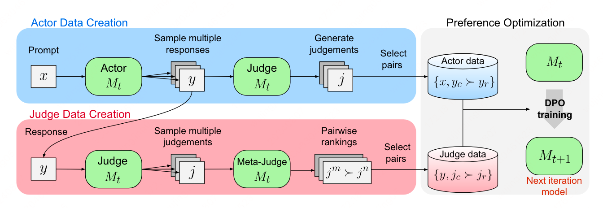

现在LLM-as-a-Judge 概念这么火，那Judge 的能力绝对不能弱啊，所以作者提出了新的方法来提升模型Judgement的能力。

方法简要介绍：
1. 让模型推理得到结果
2. 同时来评估答案的内容
3. 用评估结果来调整训练模型

效果：能够提升模型judgement和 Instruction following的能力。



## 方法详细介绍

该方法使用一个seed-model（已经SFT过，同时具备Instruction Following的能力），然后有如下流程：

* As-a-Actor: 根据输入得到对应的 responses。
* As-a-Judge: 根据输入和responses进行打分（Judgement），一般会提供一个CoT的思考过程，这个也是一个非常重要的计算依据。
* As-a-Meta-Judge: 对它的Judgement进行比较打分。

其中第三个阶段是核心工作内容，对应的 Prompt 如下所示：

```text
Review the user’s question and the corresponding response, along with two judgments. Determine which judgment is more accurate according to the rubric provided below. The rubric used for the initial judgments is as follows: - Add 1 point if the response is relevant and provides some information related to the user’s inquiry, even if it is incomplete or contains some irrelevant content. - Add another point if the response addresses a substantial portion of the user’s question, but does not completely resolve the query or provide a direct answer. - Award a third point if the response answers the basic elements of the user’s question in a useful way, regardless of whether it seems to have been written by an AI Assistant or if it has elements typically found in blogs or search results. - Grant a fourth point if the response is clearly written from an AI Assistant’s perspective, addressing the user’s question directly and comprehensively, and is well-organized and helpful, even if there is slight room for improvement in clarity, conciseness or focus. - Bestow a fifth point for a response that is impeccably tailored to the user’s question by an AI Assistant, without extraneous information, reflecting expert knowledge, and demonstrating a high-quality, engaging, and insightful answer. 

User: {prompt} 

Response: {response} 

Judgment A: {judgment a} 

Judgment B: {judgment b} 

After examining the original question, response, and both judgments: - Explain which judgment is more accurate according to the original rubric and why. Consider factors such as adherence to the rubric, accuracy in evaluating the response, and consistency in applying the criteria. - Conclude with a clear statement of which judgment is better using the format: “Winner: [Judgement A | Judgement B]”
```

最后质量最高的 Judgement 将参与到模型的训练当中，进而提升模型的Judgement能力。
