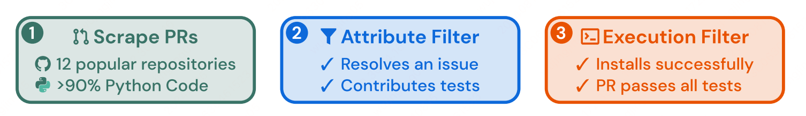
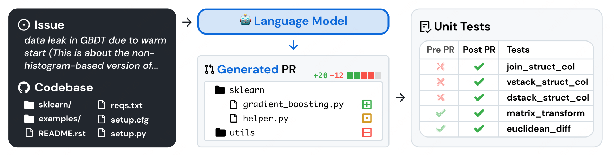

现实中的软件开发问题非常复杂，为了公正全面的评估现实中开发过程，作者根据Github issue 创建了一组评估数据集，主要是Python相关语言。

给定一个Issue 的描述，此时LLM需要基于当前的代码版来修改此问题，此时就涉及到对于代码的修改横跨不同的package、file、class、method等多个维度，同时还需要和真实执行环境进行交互，输入文本长度会很长（在输入中塞入不同file的所有的代码，此时消耗的token会很多）。

## Benchmark Construction

Github 上面的项目很多，质量层次不齐，此时需要构建一个高质量的数据集需要进行严格的筛选，此时会有如下筛选标准：

### Repo 筛选和数据筛选

筛选出Github 排名12的Python项目，首先因为他们的PR数量多，代码质量高，具备完整的单测和Contributor Guides（通常是先发Issue，再发PR来fix，此时就容易构建训练数据）。

### PR 筛选

不是所有的PR都要纳入到评估数据集当中，也是需要经过一定筛选：
* 该 PR 是否被合入
* 是否有解决Issue中的问题
* 是否有修改单测中的文件（保证新增的功能是否有通过单测进行监控到）

### 单测检测

用合入后的PR单测来检测合入前后的代码版本，如果从fail变成pass即说明此PR解决了Issue中的问题。

## 任务定义

### 模型输入

输入是一个Repo 中的issue 描述和整个CodeBase的代码文件，于是模型就需要基于Issue在整个Codebase 上面进行修改。

### 评估指标

当模型生成修改建议（[diff](https://en.wikipedia.org/wiki/Diff)）后可通过（[patch](https://en.wikipedia.org/wiki/Patch_(Unix))）命令将changes应用到当前代码库当中，然后来执行单测，如果单测通过了，则说明此修改建议解决了Issue中的问题。

针对于某一个任务是通过单测来监控是否通过，针对于整个评估任务，是通过ACC来作为整体评估指标。

## SWE-Llama：通过finetune的方式来优化模型解决问题的能力。

作者在实验中通过finetune CodeLlama 7/13B 模型来提升在SWE-Bench上的模型能力，可是也存在一些问题：

1. Issue 中的描述质量层次补齐，模型很难Follow其中的指令。
2. 模型是无法重新生成整个repo 的代码，理想情况下至需要生成 git diff 的部分内容即可。

### 训练数据

作者从Python top 37 仓库当中筛选出 19000 个 Issue-PR 对用来训练，此时不需要模型生成单测相关的代码。

### 训练细节

为了让模型能够生成 patch 相关内容（关键修改代码），此时需要对训练数据进行构建：

1. 通过Prompt将 Issue 描述和相关代码文件拼接起来作为模型的输入。
2. 将patch作为训练中的可学习内容（golden patch），这样模型就只需要学习最关键的部分内容即可。

作者使用Lora进行finetune，同时将训练数据中总长度超过 30000 的token 给剔除掉了，最终控制到 10000 个数据集。

## 实验设置

### Retrieval-Based 方法

在模型的输入中，issue 的描述是非常短的，作者训练数据集中平均长度为195个token，而整个CodeBase的token是非常长的：438K **行**代码（还不是token哟）。

此时两者长度极度不均衡，会导致模型难以理解issue 问题，也无法从代码中找到对应的修改位置：非常考验LLM的长文本理解能力，很显然，这种能力是经不起考验的，此时就需要想办法来解决。

最直观的想法肯定是：从codebase 当中召回出对应的文件，然后塞入到模型当中。

此时 Dense-Retrieval 不太适合当前任务：query 和 document 都太长了，现有 dense-retrieval 的模型支持长度都比较短，所以没办法适用。所以作者们采用了BM25（关键字召回）的Sparse-Retrieval 的方法来召回出相关代码文件。
