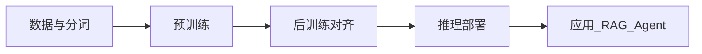

# 什么是大语言模型

## 要解决的问题

如何让计算机**理解、生成并推理**自然语言，并在开放域任务上达到可用智能？传统 NLP 为每个任务单独建模；大语言模型（LLM）通过**单一预训练模型 + 少量后训练**，统一覆盖对话、摘要、代码、推理等能力。

## 核心定义

| 概念 | 含义 |
| --- | --- |
| **语言模型（LM）** | 对文本序列 $p(x_1,\ldots,x_T)$ 建模，通常分解为下一 token 预测 $\prod_t p(x_t \mid x_{<t})$ |
| **大语言模型（LLM）** | 参数量达数十亿～万亿级、在超大规模语料上预训练的 **自回归 Transformer**（主流）或同类架构 |
| **基础模型（Foundation Model）** | 预训练后尚未针对单一下游任务精调、可作为多种应用基座的模型 |

「大」主要体现在：**参数量、训练 token 数、算力与数据工程复杂度**。

## 能力从何而来

1. **规模（Scale）**：参数与数据增至一定阈值后，少样本学习、指令遵循、链式推理等 **涌现** 能力更明显（存在学术争议，见 [3.4.5 涌现能力](../03-pre-training/04-scaling-laws/05-emergent-abilities)）。
2. **自监督预训练**：从互联网文本学习语法、事实、风格，无需人工标注每一句话。
3. **后训练对齐**：SFT、RLHF/DPO 等使行为符合人类偏好与安全策略（见第四部分）。

## 与相邻技术的关系

- **Transformer**：当前 LLM 的默认骨干，见 [第二部分](../../02-transformer/)。
- **RAG / Agent**：在 LLM 之上增加检索、工具与规划，见 `docs/` 默认文档区 Agent 章节。
- **多模态大模型**：在 LLM 上扩展视觉/音频编码器，本大纲以 **文本 LLM** 为主。

## 工程视角：训练与应用栈

## 局限

- **幻觉**：生成看似合理但事实错误的内容。
- **知识截止与上下文边界**：依赖训练数据时间与窗口长度。
- **成本**：训练与长上下文推理的算力、电费与延迟。

## 参考链接

- 发展脉络：[1.1.2 LLM 发展简史](./02-llm-history)
- 技术栈：[1.1.3 LLM 的技术栈全景](./03-tech-stack-overview)
- 入口时间线：[LLMs 发展历程](../../00-intro)
