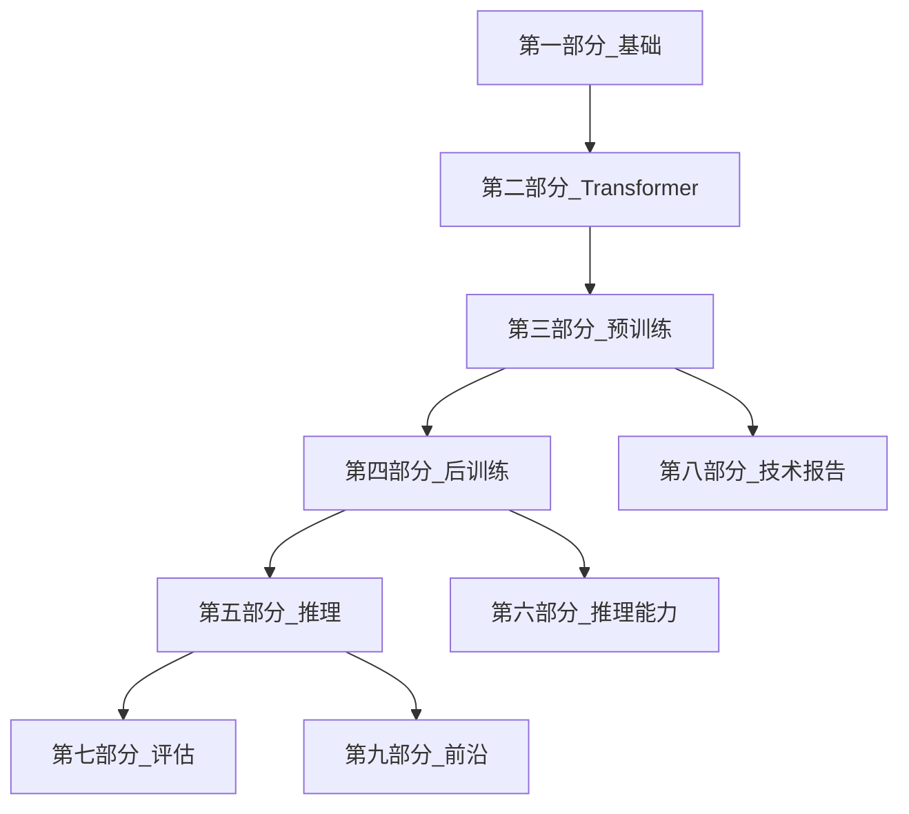

# 1.1.4 本书的阅读路径与读者对象

## 读者对象

| 读者 | 建议路径 |
| --- | --- |
| **入门** | 第一部分 → 第二部分原理 → [00-intro](../../00-intro) |
| **训练 / 算法** | 第一～四部分 → 第三部分预训练 → 第四部分对齐 |
| **推理 / 部署** | 第二～五部分 → 第五部分推理部署 |
| **推理模型 / Agent** | 第六部分 + `docs/03-agent-application/` |
| **读论文 / 模型报告** | 第八部分 + [paper-reading](/paper-reading/) |

## 推荐学习顺序（完整大纲）

## 与站点其他文档区的关系

| 文档区 | 路由 | 定位 |
| --- | --- | --- |
| **llms（本区）** | `/llms` | 系统化知识大纲，按部章节编号 |
| **docs** | `/docs` | Agent、提示词、应用实践 |
| **paper-reading** | `/paper-reading` | 论文与技术报告领读 |
| **weekly-paper** | `/weekly-paper` | 周刊速览 |
| **blog** | `/blog` | 作者随笔 |

## 阅读建议

1. **不必线性读完**：按岗位跳读对应章。
2. **交叉链接**：技术报告深度内容优先看 paper-reading，本区第八部分为 **提纲 + 摘要**。
3. **动手**：结合 Hugging Face、vLLM 与开源权重复现一小节（如 LoRA、PagedAttention）。
4. **版本**：模型与框架迭代快，以各节文末 **官方链接** 为准。

## 进度追踪

见 [CONTENT_STATUS.md](../../CONTENT_STATUS.md) 了解各篇完成度。

## 参考

- [1.1.3 技术栈全景](./03-tech-stack-overview)
- [LLMs 入口](/llms/intro)
