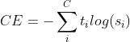
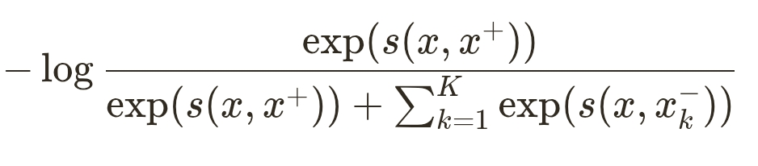
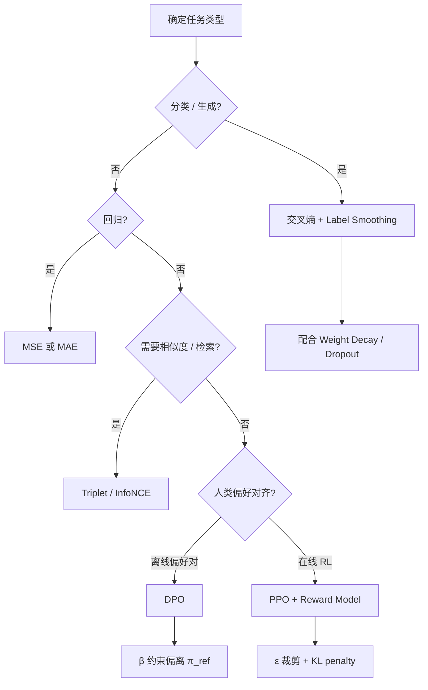

# 损失函数与正则化

损失函数（Loss Function）衡量模型预测与真实标签之间的差异，是训练时梯度下降的直接优化目标。正则化（Regularization）则在损失上施加额外约束，限制模型容量、抑制过拟合，提升泛化能力。二者共同构成「经验风险最小化 + 结构先验」这一经典机器学习范式。

:::tip 延伸阅读
- 综述论文：[Loss Functions and Metrics in Deep Learning](https://arxiv.org/pdf/2307.02694)（2023）
- 正则化经典章节：[Deep Learning Book — Regularization](https://www.deeplearningbook.org/contents/regularization.html)
- 损失函数分类综述：[A Survey and Taxonomy of Loss Functions in Machine Learning](https://www.mdpi.com/2673-2688/7/4/128)
:::

---

## 一、损失函数的作用

在监督学习中，训练目标通常写为：

$$
\theta^* = \arg\min_\theta \; \mathbb{E}_{(x,y)\sim\mathcal{D}}\big[\mathcal{L}(f_\theta(x), y)\big]
$$

其中 $\mathcal{L}$ 为损失函数，$f_\theta$ 为参数化模型。不同任务选用不同损失：

| 任务类型 | 常用损失 | 典型场景 |
| -------- | -------- | -------- |
| 回归 | MSE、MAE、Huber | 房价预测、连续值估计 |
| 二分类 / 多分类 | 交叉熵（Cross-Entropy） | 文本分类、图像分类、LLM 下一 token 预测 |
| 排序 / 度量学习 | Triplet Loss、Margin Ranking Loss | 检索、推荐、人脸验证 |
| 表示学习 | InfoNCE（NT-Xent） | SimCLR、MoCo、CLIP |
| 偏好对齐 | DPO、PPO（RLHF） | ChatGPT 类模型的人类偏好对齐 |

仅最小化训练集上的损失称为**经验风险最小化（ERM）**，容易过拟合；因此实践中几乎总会配合正则化或其他约束（见本文第四节）。

---

## 二、回归损失

### 2.1 均方误差（MSE / L2 Loss）

$$
\mathcal{L}_{\text{MSE}} = \frac{1}{n}\sum_{i=1}^{n}(y_i - \hat{y}_i)^2
$$

对异常值敏感（平方项放大误差），梯度随误差线性增大，是大多数回归任务的默认选择。

### 2.2 平均绝对误差（MAE / L1 Loss）

$$
\mathcal{L}_{\text{MAE}} = \frac{1}{n}\sum_{i=1}^{n}|y_i - \hat{y}_i|
$$

对离群点更鲁棒，但在零点不可微，优化时需用次梯度（subgradient）。

---

## 三、交叉熵损失（Cross-Entropy Loss）

交叉熵衡量两个概率分布之间的差异，是分类任务（含 LLM 语言建模）最核心的损失。

### 3.1 与极大似然的关系

设真实标签为 one-hot 分布 $q$，模型预测分布为 $p$，则：

$$
\mathcal{L}_{\text{CE}} = -\sum_{c} q_c \log p_c
$$

当 $q$ 为硬标签时，上式等价于对正确类别的**负对数似然（Negative Log-Likelihood, NLL）**，即极大似然估计（MLE）在分类场景下的实现。

### 3.2 公式

**二分类**（$y \in \{0,1\}$，$\hat{y}$ 为预测概率）：

$$
\mathcal{L} = -\frac{1}{N}\sum_{i=1}^{N}\big[y_i \log \hat{y}_i + (1-y_i)\log(1-\hat{y}_i)\big]
$$

**多分类**（$C$ 个类别，$y$ 为 one-hot 向量）：

$$
\mathcal{L} = -\frac{1}{N}\sum_{i=1}^{N}\sum_{c=1}^{C} y_{i,c} \log \hat{p}_{i,c}
$$

下图汇总了二分类与多分类的公式形式（与上文一致，便于对照记忆）：

### 3.3 应用场景

- 文本分类、情感分析、多标签分类
- 图像分类（Softmax + CE）
- **LLM 预训练与 SFT**：对每个 token 位置计算 CE，仅在非 padding 位置求平均

在 LLM 中，logits 与 label 逐 token 对齐，通过 `CrossEntropyLoss(ignore_index=pad_id)` 忽略 padding。

### 3.4 优点

- 形式简洁，与 Softmax 输出天然匹配，梯度性质良好（凸性、平滑）
- PyTorch、TensorFlow、JAX 等框架均内置高效实现
- 与信息论中的 KL 散度密切相关：最小化 CE 等价于最小化 $D_{\text{KL}}(q \| p)$

### 3.5 缺点与改进

| 问题 | 说明 | 常见改进 |
| ---- | ---- | -------- |
| 类别不平衡 | 多数类主导梯度，少数类学不好 | Weighted CE、Class-Balanced Loss |
| 难易样本 | 易分样本仍贡献大量梯度 | Focal Loss |
| 离群标注 | 错误标签导致梯度爆炸 | Label Smoothing、Robust Loss |
| 与评估指标脱节 | 低 loss 不一定对应高 Acc/F1 | 直接优化 F1 的 surrogate loss，或训练后调阈值 |

**Focal Loss**（Lin et al., 2017）通过 $(1-p_t)^\gamma$ 降低易分样本权重，聚焦难分样本：

$$
\mathcal{L}_{\text{focal}} = -\alpha_t (1-p_t)^\gamma \log p_t
$$

---

## 四、正则化

正则化在原始损失上增加惩罚项，限制参数规模或模型行为，从而改善泛化。统一形式为：

$$
J(\theta) = J_{\text{data}}(\theta; X, y) + \alpha \, \Omega(\theta)
$$

其中 $\alpha$ 为正则化系数，$\Omega$ 为惩罚函数。

### 4.1 L2 正则化（Ridge / Weight Decay）

$$
\Omega(\theta) = \frac{1}{2}\|\theta\|_2^2 = \frac{1}{2}\sum_j \theta_j^2
$$

**效果**：将权重向原点收缩，使参数更小、更平滑，降低过拟合风险。在深度学习中常称为 **Weight Decay**。

**与优化器的关系**：经典 SGD 中 L2 正则等价于在梯度上加 $\alpha \theta$；**AdamW** 则将 weight decay 与梯度更新解耦，成为 Transformer / LLM 训练的事实标准。

**贝叶斯视角**：L2 正则对应权重的**高斯先验** $\mathcal{N}(0, \sigma^2)$。

### 4.2 L1 正则化（Lasso）

$$
\Omega(\theta) = \|\theta\|_1 = \sum_j |\theta_j|
$$

**效果**：梯度在零点处为常数符号（次梯度），倾向于将部分权重**精确压到 0**，实现隐式特征选择，得到稀疏模型。

**与 L2 对比**：

| 特性 | L1 | L2 |
| ---- | -- | -- |
| 稀疏性 | 易产生精确零权重 | 权重趋近 0 但通常不为 0 |
| 几何解释 | 约束区域为菱形，角落在坐标轴 | 约束区域为圆形，光滑收缩 |
| 对离群点 | 相对更鲁棒（不平方误差） | 对大权重的惩罚更重 |
| 典型用途 | 特征选择、压缩模型 | 深度网络默认正则 |

### 4.3 Elastic Net

同时使用 L1 与 L2：$\Omega = \lambda_1\|\theta\|_1 + \lambda_2\|\theta\|_2^2$，兼顾稀疏性与稳定性。

### 4.4 Dropout

训练时以概率 $p$ 随机将神经元输出置零，迫使网络不依赖单一神经元，相当于对指数级子网络的集成平均。与交叉熵配合使用是深度网络防过拟合的经典手段。

### 4.5 Label Smoothing

将硬标签 $y_c \in \{0,1\}$ 软化为：

$$
y_c' = (1-\varepsilon)\, y_c + \frac{\varepsilon}{C}
$$

**作用**：防止模型对某一类输出极端概率（logit 无限增大），缓解过拟合与校准问题。在 LLM 训练中，Label Smoothing 可减轻「硬目标」带来的训练不稳定。

### 4.6 其他正则化手段（简述）

- **Early Stopping**：验证集 loss 不再下降时停止训练
- **数据增强**：图像翻转、文本 dropout 等，等价于扩大有效训练集
- **Batch Normalization / LayerNorm**：虽主要起稳定训练作用，也带有一定正则化效果
- **KL 散度约束**：RLHF / DPO 中限制策略 $\pi_\theta$ 不要偏离参考模型 $\pi_{\text{ref}}$ 太远

---

## 五、度量学习与排序损失

度量学习（Metric Learning）的目标是学习嵌入空间，使语义相近的样本距离更近、不相似的更远，常用于检索、推荐与人脸识别。

### 5.1 Triplet Loss

给定三元组 $(a, p, n)$（anchor、positive、negative）：

$$
\mathcal{L} = \max\big(0,\; d(a,p) - d(a,n) + m\big)
$$

其中 $d$ 为距离函数（常为欧氏距离），$m$ 为 margin。

**负样本难度**（影响训练效率与效果）：

| 类型 | 条件 | 特点 |
| ---- | ---- | ---- |
| Easy | $d(a,n) \gg d(a,p) + m$ | 已满足 margin，梯度几乎为 0 |
| Semi-hard | $d(a,p) < d(a,n) < d(a,p)+m$ | 有梯度但 violation 较小 |
| Hard | $d(a,n) < d(a,p)$ | 最难，梯度大，但易导致训练不稳定 |

实践中推荐**在线挖掘（online triplet mining）**：每个 batch 内动态选择 semi-hard 或 hard 负样本，效率更高。参考：[Triplet Loss and Online Triplet Mining](https://omoindrot.github.io/triplet-loss)。

### 5.2 其他排序损失

- **Pairwise Ranking Loss**：约束 $(x_i, x_j)$ 的相对顺序
- **Listwise Loss**：直接优化整个排序列表（如 ListNet）

更多变体见：[A Gentle Introduction to Ranking Losses](https://gombru.github.io/2019/04/03/ranking_loss/)。

---

## 六、对比学习：InfoNCE

InfoNCE（Information Noise-Contrastive Estimation）将表示学习建模为「正样本 vs 大量负样本」的分类问题，是 SimCLR、MoCo、CLIP 等方法的核心。

对于 anchor $x$、正样本 $x^+$ 和 $K$ 个负样本 $\{x_k^-\}$：

$$
\mathcal{L}_{\text{InfoNCE}} = -\log \frac{\exp\big(s(x, x^+) / \tau\big)}{\exp\big(s(x, x^+) / \tau\big) + \sum_{k=1}^{K} \exp\big(s(x, x_k^-) / \tau\big)}
$$

其中 $s(\cdot,\cdot)$ 为相似度（余弦相似度或点积），$\tau$ 为**温度（temperature）**超参数。

**温度 $\tau$ 的作用**（参见 [CVPR 2021 — Understanding Contrastive Loss](https://openaccess.thecvf.com/content/CVPR2021/papers/Wang_Understanding_the_Behaviour_of_Contrastive_Loss_CVPR_2021_paper.pdf)）：

- $\tau$ 小：分布更尖锐，对 hard negative 惩罚更强
- $\tau$ 大：分布更平滑，各样本权重更均匀

InfoNCE 与 **NT-Xent**（Normalized Temperature-scaled Cross Entropy，SimCLR 论文命名）本质相同，差异主要在相似度归一化与正负样本构造方式。

**应用**：自监督视觉预训练（SimCLR、MoCo）、多模态对齐（CLIP）、文本对比学习。

---

## 七、LLM 训练中的特殊损失

### 7.1 并行交叉熵（Parallel / Distributed Cross-Entropy）

大模型训练时，logits 与 labels 分布在多张 GPU 上。并行 CE 的典型流程：

1. 各卡计算本地 token 的 logits 与局部 CE
2. 通过 `all_reduce` 聚合 loss 或梯度
3. 在数据并行维度上求平均

实现细节因框架而异（Megatron-LM、DeepSpeed、FSDP 等），核心思想是**在保持数学等价的前提下分片计算**，避免单卡显存瓶颈。

### 7.2 DPO 损失（Direct Preference Optimization）

DPO 用偏好数据 $(x, y_w, y_l)$（$y_w$ 为优选回复，$y_l$ 为劣选回复）直接优化策略，无需显式奖励模型与 RL 循环。损失来自论文 [Rafailov et al., 2023](https://arxiv.org/abs/2305.18290)：

$$
\mathcal{L}_{\text{DPO}}(\pi_\theta; \pi_{\text{ref}}) = -\mathbb{E}_{(x,y_w,y_l)\sim\mathcal{D}} \left[ \log \sigma \left( \beta \log \frac{\pi_\theta(y_w|x)}{\pi_{\text{ref}}(y_w|x)} - \beta \log \frac{\pi_\theta(y_l|x)}{\pi_{\text{ref}}(y_l|x)} \right) \right]
$$

**直观理解**：

- $\beta \log \frac{\pi_\theta(y|x)}{\pi_{\text{ref}}(y|x)}$ 可视为对回复 $y$ 的**隐式奖励**
- 损失推动「chosen 的隐式奖励」高于「rejected」，同时通过 $\pi_{\text{ref}}$ 约束策略不要偏离参考模型太远（类似 KL 正则）
- $\beta$ 控制偏离强度，典型取值 0.1–0.5

**实现要点**（五个输入模块）：

| 模块 | 含义 |
| ---- | ---- |
| query $x$ | 用户提示 |
| policy_chosen / policy_reject | 当前策略对优选/劣选回复的 log prob |
| reference_chosen / reference_reject | 冻结参考策略的 log prob |

记 $a = \log\pi_\theta(y_w|x) - \log\pi_\theta(y_l|x)$，$b = \log\pi_{\text{ref}}(y_w|x) - \log\pi_{\text{ref}}(y_l|x)$，则 logits $= \beta(a - b)$，loss $= -\text{logsigmoid}(\text{logits})$。

### 7.3 PPO 损失（Proximal Policy Optimization）

PPO 是 RLHF 管线中强化学习阶段的核心算法，通过**裁剪（clipping）**限制策略更新幅度，保持训练稳定。

**裁剪代理目标**（单步简化形式）：

$$
L^{\text{CLIP}}(\theta) = \mathbb{E}_t \left[ \min\left( r_t(\theta) \hat{A}_t,\; \text{clip}\big(r_t(\theta), 1-\varepsilon, 1+\varepsilon\big) \hat{A}_t \right) \right]
$$

其中：

- $r_t(\theta) = \frac{\pi_\theta(a_t|s_t)}{\pi_{\theta_{\text{old}}}(a_t|s_t)}$ 为策略比率
- $\hat{A}_t$ 为优势函数（Advantage），通常由奖励模型与价值网络估计
- $\varepsilon$ 为裁剪超参（常见 0.2）

**完整 PPO 目标**（含价值函数与熵奖励）：

$$
L^{\text{PPO}} = L^{\text{CLIP}} - c_1 L^{\text{VF}} + c_2 S[\pi_\theta]
$$

| 项 | 作用 |
| -- | ---- |
| $L^{\text{CLIP}}$ | 在信任域内最大化期望奖励 |
| $L^{\text{VF}}$ | 价值网络拟合回报，降低方差 |
| $S[\pi_\theta]$ | 熵奖励，鼓励探索、防止策略过早坍缩 |

在 LLM 场景中，$a_t$ 对应第 $t$ 个 token，优势来自 reward model 对整段回复的打分（可结合 KL penalty 防止偏离 SFT 模型）。

**与 DPO 对比**：PPO 需要 reward model、价值网络与在线采样，工程复杂但灵活；DPO 离线、实现简单，已成为许多对齐场景的首选基线。

---

## 八、如何选择损失与正则化

**实践建议**：

1. **预训练 / SFT**：CE + AdamW weight decay，必要时 Label Smoothing
2. **类别极不平衡**：先试 Weighted CE 或 Focal Loss，再考虑重采样
3. **对齐**：数据量小、追求简单 pipeline 用 DPO；需要复杂奖励 shaping 用 PPO
4. **对比学习**：温度 $\tau$ 与负样本数量 $K$ 对效果影响大，需在验证集上调参

---

## 参考资料

- [IBM — What is a Loss Function?](https://www.ibm.com/think/topics/loss-function)
- [Encord — Cross-Entropy Loss Functions](https://encord.com/blog/an-introduction-to-cross-entropy-loss-functions/)
- [Deep Learning Book — Chapter 7 Regularization](https://www.deeplearningbook.org/contents/regularization.html)
- [DPO 论文](https://arxiv.org/abs/2305.18290) · [Hugging Face — RLHF to DPO](https://huggingface.co/blog/ariG23498/rlhf-to-dpo)
- [RLHF Book — Policy Gradients & PPO](https://rlhfbook.com/c/06-policy-gradients)
- [SimCLR — NT-Xent Loss](https://arxiv.org/abs/2002.05709) · [MoCo — InfoNCE](https://arxiv.org/abs/1911.05722)
