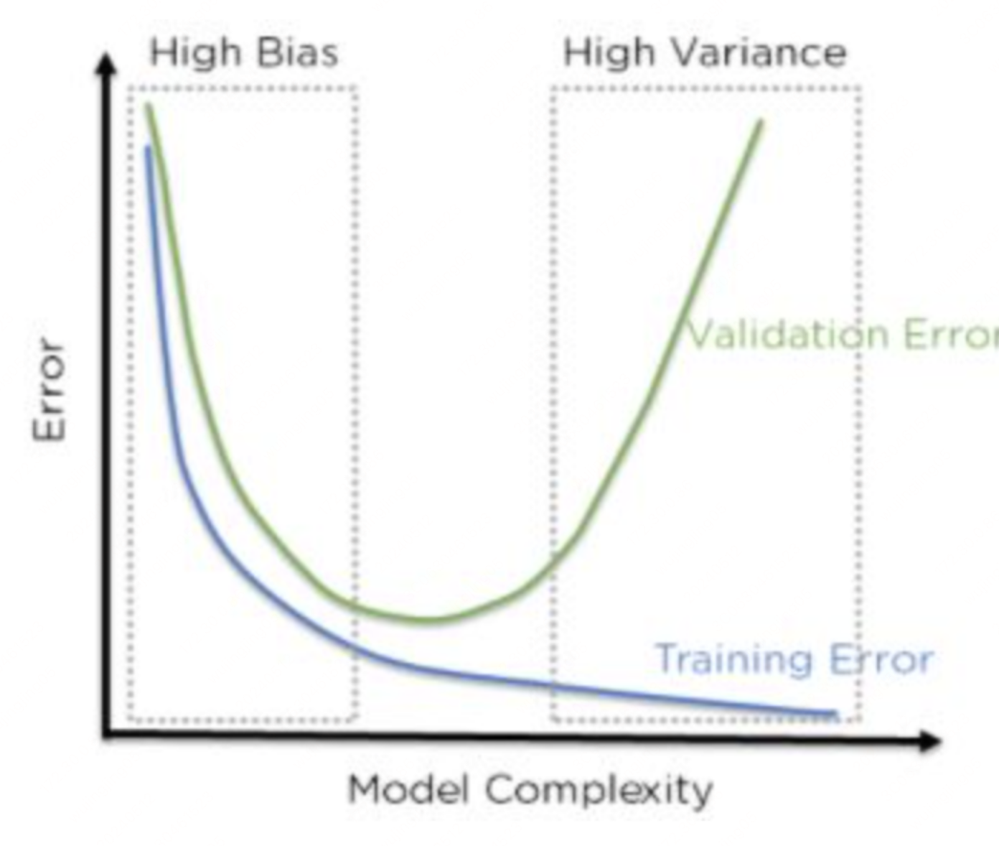

# 偏差–方差权衡

在监督学习中，模型在**未见数据**上的误差往往可以拆成「偏差」「方差」与「不可约噪声」三部分。理解二者的区别，有助于解释为什么**欠拟合**常被说成 **high bias**，**过拟合**常被说成 **high variance**，以及如何在模型复杂度之间做权衡。

:::tip 延伸阅读
- 直觉讨论：[Why underfitting is called high bias and overfitting is called high variance?](https://datascience.stackexchange.com/questions/45578/why-underfitting-is-called-high-bias-and-overfitting-is-called-high-variance)（Data Science Stack Exchange）
- 经典教材：[Deep Learning Book — Machine Learning Basics](https://www.deeplearningbook.org/contents/ml.html)（偏差–方差分解）
:::

---

## 一、从预测误差说起

设真实关系为 $y = f(x) + \epsilon$，其中 $\mathbb{E}[\epsilon]=0$，噪声方差为 $\sigma_\epsilon^2$。用训练集学得的预测函数记为 $\hat{f}(x)$。对新的输入 $x_0$，**期望平方误差**可分解为（推导略）：

$$
\mathbb{E}\big[(y - \hat{f}(x))^2 \mid x=x_0\big]
= \underbrace{\sigma_\epsilon^2}_{\text{不可约误差}}
+ \underbrace{\big(\mathbb{E}[\hat{f}(x_0)] - f(x_0)\big)^2}_{\text{偏差}^2 \text{（Bias）}}
+ \underbrace{\mathbb{E}\big[(\hat{f}(x_0) - \mathbb{E}[\hat{f}(x_0)])^2\big]}_{\text{方差（Variance）}}
$$

| 项 | 含义 |
| --- | --- |
| **偏差（Bias）** | 模型预测值的**期望**与真实 $f(x_0)$ 的系统性差距——「平均来说偏了多少」 |
| **方差（Variance）** | 因训练数据不同，$\hat{f}(x_0)$ 围绕其期望的**波动**——「换一份数据，预测抖不抖」 |
| **不可约误差** | 数据本身的噪声，再复杂的模型也无法消除 |

因此：**偏差**描述的是**系统性错误**；**方差**描述的是**对训练样本的敏感程度**，与泛化稳定性直接相关。

---

## 二、偏差与方差：核心区别

### 2.1 偏差（Bias）：模型「想错了方向」

偏差高，意味着模型族过于**简单**或**假设过强**（simplifying assumption），无法表达数据中的真实结构。它会在训练集和测试集上**稳定地**表现不佳——不是偶尔猜错，而是**一贯地**偏离正确答案。

**直觉类比**（来自 [Stack Exchange 讨论](https://datascience.stackexchange.com/questions/45578/why-underfitting-is-called-high-bias-and-overfitting-is-called-high-variance)）：你被同一张猫的照片展示了 1000 次，再蒙上眼睛让你猜下一张图——你几乎总会答「猫」。这不是因为你「记住了每一张图的细节」，而是因为你的**先验假设极强**（「下一幅还是猫」），对输入变化不敏感。这就是**高偏差**：模型被自己的简化假设「绑死」了。

**典型场景**：用直线去拟合明显非线性的数据；特征太少、模型容量不足 → **欠拟合（underfitting）**。

### 2.2 方差（Variance）：模型「记太细、换数据就变」

方差高，意味着 $\hat{f}$ 对**具体训练集**非常敏感：换一份采样、换一批学生 ID，对同一个 $x_0$ 的预测会差很多。模型把训练集里的**偶然模式**也学进去了，在训练集上误差很低，在测试集上却大幅变差。

**直觉类比**：你为考试背熟了 10 道题，考试只从其中出了 1 道——你能答对那一道，对其余题目却毫无把握。训练题与考题**分布差异很大**（highly varied），说明你的知识**高度依赖**于那 10 道题的偶然内容，而不是可迁移的规律。这就是**高方差**：**过拟合（overfitting）**、泛化不足。

**典型场景**：高阶多项式、参数极多的网络在少量数据上训练 → 训练误差极低、测试误差飙升。

### 2.3 对照小结

| | **高偏差（High Bias）** | **高方差（High Variance）** |
| --- | --- | --- |
| **本质** | 期望预测偏离真值 | 预测随训练集剧烈波动 |
| **常见表现** | 训练、测试误差都偏高 | 训练误差低、测试误差高 |
| **与拟合的关系** | 欠拟合 | 过拟合 |
| **模型倾向** | 过于简单、约束过强 | 过于复杂、对训练点贴合过紧 |
| **改法方向** | 增加容量、减弱先验、加特征 | 正则化、更多数据、降复杂度、早停 |

二者回答的是**不同问题**：偏差问「平均预测对不对」；方差问「换一份训练数据，预测稳不稳」。

---

## 三、为什么欠拟合 ↔ 高偏差，过拟合 ↔ 高方差？

### 3.1 欠拟合 → 高偏差

欠拟合时，模型**故意或被迫**使用很弱的表达能力（例如全局线性、极少参数）。它对 $x$ 只能给出接近 $\mathbb{E}[y \mid x]$ 的「平均答案」，却抓不住对预测真正重要的结构（例如：科目 B 的成绩比科目 A 更能预测科目 C，但你的模型只做了两门课的平均分比较）。

此时 $\mathbb{E}[\hat{f}(x)]$ 与 $f(x)$ 之间长期存在**系统差距**——偏差项大；但因为参数少、模型形状相对固定，**换训练集**对 $\hat{f}$ 的影响反而较小，方差往往较低。

### 3.2 过拟合 → 高方差

过拟合时，模型**容量大、参数多**，可以几乎「逐点」贴合训练集，把噪声和偶然相关也拟合进去。偏差项被压得很小（在训练分布上几乎无系统误差），但 $\hat{f}(x_0)$ 会强烈依赖「这份训练集里出现了哪些样本」——方差项急剧增大，在新数据上失效。

用一句话概括 Stack Exchange 上的常见说法：**简单、强假设的模型容易偏差大；复杂、可剧烈变化的模型容易方差大。**

---

## 四、偏差–方差权衡（Bias–Variance Tradeoff）

增加模型复杂度时，通常会出现：

- **偏差下降**：更有能力逼近 $f(x)$
- **方差上升**：更依赖具体训练样本

总误差在某个复杂度附近达到平衡；过简单 → 偏差主导；过复杂 → 方差主导。

实践中可采取的平衡手段包括：正则化（见 [1.2.2 损失函数与正则化](./02-loss-regularization.md)）、交叉验证选超参、集成方法（Bagging 降方差、Boosting 降偏差）等。

:::note 复杂度并非唯一决定因素
参数多**不一定**过拟合（例如随机森林结构复杂但方差可控）；模型简单**也不一定**欠拟合（线性回归在数据确为线性时偏差、方差都低）。欠拟合/过拟合与偏差/方差的对应关系描述的是**典型趋势**，而非绝对定义。
:::

---

## 五、与本章其他内容的联系

- **损失与正则化**：正则化通过惩罚复杂解，主要**抑制方差**，有时略增偏差，以换取更好的测试误差。
- **评估与交叉验证**：方差大时，单次划分的指标波动大，故需 $k$-折交叉验证等方式更稳定地估计泛化性能（见 [1.2.4 评估指标与交叉验证](./04-metrics-cross-validation.md)）。

---

## 六、小结

1. **偏差**衡量模型预测的**系统性偏离**；**方差**衡量预测对**训练集采样**的敏感度。
2. **高偏差**常对应**欠拟合**——假设太强、容量不足，训练与测试都差。
3. **高方差**常对应**过拟合**——记忆训练细节，训练好、测试差。
4. 调模型的本质，往往是在偏差与方差之间找折中，使总泛化误差最小。

---

## 参考链接信息

- [Why underfitting is called high bias and overfitting is called high variance?](https://datascience.stackexchange.com/questions/45578/why-underfitting-is-called-high-bias-and-overfitting-is-called-high-variance) — Data Science Stack Exchange，本文直觉类比与欠拟合/过拟合对应关系的主要参考
- [Relation between "underfitting" vs "high bias and low variance"](https://datascience.stackexchange.com/questions/45577/relation-between-underfitting-vs-high-bias-and-low-variance) — Data Science Stack Exchange，欠拟合与「高偏差、低方差」表述的进一步讨论
- [Deep Learning Book — 5. Machine Learning Basics](https://www.deeplearningbook.org/contents/ml.html) — 偏差–方差分解与泛化误差的形式化定义
- [Deep Learning Book — 7. Regularization](https://www.deeplearningbook.org/contents/regularization.html) — 正则化如何抑制方差、缓解过拟合
- [scikit-learn — Underfitting vs. Overfitting](https://scikit-learn.org/stable/auto_examples/model_selection/plot_underfitting_overfitting.html) — 欠拟合与过拟合的可视化示例（多项式回归）
- [Wikipedia — Bias–variance tradeoff](https://en.wikipedia.org/wiki/Bias%E2%80%93variance_tradeoff) — 偏差–方差权衡的百科条目与历史背景
