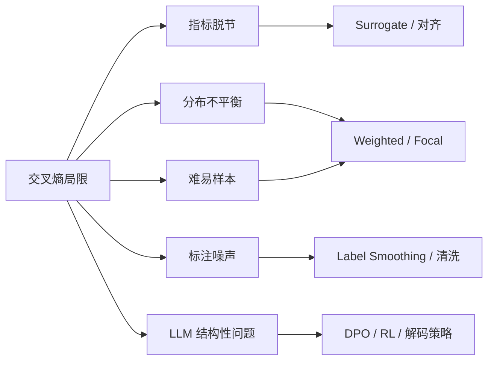

# 交叉熵的缺点

## 一、Softmax Limitation

交叉熵（Cross-Entropy, CE）是分类任务与 LLM 训练中最常用的损失函数，形式简洁、与 Softmax 天然匹配，梯度性质良好，公式定义如下所示：

$$
p_i = \frac{e^{z_i}}{\sum_{j=1}^K e^{z_j}}
$$

:::tip
其中 $z_i$ 表示第 $i$ 类（或 token）的 logits，$K$ 为类别（词表）总数。
:::

但在实际训练——尤其是 **LLM 预训练、SFT 与对齐**——中，单纯最小化 CE 往往还是存在一些问题，本篇文章将围绕此话题展开讨论。

---

## 二、缺点

### 2.1 类别与 token 分布不平衡

在分类任务中，**多数类主导梯度**；在 LLM 中，高频 token（如标点、功能词）同样占据大部分 loss 贡献，**长尾 token / 稀有实体**学习不足。

:::warning
一部分原因也是由于，***多数类*** 对应训练数据量较多，训练 Batch 对于多数类的梯度累积起来会更大。
:::

| 场景 | 表现 |
| ---- | ---- |
| 多分类 | **少数类 recall 低** |
| LLM 预训练 | **常见词 PPL 极低，专业术语、罕见拼写仍差** |
| SFT | **模板化回复、安全套话重复，多样性下降** |

当然何有一些改进方法**改进**：Weighted CE、Class-Balanced Loss、重采样、Focal Loss、对 response 段加权等。

不过在实际 LLM 训练过程中，以上方法过于雕花，通常没办法落地。

### 2.2 难易样本梯度分配不合理

交叉熵对**已分对的易样本**仍贡献显著梯度（尤其当 $p_t$ 尚未接近 1 时），训练算力被**刷分**样本占用，**难分样本**得不到足够关注。

$$
\mathcal{L}_{\text{CE}} = - p_t * \log p_t
$$

当训练逐渐收敛，此时 $p_t$ 会逐渐趋近于 1（但通常不会为 1），此时虽然对应 loss 会逐渐减小，不过由于易样本数量较大，累积的梯度相比于难样本更大，此时会很容易导致易样本过拟合，难样本梯度更新不充分。

**常见改善方法为**：Focal Loss $(1-p_t)^\gamma$、Curriculum Learning、Hard Example Mining、动态 loss 加权等。

:::tips
以前的小模型时代，这些雕花的工作会比较多，现在大模型训练泛化性较好，故以上骚操作可能就比较少了。
:::

### 2.3 LLM 场景下的结构性局限

以下问题在大模型训练中尤为突出：

| 问题类型/主题                  | 具体说明                                                                                                                                                   |
| ----------------------------- | ---------------------------------------------------------------------------------------------------------------------------------------------------------- |
| Token vs Sequence Level | CE 逐 token 平均，**不直接优化整句流畅度、事实一致性或指令遵循**。                                              |
| Exposure Bias（暴露偏差）     | 训练时用 **teacher forcing**（以 ground truth 前缀作为条件），推理时用模型自身输出作为前缀，训练和推理分布不一致，错误累积（生成序列越长越明显）。         |
| 模式坍缩与重复                | 最小化 CE 倾向拟合训练分布的**众数**，在开放生成时易出现 n-gram 重复、套路结尾，与多样性和创造性等目标有张力。                                             |
| 无法表达偏好与排序            | CE 只拟合「唯一正确答案」，无法区分多个合法回复间人类更偏好的那个。对齐阶段需用 DPO、PPO、Reward Model 等**非 CE 目标**。                                |
| 工程代价（并行/大词表相关）   | 大词表下 Softmax + CE 的计算和通信开销显著（采样 Softmax、并行 CE 可优化，但损失本身未变）。                                                              |

---

## 六、小结：何时仍用 CE，何时需要替代

| 阶段 | CE 是否合适 | 备注 |
| ---- | ----------- | ---- |
| 预训练 / Mid-Training | 通常是合理默认 | 关注 PPL、下游 probe；注意数据配比与退火 |
| SFT | 常用，但有局限 | 可配合 Label Smoothing、仅对 response 算 loss |
| 偏好对齐 / RL | 通常**不**单独使用 CE | DPO、PPO、GRPO 等直接优化偏好或奖励 |
| 分类 / 判别头 | CE 仍是基线 | 不平衡与噪声场景需加权或 Robust Loss |

---

## 参考资料

- [1.2.2 损失函数与正则化](./02-loss-regularization.md) — 交叉熵公式、Focal Loss、Label Smoothing
- [Encord — Cross-Entropy Loss Functions](https://encord.com/blog/an-introduction-to-cross-entropy-loss-functions/)
- Lin et al., 2017 — [Focal Loss for Dense Object Detection](https://arxiv.org/abs/1708.02002)
- Rafailov et al., 2023 — [Direct Preference Optimization](https://arxiv.org/abs/2305.18290)

<!-- TODO: 补充个人实验观察、论文案例或仓库内后续章节链接 -->
