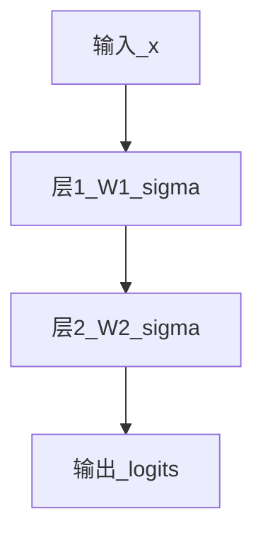

# 1.3.1 神经网络与前向传播

## 要解决的问题

如何用可微分的函数堆叠，将输入（如文本 embedding、图像像素）映射到输出（如 logits、类别）？**前向传播**定义了从输入到预测的计算图，是训练与推理的基础。

## 单层感知机

$$
\mathbf{z} = \mathbf{W}\mathbf{x} + \mathbf{b}, \quad \mathbf{h} = \sigma(\mathbf{z})
$$

- $\mathbf{W}$：权重；$\mathbf{b}$：偏置；$\sigma$：非线性激活（ReLU、GELU 等，见 [1.3.3 激活函数](./03-activation-functions)）。

## 多层前馈网络（MLP / FFN）

堆叠 $L$ 层：$\mathbf{h}^{(0)}=\mathbf{x}$，$\mathbf{h}^{(l)} = \sigma(\mathbf{W}^{(l)}\mathbf{h}^{(l-1)}+\mathbf{b}^{(l)})$。

Transformer 中 **FFN** 即两层 MLP + 激活（常 SwiGLU），见 [2.1.5 前馈网络](../../02-transformer/01-transformer-principles/05-feed-forward-network)。

## 前向传播流程

1. 输入嵌入（token → 向量）
2. 逐层：线性变换 → 激活 →（可选）归一化、残差
3. 输出头：语言模型为 **vocab 上的 logits**

## 参数量与计算量（量级）

单层线性：参数量 $\approx d_{\text{in}} \times d_{\text{out}}$；FLOPs 与同阶。LLM 总参数主要集中在 **Attention 与 FFN 的线性层**。

## 与反向传播的关系

前向得到 loss 后，**反向传播**（见 [1.3.2](./02-backpropagation)）沿计算图求梯度，更新 $\mathbf{W},\mathbf{b}$。

## 参考链接

- [1.3.2 反向传播与计算图](./02-backpropagation)
- [2.1.1 整体架构概览](../../02-transformer/01-transformer-principles/01-architecture-overview)
