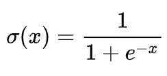
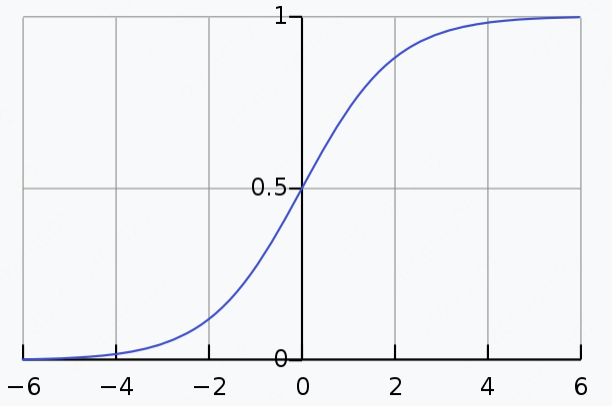
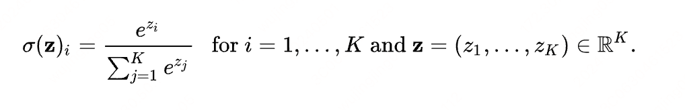
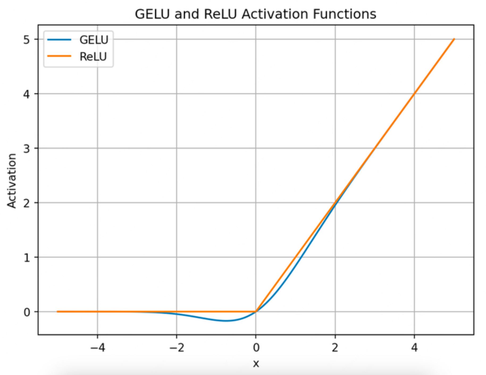
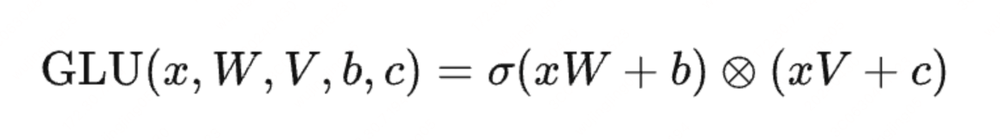
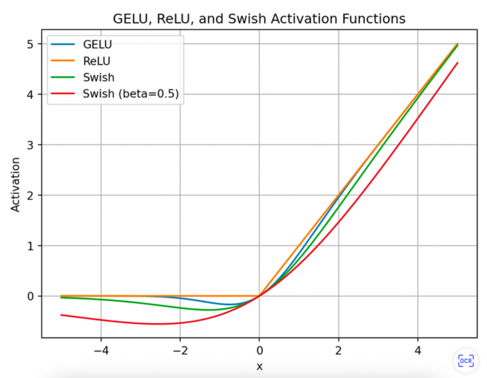
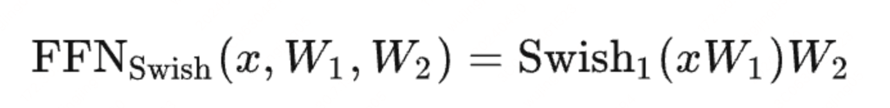
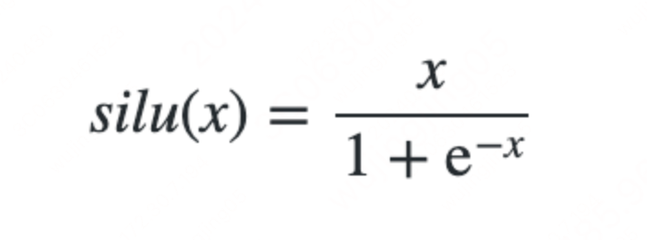
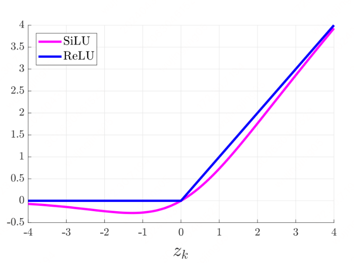

# 1.3.3 激活函数（ReLU、GELU、Swish、SiLU）

## 常用算子

sigmoid 和 softmax 公式通常在 loss 函数计算之前被加进去的。

### sigmoid（logistic）Function

sigmoid 和 softmax 公式通常在 loss 函数计算之前被加进去的。

#### 公式





#### 作用

主要用于将一个数值给转化到 0-1 的数值范围区间，并且处处可导：有利于梯度传播，非常适合在神经网络中使用。
适合做 true/false 的单标签分类任务。

### softmax

主要将一组数据的总和转化到 0-1 的数值范围区间。
​适合做多标签分类的任务。

#### 公式



#### 作用

主要将一组数据的总和转化到 0-1 的数值范围区间。
​适合做多标签分类的任务。

#### 计算效率优化

#### flash attention tilling 可以加速 softmax 的计算：在多卡上面加速计算

#### 数值稳定性问题

#### 由于是求自然对数，所以计算后的数值通常都会比较大，很容易出现数值上溢的情况

#### 解决办法：减去一个最大数，让最大的数值就为0，

#### softmax的计算涉及指数函数，对输入值的范围敏感。若输入值范围过大或过小，均可能导致数值不稳定性（上溢或下溢）

## 激活函数

## LLama 中对应的代码为
```python
def forward(self, x):
out = self.down_proj(F.silu(self.gate_proj(x)) * self.up_proj(x))
return out
```

### tanh

### gelu

#### gelu 和 relu 的对比图，优点是更加平滑



#### 核心代码：核心代码：x * norm.cdf(x)

### glu

#### 本质上是基于 sigmoid 来做门控，用来控制信息的流入



### swish

#### 核心代码：x * (1 / (1 + np.exp(-beta * x)))





#### Swish: a Self-Gated Activation Function

#### Swish同样是个处处可微的非线性函数，且有一个参数beta用于控制函数的形状，带有Swish的FFN层可以表示为

#### **这个通常会导致模型的权重增多：linear1 -> [linear1.1, linear1.2]，因为一个 gate 就需要两个输入**

### silu

#### 当 beta =1 时，silu 和 swish 是等价





### swiglu

## LLama 中对应的代码为
```python
def forward(self, x):
out = self.down_proj(F.silu(self.gate_proj(x)) * self.up_proj(x))
return out
```

#### Llama 当中就是用的此激活函数

#### 与 glu 相比，采用了 swish 来控制信息的流入，被实验证明，可以显著提高训练质量，

#### 当 beta =1 时，swiglu 就等效于 silu，所以这就是为什么代码层面的实现都是使用beta=1

## LLama 中对应的代码为
```python
def forward(self, x):
out = self.down_proj(F.silu(self.gate_proj(x)) * self.up_proj(x))
return out
```
