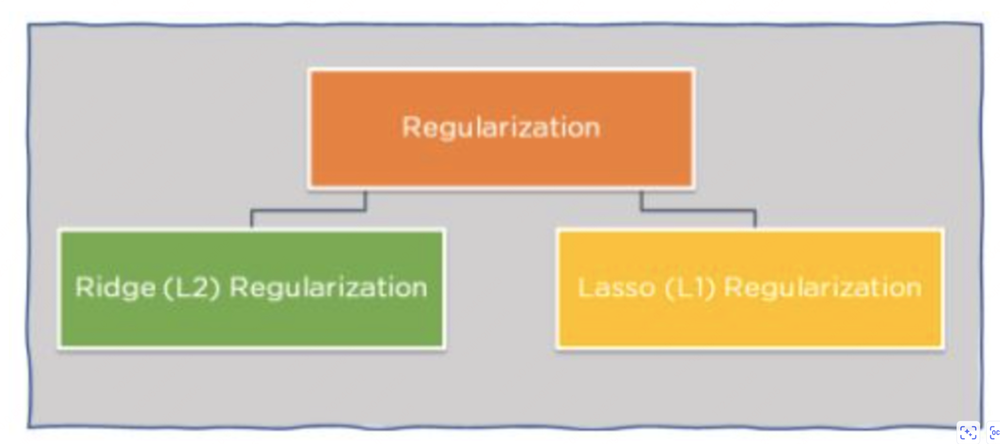
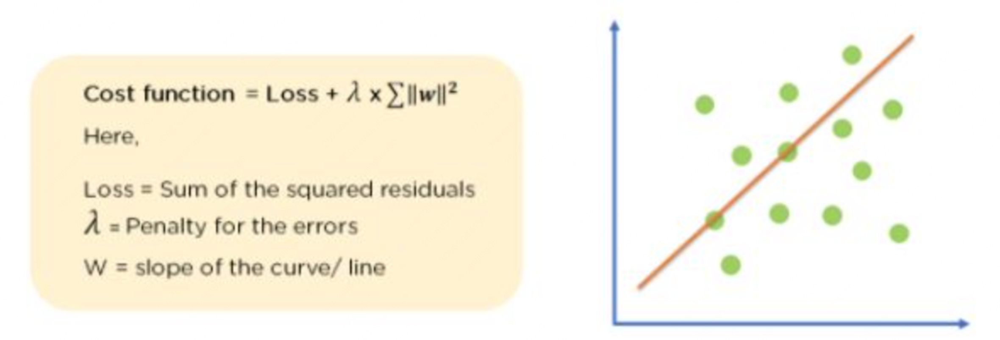
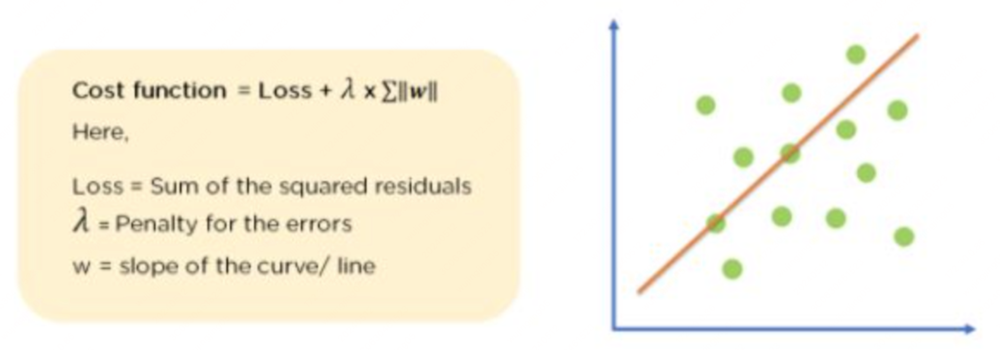
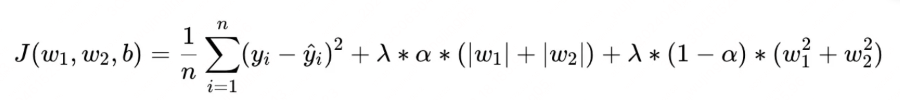

# 正则化技术（Dropout、LayerNorm、RMSNorm、权重衰减）

## regularization

可以认为 norm 是 standarization 的进化版本，方差和均值是从数据中统计而来，并非是一个固定的值（认为设定的值通常难以泛化且效果不稳定）

### standarization

#### 固定的均值和方便

### normalization

可以认为 norm 是 standarization 的进化版本，方差和均值是从数据中统计而来，并非是一个固定的值（认为设定的值通常难以泛化且效果不稳定）

#### 常见于神经网络中的 LayerNorm 等层，其作用主要为让数据分布压缩到 0-1 之间，同时保证压缩前后的数据分布保持一致，区别只是数值进行了偏移和缩放。

可以认为 norm 是 standarization 的进化版本，方差和均值是从数据中统计而来，并非是一个固定的值（认为设定的值通常难以泛化且效果不稳定）

#### 将数据规范化到一个合理的区间,让数据保持在 0-1的区间之中

#### 公式

$(x - x_{\min}) / (x_{\max} - x_{\min})$

### regularization

在 loss 中添加针对于 weight 的L1/L2 正则化项，防止权重过拟合

#### 什么是正则化

在 loss 中添加针对于 weight 的L1/L2 正则化项，防止权重过拟合

#### 正则化的作用是什么

#### 防止过拟合

#### 正则化在什么场景下起作用

#### 方法

在神经网络中，如果添加足够大的 dropout，从而增加模型参数更新的稀疏性

#### Ridge（L2）Regularization

#### 介绍

#### Lasso（L1）Regularization

#### 其实是 L1 和 L2 的混合产物

#### 隐式 Regularization

在神经网络中，如果添加足够大的 dropout，从而增加模型参数更新的稀疏性

#### Dropout Regularization

在神经网络中，如果添加足够大的 dropout，从而增加模型参数更新的稀疏性

#### Early Stopping

早停能够减少模型继续过拟合，反过来想，其实也算是 Regularization

#### Norm Noise

模拟真实世界中的噪音情况，此时将大大提升训练过程中的效果

#### Data Augmentation

增大训练数据的量，从而增大数据所覆盖的分部清况，从而避免过拟合
