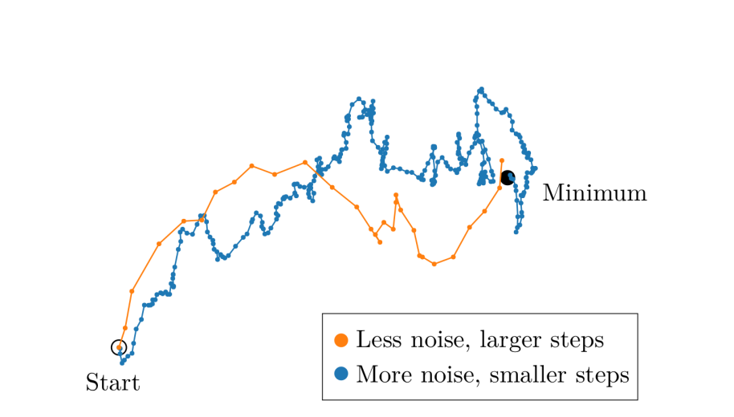
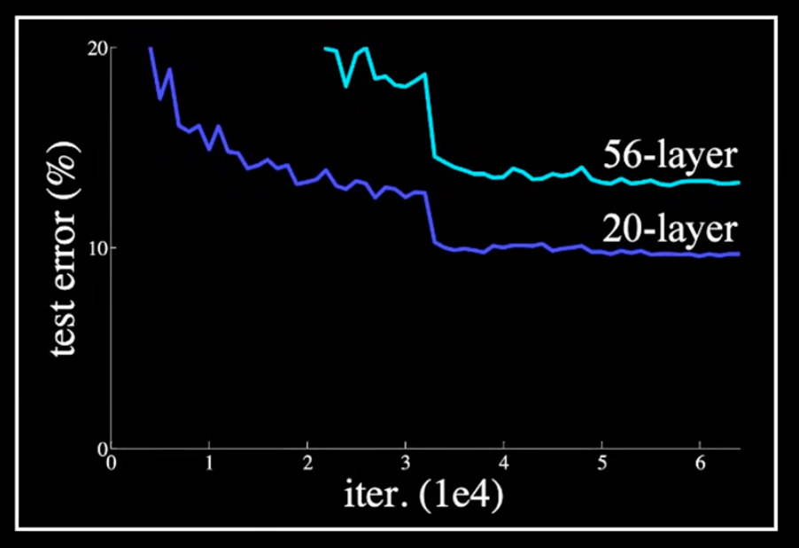

# 学习率调度（Warmup、Cosine、WSD）

## 训练规模与学习率

### Batch Size vs Learning Rate

#### openai 结论：更大的 batch_size 配备更大的 learning rate；更小的 batch_size 配备更小的 learning rate

#### llya 曾在公开场合无数次强调，能开更大的 batch_size 就开更大的 batch_size，这样也能够避免资源的浪费。

#### 解释

#### batch_size 更大 -> 训练样本数量更多 -> 可是对应的 gradient 更新梯度差不多，因为 loss 会做 average -> 为了保证能到达相同的终点，需要更大的 learning rate

### 不同 Size 的模型，Larger LLM 通常有 Larger Loss

### 参考链接：

[https://gombru.github.io/2018/05/23/cross_entropy_loss/](https://gombru.github.io/2018/05/23/cross_entropy_loss/)

## warmup

### 基础介绍

#### 一般在学习的过程中，学习率是不会变化的，而 warmup 在不同阶段采用不同的学习策略

#### 意义：在模型训练的初级阶段，模型对于数据比较陌生，需要使用较小的学习率

#### 模型在中间阶段，已经使用小学习率让模型学了一些先验知识，此时调整大的学习率让模型能够快速学习到对应的知识

### 策略

#### constant warm up

#### 学习率从比较小的数值线性增加到预设值之后保持不变

#### linear warm up

#### 学习率从非常小的数值线性增加到预设值之后，然后再线性减小

#### Cosine Warmup

#### 学习率先从很小的数值线性增加到预设学习率，然后按照cos函数值进行衰减。
