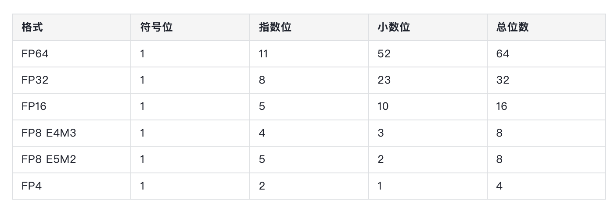
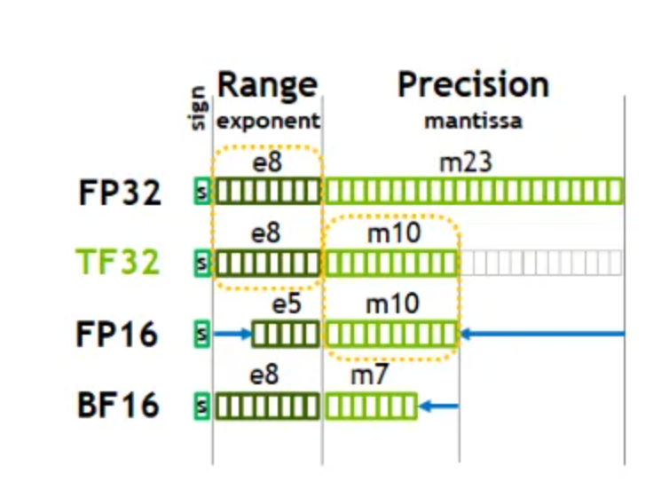
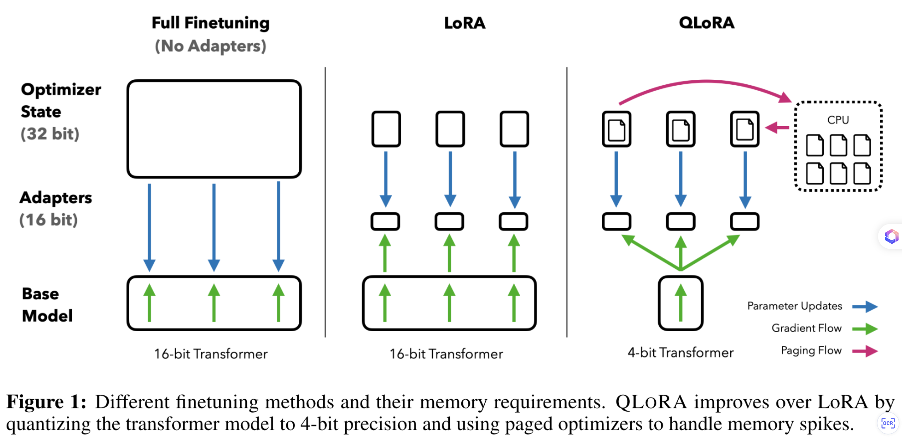
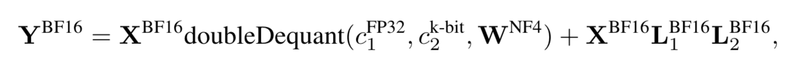

# 1.3.7 量化基础（数据类型与 QLoRA / GPTQ / AWQ）

> 更完整的推理期量化实践见 `llms/05-inference-deployment/03-quantization/`。

## 量化

E：指数位（整数位）， M：尾数位。
采用 两种表达方式：
* E4M3： 更精准
* E5M2：表达范围更广
int8 的数值表达范围是均匀的，可是 FP 有更宽的表达范围，更精准的捕获 LLM 中参数的表达分布。
虽然 Int8 和 FP8 都只使用8 位的存储空间，可是FP8使用指数来表示更小、更大的数字，但空间内相邻值之间的间隙更大、更不均匀。

### 数据类型

E：指数位（整数位）， M：尾数位。
采用 两种表达方式：
* E4M3： 更精准
* E5M2：表达范围更广
int8 的数值表达范围是均匀的，可是 FP 有更宽的表达范围，更精准的捕获 LLM 中参数的表达分布。
虽然 Int8 和 FP8 都只使用8 位的存储空间，可是FP8使用指数来表示更小、更大的数字，但空间内相邻值之间的间隙更大、更不均匀。

#### NF8

#### NF4

#### 4-bit NormalFloat，一种用于量化的特殊格式，于23年5月由华盛顿大学在QLoRA量化论文中提出，论文地址：[https://arxiv.org/abs/2305.14314](https://arxiv.org/abs/2305.14314)

#### Int8

#### 数值表达范围：2^8

#### FP8

E：指数位（整数位）， M：尾数位。
采用 两种表达方式：
* E4M3： 更精准
* E5M2：表达范围更广
int8 的数值表达范围是均匀的，可是 FP 有更宽的表达范围，更精准的捕获 LLM 中参数的表达分布。
虽然 Int8 和 FP8 都只使用8 位的存储空间，可是FP8使用指数来表示更小、更大的数字，但空间内相邻值之间的间隙更大、更不均匀。

#### 原理介绍

E：指数位（整数位）， M：尾数位。
采用 两种表达方式：
* E4M3： 更精准
* E5M2：表达范围更广
int8 的数值表达范围是均匀的，可是 FP 有更宽的表达范围，更精准的捕获 LLM 中参数的表达分布。
虽然 Int8 和 FP8 都只使用8 位的存储空间，可是FP8使用指数来表示更小、更大的数字，但空间内相邻值之间的间隙更大、更不均匀。

- E4M3 的表达范围是：2^18
- E5M2 的表达范围是：2^32

#### 参考文章

- [FP8：前沿精度与性能的新篇章](https://developer.nvidia.com/zh-cn/blog/fp8-precision-performance/)

#### FP4

#### BF16

#### Brain Float 16，由Google Brain提出

### 量化方法

#### QLora

#### 创新点

- 新的数据类型：NF4
- 双重量化以减少平均内存占用
#### 分页优化起来管理内存峰值

#### Paged optimizer

- Nvidia 的统一内存特性：当 GPU 内存不足时，可以将部分数据放在 cpu，等需要使用到时可再次将其 load 到GPU RAM 当中来
- Optimizer 就使用了此特性，从而保证optimizer 的显存峰值不会太大

#### 原理介绍

#### 公式

#### transformer 主体结构被量化成 4bit，lora 的权重还是 fp16

- [TODO]量化成 NF4，精度确定没问题吗？

#### weight only int8

#### 主观感受

- weight 是 int8，可是输入都是 fp16，bf16，scale/bias 这些都是 fp32、fp16 等数据类型

#### matmul 的权重是 int8，可是在实际计算的时候会 dequant 成 fp16

#### smooth quant

#### 原理介绍

- linear 的权重是 int8，在实际计算的时候，会将输入量化成int8，从而进行 int8 矩阵乘，然后存储到 int32 的数据里面去

#### GPTQ

#### 原理介绍：通过调整参数来让模型更容易量化

#### llm int8

#### AWQ

#### 参考资料

[https://huggingface.co/blog/Isayoften/optimization-rush#2-quantization](https://huggingface.co/blog/Isayoften/optimization-rush#2-quantization)
