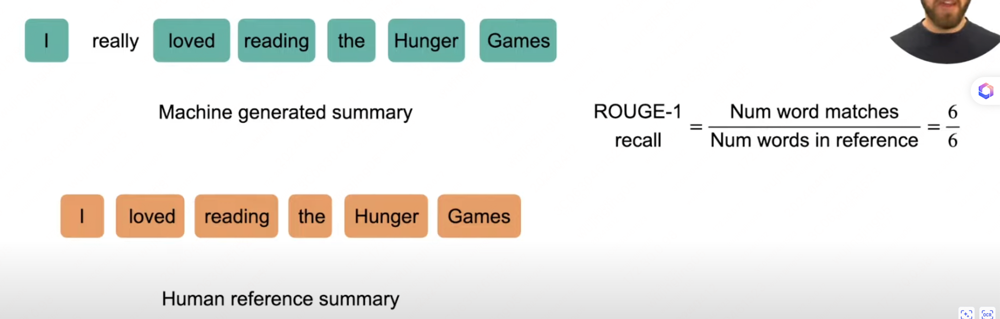
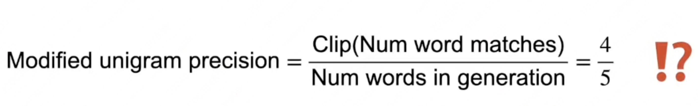
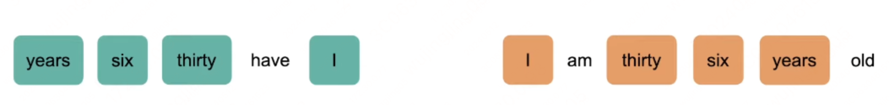

# 评估指标（BLEU、ROUGE、METEOR、BERTScore）

> 分类任务常用指标（Accuracy / Recall / Precision）见 [1.2.4 评估指标与交叉验证](../02-machine-learning/04-metrics-cross-validation.md)。

## rouge

### 主要用于对比一个文本和多个文本之间相似度的指标

## bleu

### 主要用于机器翻译的任务当中

### 从上述的 show  case 中可以看出，是根据输入文本中的 n-gram 匹配长度来计算的，同时还具有顺序信息

## LLM  Alignment 中的评估

### Truthfulness

### Helpfulness

### Effectiveness

### Creativity

### Safety

## 参考资料

[https://research.aimultiple.com/large-language-model-evaluation/](https://research.aimultiple.com/large-language-model-evaluation/)

[https://github.com/huggingface/evaluate/tree/main/metrics](https://github.com/huggingface/evaluate/tree/main/metrics)
