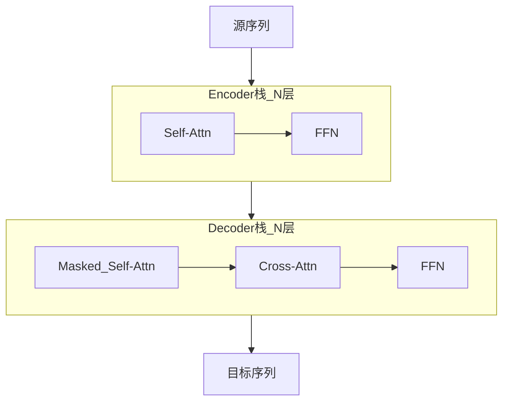

# 2.1.1 整体架构概览

## 要解决的问题

如何将 **可变长序列** 映射到 **可变长输出**（翻译、摘要）或 **下一 token 分布**（语言模型）？Transformer 用 **自注意力 + 前馈网络 + 残差** 堆叠，摆脱 RNN 的顺序瓶颈。

## Encoder-Decoder 整体（原始论文）

[Vaswani et al., 2017](https://arxiv.org/abs/1706.03762) 提出：

- **Encoder**：双向 self-attention，见 [2.2.1 编码器](../02-transformer-details/01-encoder)
- **Decoder**：因果 mask + 对 encoder 输出的 cross-attention，见 [2.2.2 解码器](../02-transformer-details/02-decoder-causal-mask)

## 现代 LLM 主流：Decoder-only

GPT、Llama、Qwen 等仅保留 **Decoder 栈** + **因果掩码**，预训练目标为 CLM（见 [3.3.1](../../03-pre-training/03-pretraining-objectives/01-causal-lm)）。三大范式对比见 [2.2.3](../02-transformer-details/03-architecture-paradigms)。

## 单层 Transformer Block（Pre-LN 常见）

$$
\mathbf{x}' = \mathbf{x} + \text{Attention}(\text{LN}(\mathbf{x}))
$$
$$
\mathbf{x}'' = \mathbf{x}' + \text{FFN}(\text{LN}(\mathbf{x}'))
$$

组件专章：

| 组件 | 章节 |
| --- | --- |
| 缩放点积注意力 | [2.1.2](./02-scaled-dot-product-attention) |
| 多头注意力 | [2.1.3](./03-multi-head-attention) |
| 位置编码 | [2.1.4](./04-positional-encoding) |
| FFN | [2.1.5](./05-feed-forward-network) |
| 残差与归一化 | [2.1.6](./06-residual-normalization) |

## 复杂度提示

序列长度 $L$，隐藏维 $d$，层数 $N$：自注意力约 $O(L^2 d)$ 每层；长上下文改进见 [2.3.6 稀疏注意力](../03-transformer-improvements/06-sparse-attention/01-overview)。

## 参考链接

- 原论文：[Attention Is All You Need](https://arxiv.org/abs/1706.03762)
- docs 导读：[Transformer](/docs/llm-intro/transformer)（默认文档区）
