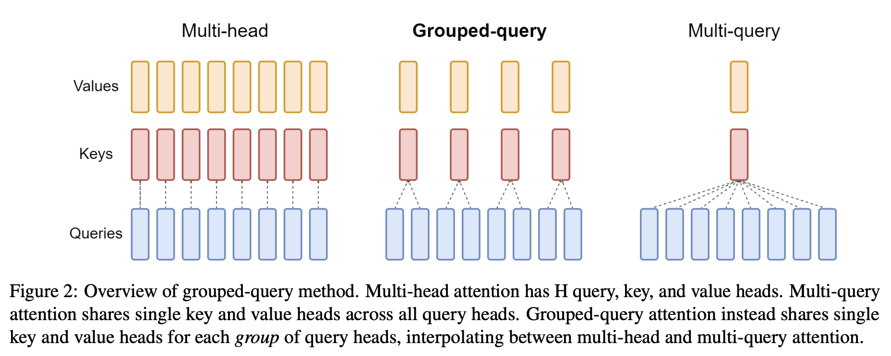
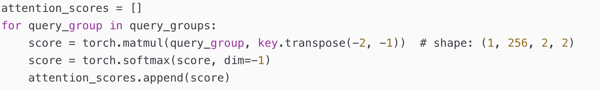
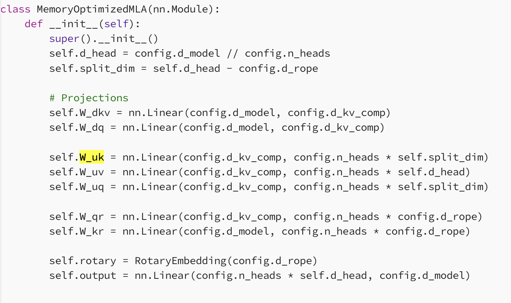

# 2.1.3 多头注意力（Multi-Head Attention）

## Attention

伪代码如上所示

### Grouped Query Attentionppo

#### 将 query 在 KV cache 当中保存了 G 份，这样现存就少很多了

#### query 是全量的 heads，可是 k-v 的 heads 就比较少了

#### 计算逻辑

#### 优点

#### 减少了计算量

#### 减少了 kv-cache 的容量，进而提升整个模型的吞吐

### Multi-Lantent-Attention

伪代码如上所示

#### hidden_state = up(down(hidden_size))

### Ring Attention

#### 核心原理

#### 在计算 Attention 时，假如说 32K 长度的 Attention，此时主要的 Attention 是在于 K 的长度（兼容训练和推理），当平均分为 4 份之后，通过 ring 四次，进而得到完整的 attention 内容

#### 性能指标

#### 可以发现通过 sequence parallel 可以很大程度上减少

### Native Sparse Attention

#### 背景

#### 此前的方法都是属于

### Sparse Attention 相关方法

#### 参考文章

[https://x.com/rasbt/status/2055637086380650538](https://x.com/rasbt/status/2055637086380650538)
