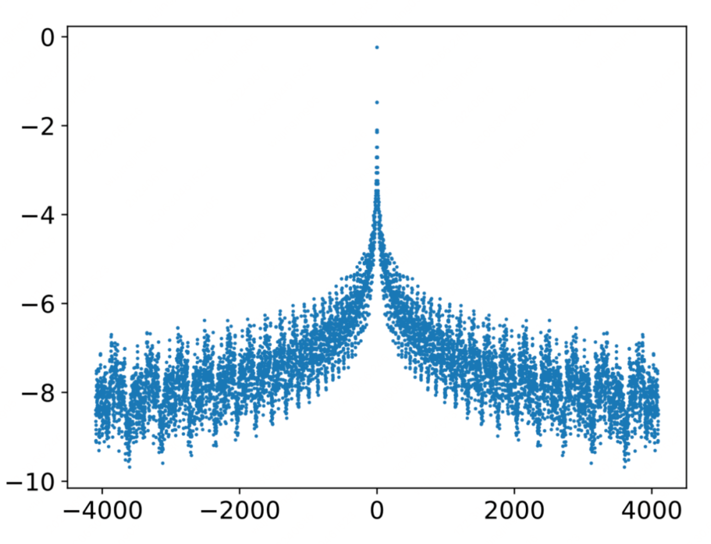

# 2.1.4 位置编码（正弦位置编码、可学习位置编码）

## 位置编码

### 相对位置编码

假设：LLM 子回归的解码器当中，当前解码的 token 跟附近的 token 相关性概率最大，

#### 为什么要引入相对位置编码

假设：LLM 子回归的解码器当中，当前解码的 token 跟附近的 token 相关性概率最大，

#### 相对位置编码很慢

#### 在 transformer layer 要单独添加相对位置编码

#### 在解码中的每个 step 都要更新，cache-kv 也要随之更新

### sinuasoidal 位置编码

#### 基本介绍

#### 整体非严格的单调，而是正当下降

#### 参考文章：[https://mp.weixin.qq.com/s?__biz=MzIwMTc4ODE0Mw==&mid=2247522799&idx=1&sn=97cc77f6be765bb6124e0f7c5c4e533e&chksm=96ea466fa19dcf79e4cdeba36f41b17917a724cadfbe6d81f256526cef5c79199ac2708b7988&token=1557779959&lang=zh_CN&scene=21#wechat_redirect](https://mp.weixin.qq.com/s?__biz=MzIwMTc4ODE0Mw==&mid=2247522799&idx=1&sn=97cc77f6be765bb6124e0f7c5c4e533e&chksm=96ea466fa19dcf79e4cdeba36f41b17917a724cadfbe6d81f256526cef5c79199ac2708b7988&token=1557779959&lang=zh_CN&scene=21#wechat_redirect)
