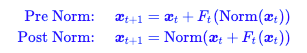
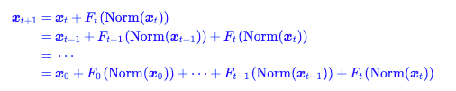

# 残差连接与归一化

## 残差网络

### 作用：

#### 主要缓解模型信息传递过程中的“退化”现象。

#### 残差的本质在于：给梯度一个高速公路，避免梯度消失

### PreNorm vs PostNorm

#### 公式

#### 因为 Pre-Norm 最后一层输出 x_L 没被 LN 过，整个网络末端通常会再补一个 final LayerNorm 再接 unembedding。

#### 对比

#### Post-Nrom 对于下游 fine-tune 是更友好的（[https://www.spaces.ac.cn/archives/9009](https://www.spaces.ac.cn/archives/9009)）

#### 但 Post-Norm 训好之后表达能力往往更强，因为每层输出都被归一化，特征分布更稳定，浅层和深层的贡献更"平等"。

#### Pre-Norm 的严重问题

#### 因为 Pre-Norm 没有梯度消失的问题，所以即使表征多样性相对较差，主流LLM 模型也还是使用此方法继续训练

#### 当层越来越深时，每层对梯度的共享逐层递减，会导致最后几层的 hidden_state 的相关性越来越高（使用 cosine 来计算）

#### Post-Norm

#### 因为每一层的输出都经过了 Norm，输出更加的稳定，表征性更好

#### 为什么 Post-Norm 的梯度消失情况更严重呢？因为没有一条干净的通道让原始的输入直达重点，**每次都需要经过 Norm 的压缩**（在梯度公式中，每一层都会带有一个缩放因子），故肯定会导致梯度逐渐消失

#### **Pre-Norm**：能缓解梯度消失，但深层特征会出现 **表示坍缩（representation collapse）**——相邻层的隐状态高度相似，加深层数收益递减；**Post-Norm**：能缓解表示坍缩，但又把 **梯度消失** 引回来了；这种现象叫做"跷跷板效应"（seesaw effect）：根本原因是残差连接 预先固定了 层输入和输出之间的连接强度（系数都是 1）

### Hyper-Connections

#### 介绍

#### 是字节跳动提出的一种可替代传统残差连接的方法，通过引入可学习的**深度连接与宽度连接**，让网络自主动态调整不同深度特征间的连接强度并灵活重组层结构，解决残差连接中**梯度消失与表征崩溃的跷跷板问题**，计算与参数开销几乎可忽略，在大语言模型预训练及视觉任务中**均显著提升性能与收敛速度**。

#### 效果对比

#### **收敛快 1.8 倍**：同样效果只需要一半左右训练量

#### **损失更低**：V2/V3 验证损失显著下降

#### **下游准确率更高**：ARC-Challenge 直接 **+6 点**

#### **训练更稳定**：无 loss spike，曲线更平滑

### Manifest Hyper-Connections

#### 介绍

#### 破坏残差的恒等映射 → 训练极不稳定

- HC 扩展残差流宽度、引入无约束的可学习矩阵 Hlres，彻底丢失了残差连接固有的恒等映射特性。
- 多层复合后，特征全局均值无法保持，信号在正向 / 反向传播中**无界放大或衰减**，出现**梯度爆炸 / 消失**，损失剧烈波动、训练失控。
- 27B 模型中 HC 的增益峰值可达 **3000**，完全偏离稳定区间。

#### 宽残差流带来巨大内存访问与系统开销

- 虽然 FLOPs 几乎不变，但残差流扩为 n 倍，**内存访问（I/O）成本大幅上升**，成为 “内存墙” 瓶颈。
- 中间激活、流水线并行通信成本同步激增，**严重降低训练吞吐量与可扩展性**，无法支撑超大模型训练。

#### HC 的本质缺陷：HC 靠拓宽残差流提升表达能力，但**无约束的矩阵混合**毁掉了残差网络赖以稳定训练的**恒等映射**，同时带来**效率灾难**，导致**不稳定、难扩缩、跑不动**。

#### 解决方案

#### 稳定性

用 **Sinkhorn-Knopp** 把 $H_l^{res}$ 投影到双随机矩阵流形（Birkhoff 多面体），强制行 / 列和为 1，恢复恒等映射、约束信号范数，保证多层复合仍稳定。

#### 效率：通过**算子融合、选择性重计算、DualPipe 通信计算重叠**，把 n=4 时的训练 overhead 压到仅 **6.7%**。

#### mHC 就是**给 Hyper-Connections 加 “稳定器 + 效率优化”**：**保留 HC 的性能收益，修复训练不稳定，消除内存与通信开销，让超连接真正能用在千亿 / 万亿参数大模型上**。

### 详细相关文章

[https://www.notion.so/wjmcat/Pre-Post-Norm-Hyper-Connections-363ba90003da81e3a475ffdedfadb6d4](https://www.notion.so/wjmcat/Pre-Post-Norm-Hyper-Connections-363ba90003da81e3a475ffdedfadb6d4)

## 归一化层

### 作用：让模型训练更加稳定，进而加速模型的收敛速度。
