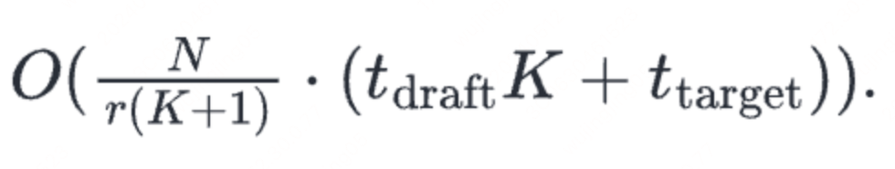
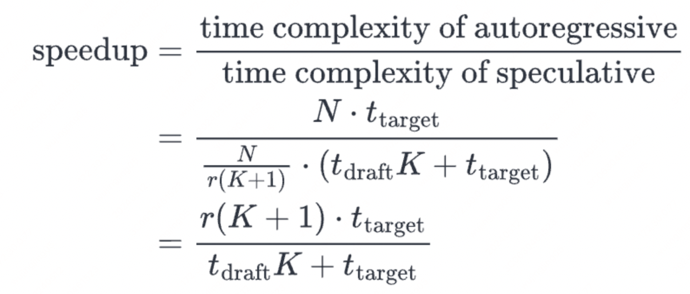

# 2.2.2 解码器结构与因果掩码

> 自回归解码基础见本章；投机解码、Assistant Decoding 等属推理加速技巧。

## 解码加速

### Flash Decoding

#### 参考文章

[https://pytorch.org/blog/flash-decoding/](https://pytorch.org/blog/flash-decoding/)

#### 原理介绍

#### Flash Attention 主要解决的是什么问题

#### 在训练过程中，Flash Attention 主要针对于 BatchSize 和 query-length 两个维度进行优化。
可是在生成解码的过程中，query-length 始终为 1 ***所以当 batch-size=1 时，gpu 的利用率还不足 1%

### TensorRT-LLM 框架

#### padded & packed

#### 模型的输入其实是包含：padded 和 packed

#### 用一个 1D tensor 来代表每个输入的长度

#### **目前paddle 这边的动态插入，从输入层面来看是 padded，可是内部实现的还是 packed**

#### pad 到输入长度的最大长度其实很浪费机器资源。

#### kv-cache

#### contiguous kv-cache

- 将显存初始化成一整块

#### paged kv-cache

- 将 cache-kv 拆分成不同的 block，从而更加细粒度的控制显存

#### int8/fp8 kv-cache

#### sliding window attention

- attention-sink
- 传统的 sliding window

## 解码与采样策略

### min-p

#### 基础信息介绍

#### 参考链接：https://mp.weixin.qq.com/s/ILwPmtLGSGDlKH6KbdTSaw

#### 其他方法缺点介绍

#### top-k

- 前面 token 概率很大，可是后面 token 并不大

#### top-p

- 会包含太多的长尾数据，这个会影响采样的效果

### assistant decoding

#### 参考文章

[https://huggingface.co/blog/assisted-generation](https://huggingface.co/blog/assisted-generation)

#### 原理介绍

#### 1. 会有一个大模型和小模型，小模型用于生成候选列表（连续的几个 tokens），大模型用来做评估选择。同时 tokenizer 一般是使用一样的

#### 整体流程描述： 小模型 tokens -> candidate_ids -> 大模型 forward  -> ids -> n_match(candidate_ids, ids) -> ids[: n_match]

### speculative decoding

#### 介绍

#### 用 draft 模型来生成 n-token，然后将其与模型生成的 token 来做对比，如果是正确的，就采纳其中的 k-token。

#### 此方法相当于 sampling。

#### 整体上属于：guess-and-verify  模式

- 先让小模型来猜，然后让大模型来验证是否正确

#### 时间复杂度

- t_draft * K : 是小模型一个 epoch 的时间复杂度
- N 是整体解码长度， K 是一次性解码的候选 token 长度
- r： 平均接受文本的长度

#### 加速比

#### 缺点

#### 解码速度受限于 token 接受率：draft 模型的输出和 large 模型的输出匹配率

#### draft 模型通常是需要额外训练，并且“careful tuning”

#### 步骤

#### 1. 小模型通过自回归解码出 k 个 token

#### 2. 将这 k 个 token 塞到大模型当中获取其 logit 分布，这样能够得到最终的 next-tokens

- 能够得到小模型和大模型在这 k 个 token 上面的解码结果

#### 3. 通过对比小模型和大模型产生出来的 logits，从而决定到底保留多少 token

- 如何从 logits 中选择对应的 next-tokens 是有对应的策略的，也就是这其中不一定就是 greedy_search

#### **4. 其中还可以保留 0 &lt; N &lt;= K 个 token，如果所有的 token 都被保留了，还可以额外再接受一个 来自于大模型解码出来的next-token**

#### 注意

#### **这个方法的解码并不是 greedy_search，也可以和 top_k 、top_p 和 temperature 联合使用**

#### 参考链接

#### Fast Inference from Transformers via Speculative Decoding  [https://arxiv.org/abs/2211.17192](https://arxiv.org/abs/2211.17192)

[https://jaykmody.com/blog/speculative-sampling/](https://jaykmody.com/blog/speculative-sampling/)

### lookahead decoding

#### 方法

#### 用 n-gram 来猜测接下来的数据

- n-gram 自己来构造
- 可以从某些数据集上面来构造也行

#### 用当前预测的 token 来在库里面查找，如果存在的话就看看下一个词是否一致

#### 缺点：也是 greedy_search 的一种

#### 参考链接

[https://lmsys.org/blog/2023-11-21-lookahead-decoding](https://lmsys.org/blog/2023-11-21-lookahead-decoding)

### min-p

#### 基本介绍

#### 最大token 概率 * p，此时通过最大值来限定考虑范围

#### 单纯用 top-k: 前面 token 概率很大，可是后面 token 并不大

#### 单纯用 top-p：会包含太多的长尾数据，这个会影响采样的效果

#### 其实 top-k 和 top-p 结合起来使用的话，效果和 min-p 差不多

#### 参考资料

[放弃top p/k、温度采样，全面拥抱min p](https://mp.weixin.qq.com/s/ILwPmtLGSGDlKH6KbdTSaw)

### 受限生成

#### 参考资料

[[TODO]Guiding LLMs The Right Way: Fast, Non-Invasive Constrained Generation](https://arxiv.org/abs/2403.06988)
