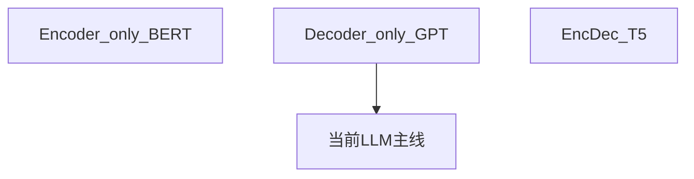

# 2.2.3 Encoder-only / Decoder-only / Encoder-Decoder 三大范式

## 要解决的问题

Transformer 堆栈可裁剪为三种 **架构范式**，对应不同预训练目标与产品形态。选型决定数据格式、推理方式与生态工具链。

## 对比总表

| 范式 | 代表 | 预训练目标 | 推理 | 典型应用 |
| --- | --- | --- | --- | --- |
| **Encoder-only** | BERT、RoBERTa | MLM、NSP | 双向一次前向 | 分类、检索、NLI |
| **Decoder-only** | GPT、Llama、Qwen | CLM（下一 token） | 自回归逐 token | 对话、代码、推理 |
| **Encoder-Decoder** | T5、BART、原始 Transformer | Span corruption 等 | Encoder 编码 + Decoder 生成 | 翻译、摘要（专用时代） |

## Decoder-only 为何成为 LLM 主流

1. **统一生成接口**：所有任务可表述为文本续写
2. **Scaling 路径清晰**：CLM + 算力 + 数据
3. **推理栈成熟**：KV Cache、投机解码、vLLM 等均围绕自回归优化

## Encoder-Decoder 的当代地位

- **T5/UL2** 等仍用于特定研究
- 部分多模态模型用「视觉 Encoder + 语言 Decoder」
- 纯文本通用 LLM 新品较少采用完整 Encoder-Decoder

## Encoder-only 的当代地位

- **Embedding 模型**（检索、RAG）：双塔或 late interaction，常基于 BERT 类或 LLM 派生 embedding
- 不与万亿参数生成模型争「通用对话」主战场

## 参考链接

- [2.2.1 Encoder](./01-encoder)
- [2.2.2 Decoder](./02-decoder-causal-mask)
- [3.3.1 CLM](../../03-pre-training/03-pretraining-objectives/01-causal-lm)
