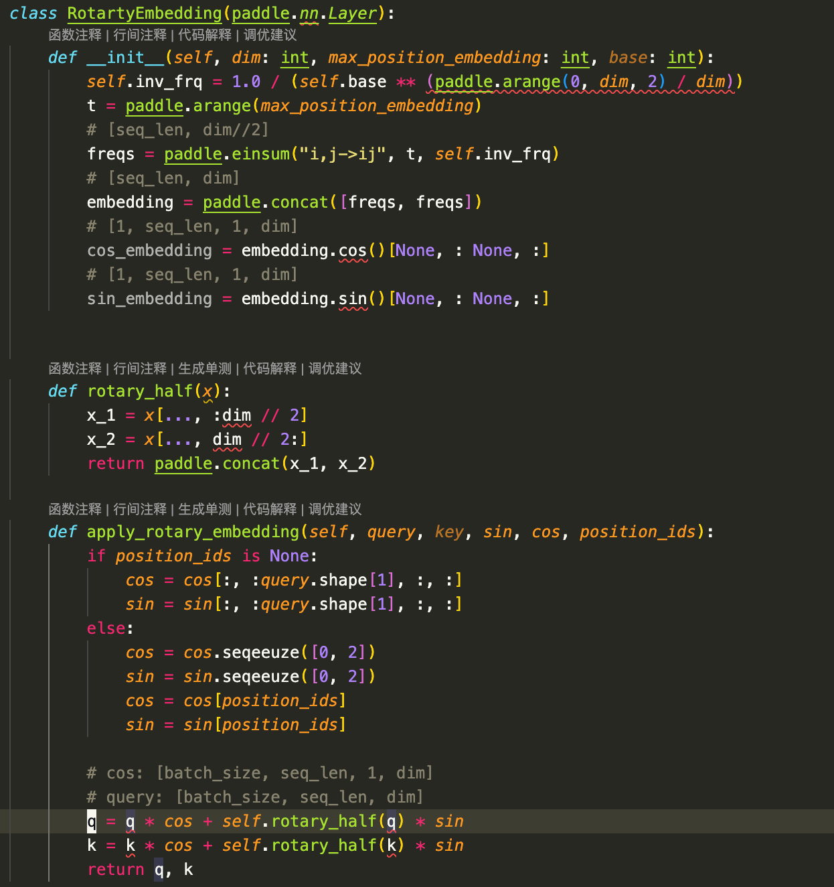
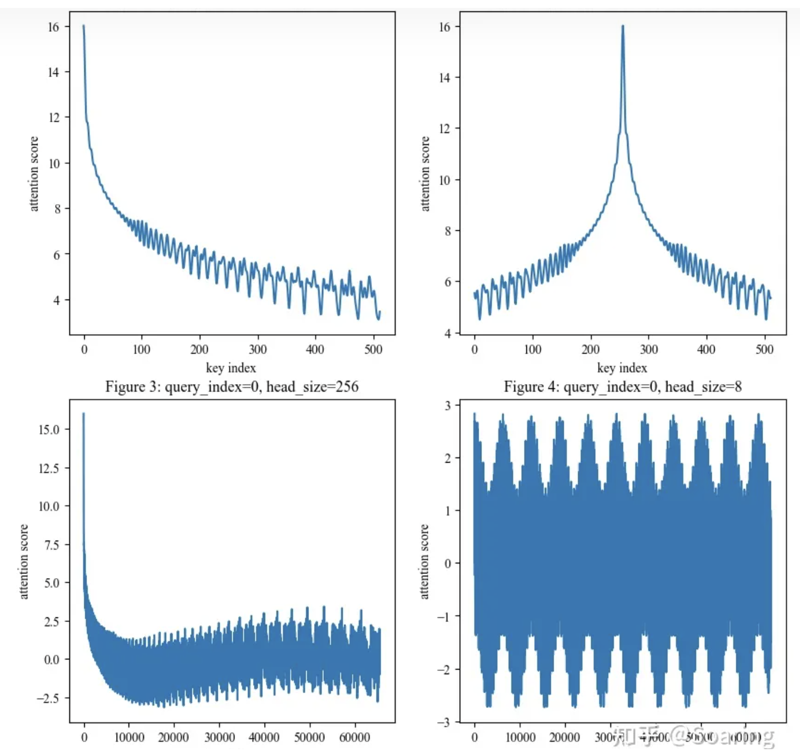
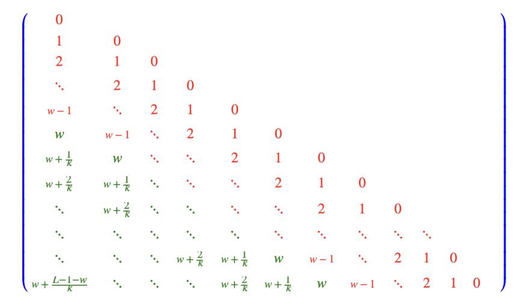
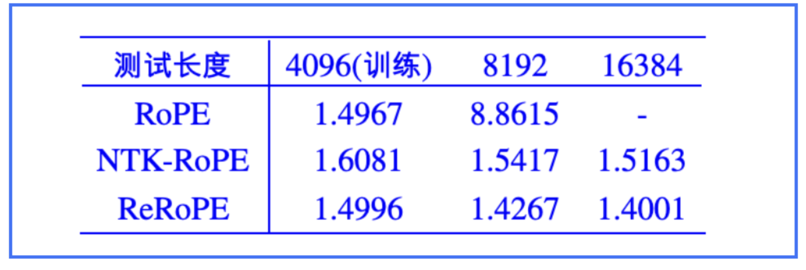

# 位置编码改进：RoPE、ALiBi、NoPE

## 位置编码改进

### Rotary Embedding

#### 原理介绍

#### 经典位置编码： Sinusoidal 函数

- 参考视频：[https://www.youtube.com/watch?v=YhpOZcjrvQM](https://www.youtube.com/watch?v=YhpOZcjrvQM)
- Sinusoidal 位置编码是加性的，而 RoPE 可以视为乘性的

#### 苏剑林在此基础上进行了扩展：将这个位置稍微旋转一下

#### 示例代码：

- MVP 示例代码
#### 相对位置远程衰减

#### 相对位置 和 注意力分数 之间是**震荡递减**的关系

#### 相对位置 超过一万时, 震荡递减关系就不存在了。为什么会有这种关系呢?

- 参考链接：[https://zhuanlan.zhihu.com/p/662790439](https://zhuanlan.zhihu.com/p/662790439)

#### 疑问

- [TODO]为什么sin, cos 函数就能够代表位置编码，这个循环变化的吗？为何能够表示不断增加的一个信息
[TODO]cos 和 sin 的输入值域范围分别是多大呢？

- 是否是 2pai 呢？

#### 总结

- 旋转编码 RoPE 可以有效地保持位置信息的相对关系,即相邻位置的编码之间有一定的相似性，而远离位置的编码之间有一定的差异性。这样可以增强模型对位置信息的感知和利用
- 旋转编码 RoPE 可以通过旋转矩阵来实现位置编码的外推，即可以通过旋转矩阵来生成超过预训练长度的位置编码
- 旋转编码 RoPE 可以与线性注意力机制兼容，即不需要额外的计算或参数来实现相对位置编码。这样可以降低模型的计算复杂度和内存消耗。

#### 外推方法

#### 直接外推

- 最直接的外推方式：不做任何处理，直接外推，效果比较差

#### 线性内插

- 理论：确保 推理时向量旋转角度 在 预训练时向量旋转角度 的范围之内
- 线性内插 的效果比 直接外推 的效果要差; 如果额外训练 1000 步, 线性内插 的效果和原本效果是接近的。

#### NTK rope

#### 全称

- Neural Tangent Kernel (NTK)
#### 参考链接

- [https://ku.baidu-int.com/knowledge/HFVrC7hq1Q/pKzJfZczuc/sew0JEk8K5/T5Nd2MOYo2adx2](https://ku.baidu-int.com/knowledge/HFVrC7hq1Q/pKzJfZczuc/sew0JEk8K5/T5Nd2MOYo2adx2)

#### 原理介绍

- base=10000
base = base  * self.scaling_factor ** (self.dim / (self.dim - 2))

#### ReRope

#### 原理介绍

#### 缺点

- 它们的推理速度相比原本的Attention来说是变慢
- 第一步推理需要算两次Attention，以及后续每步推理需要重新计算位置编码, 并且目前尚不兼容Flash Attention等加速技术

#### 参考资料

[https://zhuanlan.zhihu.com/p/647109286?utm_psn=1706662237966737409&utm_id=0](https://zhuanlan.zhihu.com/p/647109286?utm_psn=1706662237966737409&utm_id=0)
