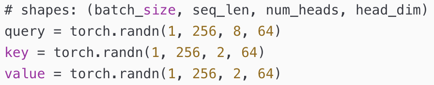

# 注意力变体：MQA、GQA、MLA

> **KV 压缩 vs token 稀疏** 边界见 [2.3.6.8 KV 压缩与稀疏边界](./06-sparse-attention/08-kv-compression-boundary)。

## 要解决的问题

推理时 **KV Cache** 随序列长度与头数线性增长，成为吞吐瓶颈。MQA、GQA、MLA 在 **保持 Q 表达力** 的同时 **减少 K/V 头数或维度**。

## MQA（Multi-Query Attention）

- 所有 Q 头 **共享一组** $K,V$
- KV Cache 体积 $\propto 1$（相对头数 $H$）
- 用于 PaLM、Falcon 等；可能略损质量

## GQA（Grouped-Query Attention）

- $H$ 个 Q 头分为 $G$ 组，**每组共享** $K,V$
- 在 MHA 与 MQA 之间折中；**Llama 2/3、Qwen** 广泛采用

**计算**：Q 头数不变，K/V 仅 $G$ 组；attention 分数在组内广播或 repeat 到各 Q 头。

## MLA（Multi-head Latent Attention）

DeepSeek V2/V3 路线：$K,V$ 经 **低维 latent** 缓存，解码时再 up-project。

- **解耦 RoPE** 与压缩路径
- 详见 [DeepSeek 稀疏路线](./06-sparse-attention/04-deepseek-sparse-route)、[paper-reading DeepSeek-V3](/paper-reading/tech-report/deepseek/deepseek-v3)

## 对比

| 变体 | KV 相对 MHA | Token 连接 |
| --- | --- | --- |
| MHA | 1× | 稠密 |
| GQA | $\approx G/H$ | 稠密 |
| MQA | $\approx 1/H$ | 稠密 |
| MLA | 更低（latent） | 稠密 |

## 参考链接

- [2.3.6.8 稀疏边界](./06-sparse-attention/08-kv-compression-boundary)
- GQA 论文：[arXiv:2305.13245](https://arxiv.org/abs/2305.13245)
