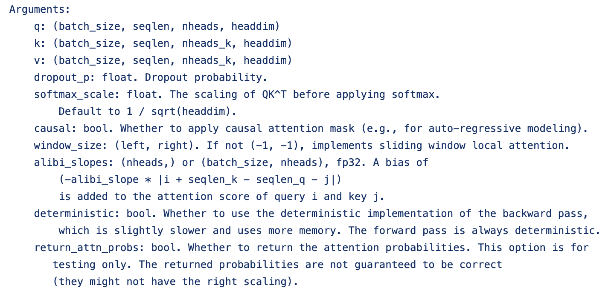
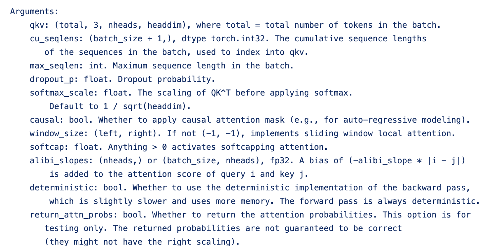
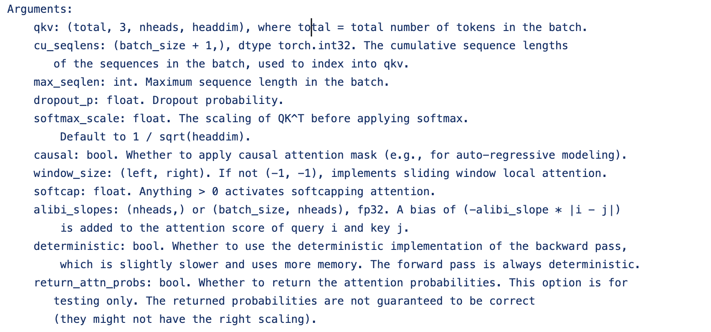
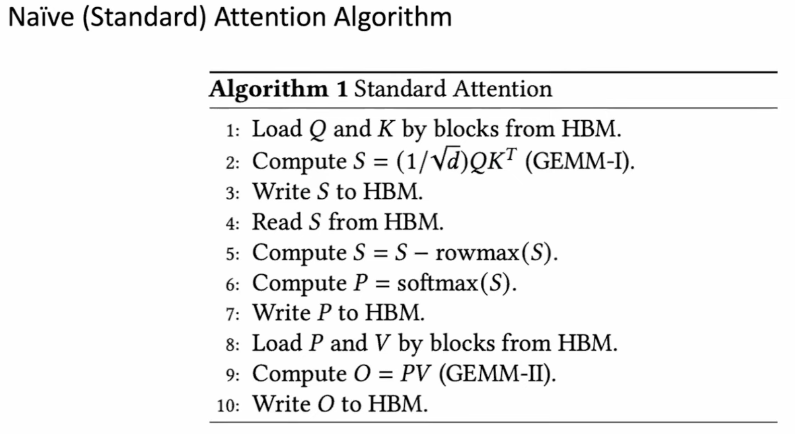
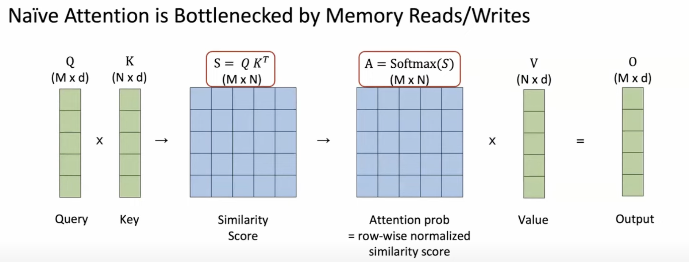
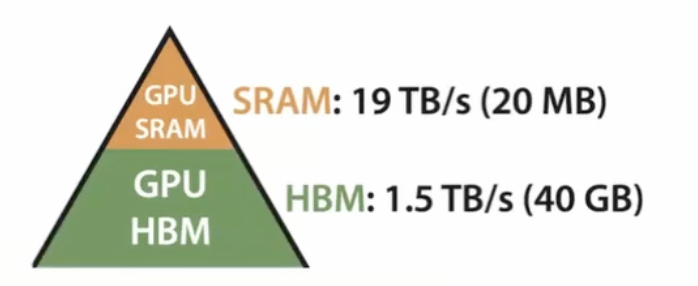
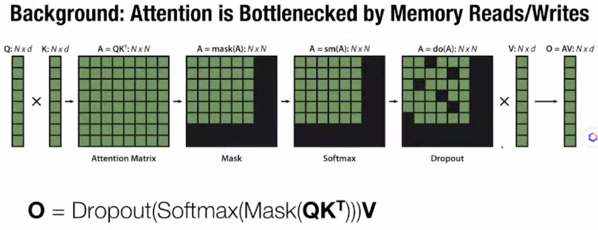
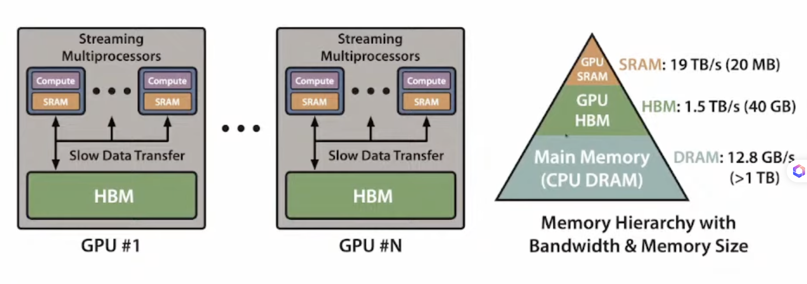
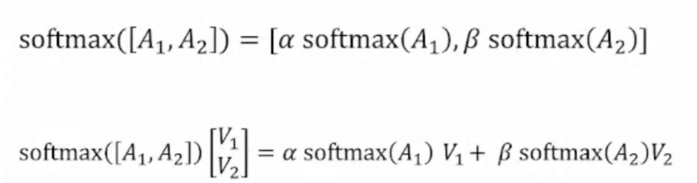

# Flash Attention 与 IO 优化

> Flash Attention 通过 **Tiling + Online Softmax + Recomputation** 降低 HBM↔SRAM 数据搬运，在数学上与标准 Attention 等价，但 **不改变 $O(L^2)$ 渐近复杂度**。与 token 稀疏、KV 压缩（MLA 等）正交，工业界常叠加使用。稀疏与长序列路线见 [稀疏注意力总览](./06-sparse-attention/01-overview)。

## Flash Attention

### Motivation

#### Longer Sequence

#### 参考：Data Movement Is All You Need: A Case Study on Optimizing Transformers

### API 与输入形式

#### flash Attention 有哪些输入

#### flash_attn_func

#### flash_attn_qkvpacked_func

#### flash_attn_varlen_qkvpacked_func

### 标准 Attention 的计算逻辑

#### 其中最大的时间消耗在于：SRAM 和 HBM 之间的显存数据搬运

#### 如何解决 SRAM 和 HBM 之间的高频 & 大量的读写 IO 消耗的问题呢？此时就需要使用 Tilling 和 Recompute 两项技术

### 挑战

#### 在 attention_score  -> softmax 整个过程能否都在 SRAM 上面完成？

- 解决 fusion kernel（tilling 以及 online softmax）
- Q: 是 tile query，然后 key 和 value 是以 block by block 的方式来进行加载，最后的 Output 会通过 online softmax 的技术来
- backward 的过程中不需要大量的 attention matrix

### 优点

#### 速度快

- 通过融合计算实现 Block Attention 的计算，实现计算时间和存储空间上面的加速

#### 减少显存占用

- 将 self-attention 中的 $O(n^2)$ 的激活变量值减小成 $O(n)$

#### 效果无损

- 在数学计算上面来看，计算的结果和传统的一致
- 以上所有的优点都是从 IO 是计算瓶颈出发，提出一个有效解决方案

## 核心方法

### Tilling

#### 原理

- 1. 将 cache-kv 切片成多份
- 2. 计算每个切片中的 attention-score，同时计算每行每列的 $e^x$，用于后续的 softmax 计算
- 3. 将每个切片中的 log-sum-exp 的数值，并 reduce 起来，最后计算整体的 attention-score

### Recomputation

- 通过 recompute 的原理，减少 gradient 的显存，此时减少显存的占用情况
- 这两种方法都可以减少 IO 消耗

## Background

### Attention 是整个 Transformer 的核心模块

### Attention 计算的瓶颈：显存的读写

- 整个计算过程需要从 GPU HBM 带宽上读取基于同一个 tensor 来读写

### 如何减少 HBM 的读写：基于 Block 的高速读写

### 挑战

#### 1. Softmax 如何在不获取到所有的数据就可以计算全局的 softmax 的结果

- 方法：Tiling：重构整个 attention-score 的算法，基于 block 的方法来计算

#### 将 softmax 解构成多个 block softmax 的计算

#### 工作流程

- 1. 将 Block 的数据从 HBM 加载到 SRAM 当中
- 2. 计算 Block 最终的结果
- 3. 在 HBM 当中计算 scale（$\alpha$ 和 $\beta$）

#### 2. 在 backward 的阶段，不基于大矩阵进行反向传播

- 方法：Recomputation：不存储大矩阵，在 backward 的时候重新计算一下

## Flash Attention 3 的主要创新点

### 在 H100 上的新指令

- **WGMMA**：与 MMA 相比有更高的吞吐和异步性
- **TMA**：更快的 loading 速度

### 异步优化

- 在不同 block 的 Attention Output 计算整个过程中，从 IO、Compute 上面做了很多定向优化，让整个计算变得非常高效

### FP8 低精度计算

- 数据存储以 FP8 来

## 参考资料

- 原作者视频讲解：[FlashAttention 讲解](https://www.youtube.com/watch?v=gMOAud7hZg4)
- 相关章节：[稀疏注意力总览](./06-sparse-attention/01-overview)（Flash 与稀疏/MLA 的对比表）
