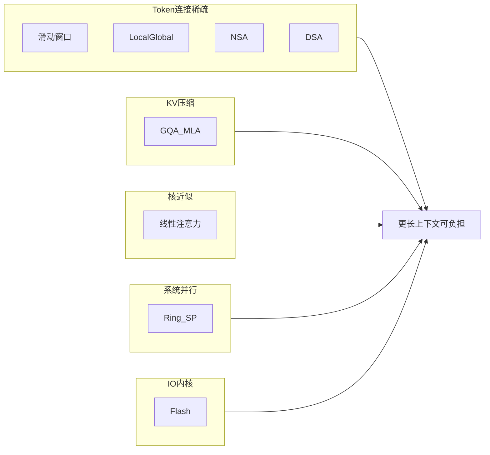

# 2.3.6.1 稀疏注意力总览

> 本章按**方法类型**拆分子页，便于逐篇深读。**Flash Attention**（IO 与融合内核，不改变 $O(L^2)$ 渐近阶）见 [Flash Attention 与 IO 优化](../05-flash-attention)。完整推理部署栈见 `llms/05-inference-deployment/`。

## 子章节索引

| 分类 | 方法 | 文档 |
| --- | --- | --- |
| 分布式切分 | Ring / 序列并行 | [Ring Attention 与序列并行](./02-ring-attention) |
| 经典 token 稀疏 | 滑动窗口 SWA | [滑动窗口注意力](./06-sliding-window-attention) |
| 经典 token 稀疏 | Local + Global | [局部-全局稀疏注意力](./07-local-global-sparse) |
| 可学习稀疏 | Native Sparse Attention | [NSA](./03-native-sparse-attention) |
| 工业路线 | DeepSeek MLA → DSA → CSA/HCA | [DeepSeek 稀疏路线](./04-deepseek-sparse-route) |
| 核近似 | 线性 / Lightning Attention | [线性注意力](./05-linear-attention) |
| KV 压缩（非 token 稀疏） | MQA / GQA / MLA | [KV 压缩与稀疏边界](./08-kv-compression-boundary) → 公式见 [注意力变体](../04-attention-variants) |
| IO 优化 | Flash Attention | [专章](../05-flash-attention) |

## 稀疏注意力分类学

长上下文下的「高效注意力」并非单一技术，可按**优化对象**分为五类（可叠加）：

| 类型 | 是否减少 softmax 参与的键值对 | 是否减小 KV Cache 体积 | 典型手段 |
| --- | --- | --- | --- |
| **Token 连接稀疏** | 是 | 有时间接减少计算 | SWA、BigBird、NSA、DSA |
| **KV 压缩** | 否（仍对全长打分） | 是 | MQA、GQA、MLA |
| **核近似 / 递推** | 隐式（无显式 $L\times L$ 矩阵） | 可递推状态 | Linear Transformer、Performers |
| **分布式切分** | 否（语义仍全连接） | 单卡分摊 | Ring Attention、Sequence Parallel |
| **IO 优化** | 否 | 否（常数因子↓） | Flash Attention |

:::note 读文献时的「稀疏」歧义

论文里的 *sparse attention* 有时指 **掩码稀疏**（少算 token 对），有时泛指 **一切降低 attention 成本的手段**（含 GQA、Flash）。本模块在表格与专章中尽量区分 **(A) token 稀疏** 与 **(B) KV 压缩**。

:::

## 标准 MHA 基线

多头自注意力（MHA）对序列长度 $L$、头数 $H$、头维 $d$：

$$
\text{Attention}(Q,K,V)=\text{softmax}\left(\frac{QK^\top}{\sqrt{d}}\right)V
$$

**复杂度（单层、单 batch 条）**：

- **FLOPs**：构造注意力分数约 $O(H \cdot L^2 \cdot d)$；与 $V$ 相乘同阶。
- **KV Cache（推理）**：需缓存历史 $K,V$，体积约 $O(H \cdot L \cdot d)$（常乘以层数与 batch）。

因此 $L$ 从 8K → 128K 时，**注意力 FLOPs 约 ×256**，**KV 体积约 ×16**——这是后续一切稀疏/压缩/并行方案的参照系。缩放点积与多头拆分见 [2.1.2 缩放点积注意力](../../01-transformer-principles/02-scaled-dot-product-attention)、[2.1.3 多头注意力](../../01-transformer-principles/03-multi-head-attention)。

## 为什么稀疏注意力重要

1. **推理 economics**：每个 decode step 读取全部历史 KV；Agent 多轮工具调用使有效 $L$ 持续增长。
2. **训练可行性**：全长稠密 attention 限制 activation 与 batch；稀疏掩码与 Ring 等使更长样本进入训练分布。
3. **Agent 场景**：上下文中大量日志/工具返回对当前 step 未必相关；**内容相关稀疏**（DSA、NSA 选择分支）比固定滑窗更贴近「从百万 token 中捞关键段」。
4. **与 Flash 的关系**：[Flash Attention](../05-flash-attention) 降低 HBM↔SRAM 搬运，**不改变 $L^2$ 渐近阶**；常与 token 稀疏、KV 压缩**叠加**。

## 主流方法对比表

下表为全章索引；各方法细节见对应子页。

| 方法 | 优化类型 | 复杂度（量级） | 掩码/连接 | 内容相关 | 详见 |
| --- | --- | --- | --- | --- | --- |
| **标准 MHA** | 基线 | $O(L^2)$ | 全连接 | — | 上文基线 |
| [**Flash Attention**](../05-flash-attention) | IO / 融合 | $O(L^2)$ 常数↓ | 全连接 | — | [专章](../05-flash-attention) |
| **MQA / GQA / MLA** | KV 压缩 | $O(L^2)$，KV↓ | 全连接 | — | [08-kv-compression](./08-kv-compression-boundary) |
| [**滑动窗口 SWA**](./06-sliding-window-attention) | token 稀疏 | $O(Lw)$ | 固定局部 | 否 | [06](./06-sliding-window-attention) |
| [**Local + Global**](./07-local-global-sparse) | 混合稀疏 | $O(Lw+Lg)$ | 局部+全局 token | 半固定 | [07](./07-local-global-sparse) |
| [**线性 / Lightning**](./05-linear-attention) | 核近似 | $O(L)$ 推理 | 隐式全局 | 部分 | [05](./05-linear-attention) |
| [**NSA**](./03-native-sparse-attention) | 可学习多分支 | $<O(L^2)$ | 压缩+选择+滑窗 | 可学习 | [03](./03-native-sparse-attention) |
| [**DSA**](./04-deepseek-sparse-route#deepseek-v32dsadeepseek-sparse-attention) | token 稀疏+MLA | $O(Lk)$ | Indexer top-$k$ | 是 | [04](./04-deepseek-sparse-route) |
| [**CSA + HCA**](./04-deepseek-sparse-route#deepseek-v4csa--hca取代-mla-的混合压缩注意力) | 分层压缩+稀疏 | $\ll O(L^2)$@超长 | 层间交替 | 是 | [04](./04-deepseek-sparse-route) |
| [**Ring / Seq. Parallel**](./02-ring-attention) | 分布式 | 单卡语义 $O(L^2)$ | 全连接分片 | — | [02](./02-ring-attention) |
| **iRoPE + NoPE** | 长程结构 | 介于稠密与稀疏 | 层类型交替 | 结构固定 | 下文短节 |

**读表速查**：

- **推理省钱**：KV 压缩 + token 稀疏 + Flash 内核。
- **训练更长序列**：Ring/序列并行 + 可训练稀疏（NSA/DSA）或滑窗。
- **Agent 百万上下文**：内容相关稀疏（DSA、CSA）+ 分层压缩（HCA）。

## iRoPE + NoPE（Llama 4 Scout 等）

部分超长上下文模型通过**层间交替**改变位置编码与注意力形态，而非直接做 token 掩码稀疏：

- **iRoPE**：在部分层使用扩展/插值后的 RoPE，服务极长位置索引。
- **NoPE**：在部分层去掉显式位置编码，依赖局部全注意力与层叠获得长程结构。

这与 **SWA/DSA** 的「少算 token 对」不同：主要改变**位置信号如何注入**，计算量未必按 $L^2$ 下降。细节见 [位置编码改进：RoPE、ALiBi、NoPE](../01-positional-encoding-improvements)。

:::tip 个人理解（待更多公开细节验证）

iRoPE + NoPE 更像 **长上下文归纳偏置工程**，与 DeepSeek 的 **DSA/CSA token 稀疏** 可并存于不同产品线，不宜混称为同一类「稀疏注意力」。

:::

## 方法选型（按场景）

| 场景 | 推荐组合 | 原因 |
| --- | --- | --- |
| 通用 Chat 8K–32K | GQA + Flash | 生态成熟 |
| 开源长文 128K | MLA/GQA + 数据 | 先压 KV |
| Agent / 代码仓 128K–1M | DSA 或 CSA+HCA + MoE | 内容相关 + 分层 |
| 多卡训练极限长序列 | Ring + 滑窗/NSA | 先装得下再算得少 |
| 端侧小模型 | GQA + 小窗口 SWA | 算力极紧 |
| 算法研究 / 可训练稀疏 | NSA、BigBird 类 | 端到端学习稀疏模式 |

## 延伸阅读

- DeepSeek 演进：[V3 → V3.2 技术解读](https://magazine.sebastianraschka.com/p/technical-deepseek)
- NSA 论文：[arXiv:2502.11089](https://arxiv.org/abs/2502.11089)
- 稀疏注意力讨论：[rasbt 线程](https://x.com/rasbt/status/2055637086380650538)
