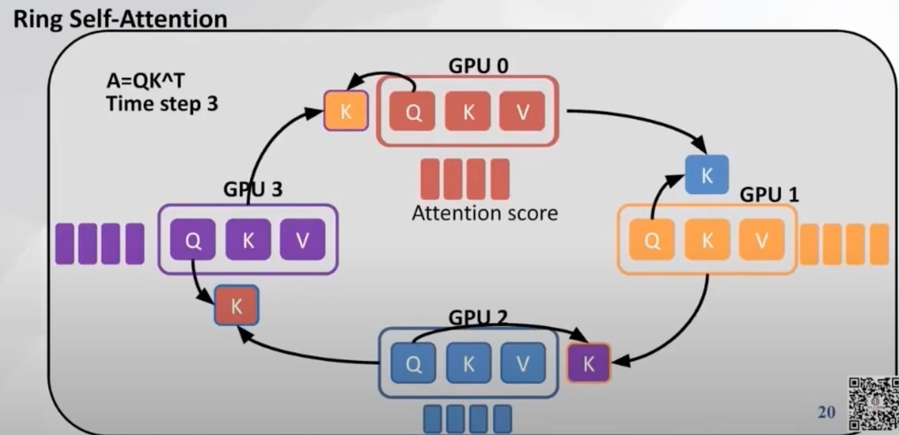
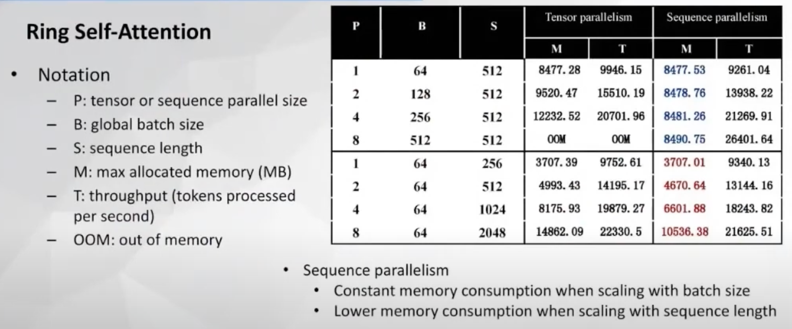

# Ring Attention 与序列并行

> 总览见 [稀疏注意力总览](./01-overview)。Ring 解决 **「单卡装不下、但语义仍需全连接 attention」**；与 [DSA](./04-deepseek-sparse-route)、[NSA](./03-native-sparse-attention) 等 **减少参与计算的 token 数** 正交。

## 要解决的问题

当序列长度 $L$ 达到 32K、128K 甚至更长时，即便使用 [Flash Attention](../05-flash-attention)，**单层激活与 KV 仍可能超出单卡 HBM**。典型瓶颈：

- **训练**：保存 $L\times L$ 中间量或分块累加时的 activation；batch 与序列长度无法同时拉大。
- **推理**：KV Cache 随 $L$ 线性增长；多卡推理若不做切分，单卡仍要承载完整 KV。

Ring Attention 与 **Sequence Parallel（序列并行）** 不把 attention 改成稀疏掩码，而是把 **序列维上的 K/V（及中间结果）切到多卡**，通过环形通信拼出全局 attention 结果。

## Ring Attention 核心机制



### 直觉

设 $P$ 张 GPU，将序列均分为 $P$ 段，每卡 initially 只持有本段 Query 及对应 K/V 块。要计算全局 attention，每卡的 Query 需要「见过」**所有位置的 K/V**。

**Ring 协议**：在 $P-1$ 轮通信中，每轮将本卡的 K/V block 发给环上下一张卡；各卡用收到的 K/V 块与本地 Q 做 attention 分块累加（配合 online softmax），$P$ 轮后每卡得到其负责 Query 位置上的**完整** attention 输出。

### 伪代码（概念级）

```text
# 每卡 p 持有 Q_p, K_p, V_p（序列的一段）
for step in 0 .. P-1:
    K_recv, V_recv = ring_receive_from_prev_gpu()
    partial_attn = flash_attn(Q_local, K_recv, V_recv)  # 分块累加
    accumulate_online_softmax(partial_attn)
    ring_send_to_next_gpu(K_local, V_local)  # 轮转本段 KV
```

### 复杂度与通信

| 维度 | 单卡稠密 | Ring（$P$ 卡） |
| --- | --- | --- |
| 每卡峰值 KV/激活 | $O(L)$ | 约 $O(L/P)$ |
| 全局总 FLOPs | $O(L^2)$ | 仍 $O(L^2)$（未减少总计算） |
| 通信量/步 | — | 与 KV block 大小成正比，约 $O(P)$ 轮 |

**结论**：Ring 是 **显存与并行度** 优化，不是算法渐近阶优化。

## Sequence Parallel

**序列并行（SP）** 将 LayerNorm、Dropout、部分 FFN 输入等 **沿序列维切分**，使 activation 不集中在单卡。与 Ring Attention 组合时：

- SP 降低 **非 attention 算子** 的激活峰值；
- Ring 降低 **attention 内 KV 与分块计算** 的峰值。



实践中（如 Megatron-LM、DeepSpeed-Ulysses 生态的多种组合），**Sequence Parallel + Ring Attention** 可将单卡峰值显存显著压低，使 **更长 $L$ 进入训练**。

## 与其它并行方式对比

| 方式 | 切分维度 | 主要缓解 | 是否保持全连接 attention |
| --- | --- | --- | --- |
| **Tensor Parallel** | 隐藏维 / 头维 | 参数与单层矩阵 | 是 |
| **Pipeline Parallel** | 层 | 层间激活 | 是 |
| **Ring / Sequence Parallel** | 序列 | KV、序列 activation | 是 |
| **Ulysses / Context Parallel** | 头或序列+通信重排 | 长上下文 attention 通信 | 是 |
| **滑动窗口 / DSA** | 算法掩码 | FLOPs 与访存 | 否（子集 token） |

:::tip Ulysses 与 Ring 的选型（经验判断）

- **Ring**：实现路径成熟，适合「KV 放不下」的训练集群。
- **Ulysses 类**：通过 all-to-all 重排 Q/K，有时在特定 $P$ 与 $H$ 下通信更优；需框架支持（如 DeepSpeed-Ulysses）。

二者常与 **Flash Attention** 内核叠加，与 **token 稀疏** 也可叠加（稀疏掩码在分块内核内实现）。

:::

## 工程落地

- **训练**：长上下文预训练/SFT 常用多卡 Ring + SP；需关注 **NCCL 带宽** 与 ring 步数带来的 wall-clock 开销。
- **推理**：多卡推理若不做 tensor parallel，Ring 类方案较少见；推理侧更常先做 **KV 压缩（GQA/MLA）** 或 **token 稀疏（DSA）**。
- **与 Flash**：分块 attention 累加天然适配 FlashAttention 的 tiling；工业实现多在分布式框架内封装。

## 局限与风险

1. **总 FLOPs 不降**：集群总算力需求仍随 $L^2$ 增长。
2. **通信瓶颈**：$P$ 过大或网络慢时，ring 步数拖累扩展效率。
3. **实现复杂度**：online softmax 跨块合并、梯度同步需与框架深度集成。
4. **不等同稀疏**：不能替代 [滑动窗口](./06-sliding-window-attention) 或 [DSA](./04-deepseek-sparse-route) 降低单卡推理成本。

## 参考链接

- Ring Attention with Blockwise Transformers for Near-Infinite Context ([arXiv:2310.01889](https://arxiv.org/abs/2310.01889))
- Megatron-LM 序列并行文档
- 总览对比：[稀疏注意力总览](./01-overview#主流方法对比表)
