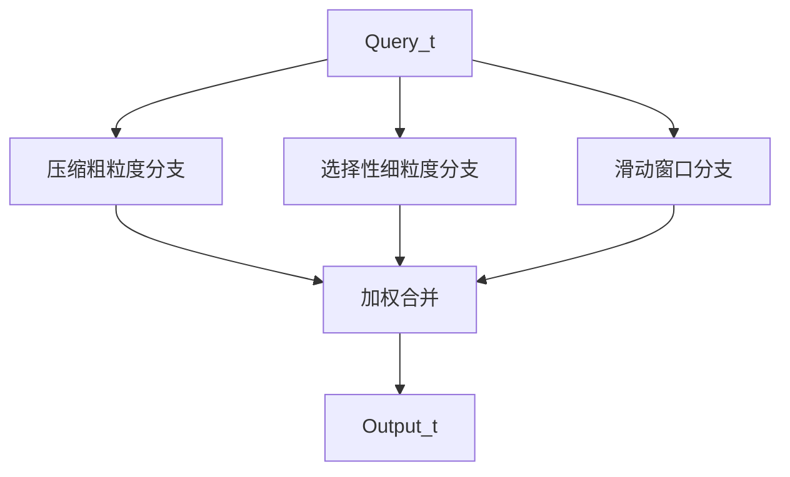

# Native Sparse Attention（NSA）

> 方法对比表见 [稀疏注意力总览](./01-overview#主流方法对比表)。论文：[Native Sparse Attention: Hardware-Aligned and Natively Trainable Sparse Attention](https://arxiv.org/abs/2502.11089)（DeepSeek-AI，2025）。

## 要解决的问题

经典 [滑动窗口](./06-sliding-window-attention) 与 [BigBird 类局部-全局](./07-local-global-sparse) 稀疏掩码能降低 FLOPs，但常面临两难：

1. **推理快、训练难**：若稀疏模式仅在推理期启发式施加，与预训练分布不一致，长文能力受损。
2. **硬件不友好**：随机或非连续 token 访问导致 KV Cache 散射，GPU 算力与带宽利用差。

**NSA（Native Sparse Attention）** 目标同时满足：**(1) 硬件对齐的块稀疏访问**；**(2) 端到端可训练的稀疏 attention**。

## 核心思想：三层并行路径

NSA 将历史 K/V 组织为 **时间块（temporal blocks）**，对每个 query 位置并行执行三条 attention 路径，再聚合输出：

| 分支 | 作用 | 类似经典方法 |
| --- | --- | --- |
| **压缩注意力** | 将若干 token 块压缩为少量 **粗粒度** 表示，捕获远程摘要 | 低秩/池化全局信息 |
| **选择注意力** | 按重要性分数保留 **少量完整块**（细粒度） | 内容相关 top-block |
| **滑动窗口** | 局部连续 token，保证邻近上下文 | [SWA](./06-sliding-window-attention) |

三条路径输出在 query 维合并（学习上可视为多分支 attention 的加权和或拼接后投影，以实现为准）。

## 硬件对齐设计

NSA 强调 **块连续（block-contiguous）** 访存：

- 压缩分支：在 **连续压缩块** 上计算；
- 选择分支：选取 top-$m$ 个 **64-token 级块**（实现细节以论文/内核为准），并常 **固定激活首块**（缓解 [Attention Sink](./06-sliding-window-attention#attention-sink注意力汇)）；
- 滑窗分支：最近 $w$ 个连续 token（如 512 token 窗口）。

这样 Triton/CUDA 内核可使用 **Tensor Core 友好的块矩阵乘**，与 [Flash Attention](../05-flash-attention) 的 SRAM tiling 理念一致：**算法稀疏定义访问模式，Flash 类内核负责 IO 高效**。

:::note 与 Flash Attention 的关系

Flash 解决 **同一块内** 的 HBM 流量；NSA 解决 **哪些块需要参与计算**。二者正交，可栈式组合。

:::

## 可训练性

NSA 提供 **可微的稀疏选择** 与稳定反向（含针对块选择的梯度处理），支持 **预训练阶段即使用稀疏 attention**，避免「训练稠密、推理稀疏」的分布偏移。

报告中的效率（以 64K 上下文为例，硬件与实现相关）：

- 前向约 **9.0×** 加速；
- 解码约 **11.6×** 加速；
- 下游任务与全注意力相当或部分更优（以论文表格为准）。

## 与 DeepSeek DSA 的对比

| 维度 | NSA (2025 论文) | DSA (V3.2 工业架构) |
| --- | --- | --- |
| 稀疏结构 | 固定三分支（压缩+选择+滑窗） | Indexer top-$k$ token + MLA |
| KV 处理 | 块级 K/V | MLA 潜空间压缩 + 精细子集 |
| 训练 | 原生稀疏预训练 | Continued training 引入 |
| 目标场景 | 通用长上下文 LM | 128K+ Agent / 代码仓 |
| 与 MLA 关系 | 独立架构研究方向 | 在 MLA 之上叠加 |

二者都强调 **内容相关选择** 与 **GPU 友好访问**；DSA 更深度耦合 DeepSeek 的 **MLA 推理栈**（FlashMLA、vLLM 等）。

## 与经典稀疏模式的关系

- 相对 [滑动窗口](./06-sliding-window-attention)：NSA 的滑窗只是 **三分支之一**，远程依赖由 **压缩+选择** 补充。
- 相对 [Longformer/BigBird](./07-local-global-sparse)：NSA 的选择分支类似 **learned global blocks**，但块划分与压缩分支是 **层级化** 设计，且 **端到端训练稀疏模式**。

## 工程落地与局限

**落地**：

- 需 **专用 Triton/CUDA 内核** 实现三分支与合并；
- 与现有 Hugging Face / vLLM 栈的集成取决于社区或官方分支。

**局限**：

- 超参（块大小、top 块数、窗口长）需与模型尺度联调；
- 极短序列（$L < $ 窗口）收益有限；
- 与 **Ring 并行** 正交：NSA 减 FLOPs，Ring 减单卡显存。

## 参考链接

- 论文：[arXiv:2502.11089](https://arxiv.org/abs/2502.11089)
- 工业路线对比：[DeepSeek 稀疏路线](./04-deepseek-sparse-route)
- 讨论：[rasbt 稀疏注意力线程](https://x.com/rasbt/status/2055637086380650538)
