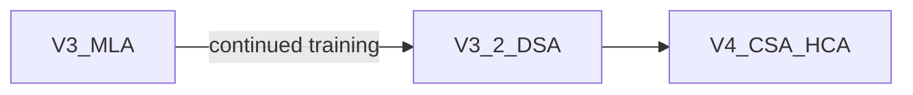

# 2.3.6.4 DeepSeek 稀疏注意力路线（V3 / V3.2 / V4）

> 总览见 [稀疏注意力总览](./01-overview)。**MLA 公式与示意图**见 [注意力变体：MQA、GQA、MLA](../04-attention-variants#multi-lantent-attention)；技术报告领读见 [V3](/paper-reading/tech-report/deepseek/deepseek-v3)、[V4](/paper-reading/tech-report/deepseek/deepseek-v4)。

DeepSeek 在长上下文上的路线可概括为：**先压 KV（MLA）→ 再压连接数（DSA）→ 超长上下文统一压缩+稀疏（CSA/HCA）**。

## 三代总览

| 版本 | 注意力机制 | 稀疏类型 | 训练受益 | 推理受益 | 典型上下文 |
| --- | --- | --- | --- | --- | --- |
| **V2 / V3 / R1** | MLA | KV 压缩，**非** token 稀疏 | 中（激活/KV） | **高**（KV 带宽） | 128K |
| **V3.2** | MLA + DSA | 内容相关 top-$k$ | 高（长文 FLOPs） | **高** | 128K+ |
| **V4** | CSA + HCA | 分层混合 | 高 | **极高**@1M | **1M** |

---

## DeepSeek-V3：MLA 基座（KV 压缩，非 token 稀疏）

### 要解决的问题

标准 MHA 的 KV Cache 随头数 $H$ 与头维 $d$ 线性增长。长上下文 **推理瓶颈往往在 KV 读取带宽**，而非仅 FLOPs。

### 核心机制（直觉）

**MLA（Multi-head Latent Attention）** 将每个 token 的 $K,V$ 先映射到低维 **latent** 空间再缓存；推理时由 latent 恢复参与 attention 的有效 $K,V$：

- **Down-projection**：$c^{KV}_t = W^{DKV} h_t$（维度 $d_c \ll H \cdot d$）
- **Up-projection / 多头恢复**：由 $c^{KV}$ 生成各头所需 $K,V$
- **解耦 RoPE**：位置信息通过独立通道注入，避免压缩破坏位置编码

相对 MHA，**KV Cache 体积可降至约 1/3～1/5 量级**（取决于 $d_c$ 与头数配置，以官方实现为准）。

### 与「稀疏注意力」的边界

在 **每个历史 token 仍进入 attention 打分** 的意义上，V3 仍是 **稠密 token 连接**；「稀疏」仅体现在 **KV 表示压缩**。若论文语境下 sparse attention 特指 **少算 token 对**，则 V3 应归类为 [KV 压缩](./08-kv-compression-boundary)，**token 稀疏从 V3.2 DSA 开始**。

### 与其它组件

- **DeepSeekMoE**、**MTP**、**FP8 训练** 与 MLA 正交，共同构成 V3 训练/推理效率。
- 详见 [DeepSeek-V3 技术报告](/paper-reading/tech-report/deepseek/deepseek-v3)。

---

## DeepSeek-V3.2：DSA（DeepSeek Sparse Attention）

### 要解决的问题

MLA 解决了 KV 体积，但 **注意力 FLOPs 仍随 $L^2$ 增长**。在 Agent、代码仓等 **有效上下文接近 128K+** 时，需减少 **参与精细 softmax 的 token 数**。

V3.2 相对 V3.1-Terminus 的 **核心架构改动**：在 continued training 中引入 **DSA**，保留 MLA 压缩 KV，对历史 token 做 **动态子集选择**。

### 两阶段流程

**1. Lightning Indexer（闪电索引器）**

- 轻量网络，常用 **FP8** 计算；
- 输入：MLA 压缩后的 $K$ 表示与当前 $Q$；
- 打分：类似 scaled dot-product，常配合 **ReLU** 等非负激活，得到每个历史位置的相关性分数；
- 多头 indexer 分数聚合为 **内容相关** 的重要性分布。

**2. Fine-grained Token Selection（细粒度 token 选择）**

- 对每个 query 位置取 **top-$k$** 历史 token（公开解读中 $k$ 常见 $\approx 2048$ 量级，以官方 config 为准）；
- 仅对该子集做 **完整精度** 的 attention（与 MLA 主干配合）；
- 复杂度由 $O(L^2)$ 降为约 **$O(L \cdot k)$**。

### 与滑动窗口 / NSA 的对比

| 方法 | 掩码是否随内容变化 | 远程 token 是否可命中 |
| --- | --- | --- |
| [滑动窗口](./06-sliding-window-attention) | 否（固定邻域） | 仅能通过层叠间接传递 |
| [NSA](./03-native-sparse-attention) | 是（块选择+压缩分支） | 是 |
| **DSA** | 是（indexer top-$k$） | 是 |

### 工程要点

- **非连续访存**：top-$k$ 索引导致 KV _gather 不规则，需 **定制 CUDA kernel**（社区常与 FlashMLA 结合）；
- **推理栈**：需 vLLM / Transformers 等支持 DSA 的分支版本；
- **训练**：continued training 使模型适应稀疏分布，避免推理期才启用稀疏的失配。

**参考**：[DeepSeek-V3.2 技术报告](https://arxiv.org/abs/2512.02556)

---

## DeepSeek-V4：CSA + HCA（取代 MLA 的混合压缩注意力）

### 要解决的问题

目标 **原生 1M token** Agent 上下文；在 1M 长度下若仍主要依赖 V3.2 式精细 attention，FLOPs 与 KV 仍过高。

V4 **不再沿用 MLA**，改用层间交替的：

- **HCA（Heavily Compressed Attention）**：极强压缩的「远距离摘要通道」；
- **CSA（Compressed Sparse Attention）**：在压缩框架下的 **选择性** 长程交互。

### 分层调度（V4-Pro，细节以 PDF 为准）

1. **前几层 HCA bootstrap**：建立长程粗粒度表征；
2. **中间层 CSA/HCA 交替**：不同层覆盖不同距离尺度（局部精细 vs 长程压缩）；
3. **末端 MTP 块**：**滑动窗口** attention，服务多 token 预测与近端依赖。

相对 V3.2 @1M 上下文，报告给出约 **27% 单 token FLOPs、10% KV Cache**（V4-Pro；Flash 规格更激进）。

### 概念对照

| 机制 | 角色 |
| --- | --- |
| **HCA** | 降全序列「精细 attention」占比 |
| **CSA** | 在压缩下做稀疏/选择性长程交互 |
| **末端滑窗** | 锚定局部一致性、配合 MTP |

V4 另含 **mHC**、**Hash-MoE**、**Grouped output projection** 等，与 attention 正交；见 [DeepSeek-V4 领读](/paper-reading/tech-report/deepseek/deepseek-v4)。

**官方报告**：[DeepSeek_V4.pdf](https://huggingface.co/deepseek-ai/DeepSeek-V4-Pro/blob/main/DeepSeek_V4.pdf)

---

## 三代实现对比（实现视角）

| 维度 | V3（MLA） | V3.2（+DSA） | V4（CSA+HCA） |
| --- | --- | --- | --- |
| 是否对所有 token 完整 softmax | 是（压缩 KV 上） | 否（top-$k$ 子集） | 分层混合，非全局稠密 |
| 主要节省 | KV 显存/带宽 | 长序列 FLOPs+访存 | 超长序列 FLOPs+KV |
| 稀疏是否内容相关 | — | 是 | 是 |
| 典型部署场景 | 通用长文推理 | Agent 128K+ | 1M Agent 基座 |

## 选型建议

- **只需降 KV、$L\le 128$K**：V3 系 MLA + GQA 类栈已成熟；
- **长文/Agent 要降 FLOPs**：V3.2+ DSA 或同等 **content-aware top-$k$**；
- **百万 token 经济学**：V4 CSA/HCA 路线；需跟进推理框架支持。

## 参考链接

- [DeepSeek-V3](/paper-reading/tech-report/deepseek/deepseek-v3)
- [DeepSeek-V4](/paper-reading/tech-report/deepseek/deepseek-v4)
- [A Technical Tour of DeepSeek V3 to V3.2](https://magazine.sebastianraschka.com/p/technical-deepseek)
- [Hugging Face：DeepSeek-V4 与 Agent 效率](https://huggingface.co/blog/deepseekv4)
