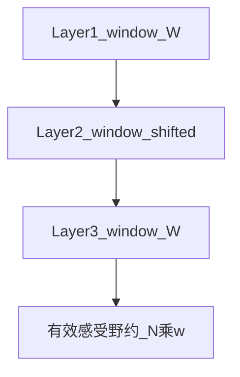

# 滑动窗口注意力（SWA）

> 总览见 [稀疏注意力总览](./01-overview)。混合全局 token 见 [局部-全局稀疏](./07-local-global-sparse)。

## 要解决的问题

全连接 attention 中，大量 FLOPs 用于 **距离很远的 token 对**，而语言局部性表明 **邻近 token 往往最重要**。滑动窗口注意力（Sliding Window Attention, SWA）对每个 query 位置 $i$ 只允许 attend 到 $[i-w,\, i]$（因果解码）或 $[i-w,\, i+w]$（双向编码）内的 key，将复杂度从 $O(L^2)$ 降为 **$O(L \cdot w)$**，$w$ 为窗口半径。

## 掩码机制

因果 LM（如 Mistral 类 decoder）常用：

$$
M_{ij} = \begin{cases}
0 & \text{if } i-w \le j \le i \\
-\infty & \text{otherwise}
\end{cases}
$$

$$
\text{Attn}(Q,K,V) = \text{softmax}\left(\frac{QK^\top}{\sqrt{d}} + M\right)V
$$

**参数量不变**，稀疏性完全由 **固定结构化掩码** 引入；实现上可用 **块稀疏 Flash** 或专用 kernel，仅计算窗口内块。

## 层间滑窗偏移（Shifted Window）

若 **每一层** 使用相同窗口，则有效感受野增长慢。Mistral 等模型在 **相邻层错开窗口偏移**（如一层看 $[i-w,i]$，下一层偏移 half-window），使堆叠 $N$ 层后有效感受野约 **$O(N \cdot w)$**，仍远小于 $L$，但优于单层 $w$。

## Attention Sink（注意力汇）

实践发现：即便使用滑窗，**初始几个 token**（尤其首 token）仍常获得 disproportionately 高 attention 权重——称为 **attention sink**。部分 SWA 实现会：

- **始终保留** 对序列开头少量 token 的 attention（超出严格滑窗）；
- 或与 [NSA](./03-native-sparse-attention) 一样 **固定激活首块**。

这与 [解码器因果掩码](../../02-transformer-details/02-decoder-causal-mask) 笔记中的 sliding window / attention-sink 讨论一致。

## 代表模型与配置

| 模型/工作 | 窗口策略 | 上下文 |
| --- | --- | --- |
| **Mistral / Mixtral** | 滑窗 + 层间偏移 | 32K 等 |
| **Longformer（局部层）** | 滑窗 + 全局 token | 见 [07-local-global](./07-local-global-sparse) |
| **DeepSeek V4 MTP 段** | 末端块滑窗 | 配合 CSA/HCA |

## 优劣分析

**优点**：

- 掩码 **固定**，内核实现简单，易与 Flash 结合；
- 训练/推理 **行为一致**，无「训练稠密、推理稀疏」问题；
- 对代码/对话等 **局部强相关** 任务性价比高。

**缺点**：

- **远程依赖** 需多层传递或额外 [全局 token](./07-local-global-sparse)；固定滑窗对「第 1 token 与第 500K token 直接交互」能力弱；
- 相对 [DSA](./04-deepseek-sparse-route)、[NSA](./03-native-sparse-attention)，**无法按内容** 挑选远距离关键 token；
- $w$ 过小损质量，过大趋近稠密，需按任务调 $w$。

## 与其它方法对比

| 方法 | 掩码 | 远程命中 |
| --- | --- | --- |
| **SWA** | 固定局部 | 间接（多层） |
| **Local+Global** | 局部 + 少量全局位 | 显式全局 token |
| **DSA / NSA 选择分支** | 内容相关 | 直接 |

## 工程落地

- Hugging Face `transformers` 对 Mistral 等已内置滑窗 mask；
- 推理时 KV Cache 只需保留 **最近 $w$ 个 token** 的 K/V（+ sink token），**显存约 $O(w)$** 每层，而非 $O(L)$——这是 SWA 推理侧的核心收益。

## 参考链接

- Mistral 7B 技术报告
- Longformer: [arXiv:2004.05150](https://arxiv.org/abs/2004.05150)（局部+全局）
- 总览：[稀疏注意力总览](./01-overview)
