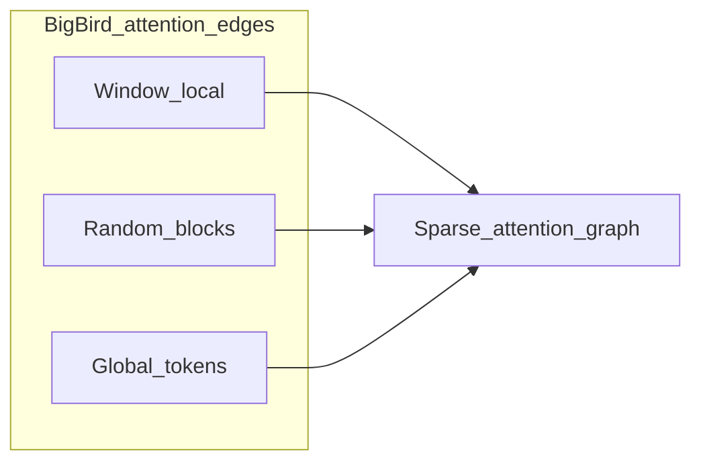

# 2.3.6.7 局部-全局稀疏注意力（Local + Global）

> 滑动窗口基础见 [滑动窗口注意力](./06-sliding-window-attention)。可学习多分支见 [NSA](./03-native-sparse-attention)。

## 要解决的问题

纯 [滑动窗口](./06-sliding-window-attention) 难以让任意两个远距离 token **直接** 交互。Longformer、BigBird 等在 **局部窗口** 之外，为少量位置保留 **全局 attention 边**，在 $O(L\cdot w + L\cdot g)$ 复杂度下兼顾局部与远程，$g$ 为全局 token 数（常 $\ll L$）。

## Longformer

### 结构

- **滑动窗口**：每个 token attend 邻近 $w$ 个 token（局部）；
- **全局 token**：
  - **任务驱动全局**：如 QA 中整段 **问题** token 对所有文档 token 可见；
  - **空全局 token**（如 `<s>`）：作为汇聚信息的枢纽。

### 复杂度

每层约 $O(L \cdot w + L \cdot g)$；当 $g \ll L$ 且 $w$ 固定时，相对 $O(L^2)$ 显著节省。

### 适用场景

长文档 QA、摘要等 **明确「全局锚点」** 的任务；预训练通用 LM 时需设计全局 token 策略，否则 inductive bias 与下游不匹配。

## BigBird

### 稀疏图组成

BigBird 将 attention 图定义为三种边的并集：



| 边类型 | 含义 | 作用 |
| --- | --- | --- |
| **Window** | 局部滑窗 | 局部性、硬件友好 |
| **Random** | 随机块连接 | 扩大感受野、理论连通性 |
| **Global** | 少数 token 连接全体 | 远程信息高速公路 |

### 理论性质

BigBird 证明在适当参数下，该类稀疏图 **可近似全连接 attention 的表达力**（图灵完备性相关讨论见原论文），并给出 **$O(L)$** 复杂度变体。

### 与 Longformer 对比

|  | Longformer | BigBird |
| --- | --- | --- |
| 全局边 | 任务相关全局 token | 内置 global + random |
| 随机边 | 通常无 | 有 |
| 主要应用 | 长文档理解 | 编码器、部分预训练 |

## 稀疏模式可视化（概念）

对序列位置 $i$，允许 attend 的 $j$ 集合示意：

```text
全连接:     ████████████████  (所有 j)
滑窗 only:  ....████....      (|i-j|<=w)
Local+Global: ..██Global██.. + 窗口块
```

## 与 NSA、DSA 的历史脉络

| 时代 | 思路 | 代表 |
| --- | --- | --- |
| 固定图稀疏 | 人工设计窗口+全局+随机 | Longformer, BigBird |
| 可学习块稀疏 | 三分支压缩+选择+滑窗、可训练 | [NSA](./03-native-sparse-attention) |
| 工业 content-aware | Indexer top-$k$ + MLA | [DSA](./04-deepseek-sparse-route) |

NSA 可看作在 **硬件对齐块** 上统一了「全局压缩 + 局部选择 + 滑窗」；DSA 则用 **连续训练** 的 indexer 实现 **内容相关** 稀疏，而非固定 $g$ 个全局 token。

## 工程落地

- **BERT 时代** 编码器长文本常用 Longformer/BigBird 变体；
- **Decoder LLM** 时代更常见纯 SWA（Mistral）或 **DSA/NSA**；Local+Global 思想仍体现在 **全局 sink token**、**NSA 压缩分支** 等设计中。
- 实现需 **稀疏 attention mask** 或 block-sparse kernel；稀疏度不足时收益有限。

## 局限

1. **全局 token 数量 $g$** 需调参；过小损远程能力，过大趋近稠密。
2. **Random 边** 增加实现与复现复杂度，推理引擎支持不均。
3. 与 **KV 压缩（MLA）** 正交：可先 Local+Global 减 FLOPs，再用 MLA 减 cache。

## 参考链接

- Longformer: [arXiv:2004.05150](https://arxiv.org/abs/2004.05150)
- BigBird: [arXiv:2007.14062](https://arxiv.org/abs/2007.14062)
- 总览：[稀疏注意力总览](./01-overview)
