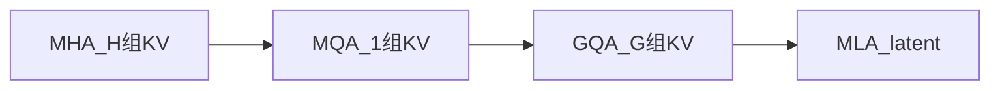

# 2.3.6.8 KV 压缩与「稀疏」的边界（MQA / GQA / MLA）

> **公式、示意图与实现细节** 以 [注意力变体：MQA、GQA、MLA](../04-attention-variants) 为准。本章说明它们为何 **不是 token 级稀疏**，以及如何与 [DSA](./04-deepseek-sparse-route) 等 **叠加**。

## 核心结论（先读）

| 手段 | 是否减少 attended token 数 | 是否减小 KV Cache | 注意力 FLOPs 渐近阶 |
| --- | --- | --- | --- |
| **MQA / GQA / MLA** | **否** | **是** | 仍 $O(L^2)$（常数改善） |
| **SWA / DSA / NSA** | **是** | 常同时降低 | $< O(L^2)$ |

:::note 命名建议

称 MQA/GQA/MLA 为 **「KV 压缩注意力」** 或 **「高效注意力」** 比统称为 **「稀疏注意力」** 更准确，避免与掩码稀疏混淆。

:::

## MQA → GQA → MLA 递进

### MQA（Multi-Query Attention）

- **所有 query 头共享同一组 $K,V$**；
- KV Cache 相对 MHA 约减至 **$1/H$**（$H$ 为头数）；
- 表达力可能下降，适合推理吞吐优先场景。

### GQA（Grouped-Query Attention）

- 将 $H$ 个 Q 头分为 $G$ 组，**每组共享一组 $K,V$**；
- 在 **KV 体积** 与 **质量** 之间插值；Llama 2/3、Qwen 等广泛采用。
- 图示与计算逻辑见 [注意力变体](../04-attention-variants#grouped-query-attentionppo)。

### MLA（Multi-head Latent Attention）

- 将 $K,V$ **投影到低维 latent** 再缓存，解码时恢复；
- DeepSeek V2/V3/R1 核心组件；KV 可比 MHA 再降 **数倍**（配置相关）；
- 配合 **解耦 RoPE**；详见 [注意力变体](../04-attention-variants#multi-lantent-attention) 与 [DeepSeek 稀疏路线](./04-deepseek-sparse-route#deepseek-v3mla-基座kv-压缩非-token-稀疏)。

## 为何不算 token 稀疏

对长度 $L$ 序列，GQA/MLA 在计算 $\text{softmax}(QK^\top)V$ 时，**仍对（几乎）每个历史位置计算注意力分数**（可能在压缩后的 $K$ 表示上），连接图仍是 **稠密** 的。

**节省发生在**：

- **存储**：每个位置 cache 的 bytes ↓；
- **带宽**：推理每步读取的 KV ↓；
- 部分实现中 **FLOPs 常数项** ↓（头维/投影变化）。

**不发生在**：

- 将 $L^2$ 渐近阶改为 $L\cdot k$（需 [DSA](./04-deepseek-sparse-route)、[NSA](./03-native-sparse-attention) 等）。

## 工业组合建议

| 目标 | 常见栈 |
| --- | --- |
| 8K–32K Chat | GQA + [Flash Attention](../05-flash-attention) |
| 128K 推理省显存 | MLA 或 GQA + Flash |
| 128K+ Agent 省 FLOPs | MLA + **DSA**（V3.2） |
| 1M Agent | **CSA/HCA**（V4）+ 推理框架跟进 |
| 训练单卡装不下 | [Ring](./02-ring-attention) + 上表推理优化 |

## 与总览表的关系

[稀疏注意力总览](./01-overview#主流方法对比表) 中 **MQA/GQA/MLA** 一行指向本章；**DSA/NSA/SWA** 一行指向 token 稀疏专章。阅读技术报告时建议 **先分清类型再对号入座**。

## 参考链接

- 本仓库：[04-attention-variants.md](../04-attention-variants)
- [DeepSeek-V3](/paper-reading/tech-report/deepseek/deepseek-v3)
- GQA 论文：Ainslie et al., [arXiv:2305.13245](https://arxiv.org/abs/2305.13245)
