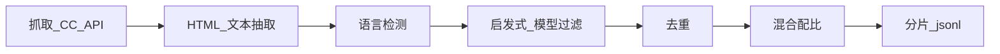

# 3.1.1 数据来源（Common Crawl、C4、The Pile、Dolma、FineWeb）

## 要解决的问题

预训练需要**数十亿到数万亿 token** 的文本，但「从互联网抓什么、以什么形态交付给训练」直接决定模型的语言能力、事实覆盖、代码/数学能力与安全边界。工程上要在**规模、多样性、许可合规、清洗成本**之间权衡，并建立可复现的数据版本（snapshot + 处理 pipeline）。

## 核心概念

| 语料 / 项目 | 规模与特点 | 典型用途 |
| --- | --- | --- |
| **Common Crawl** | 月度网页快照，原始噪声大 | 大规模网页基座，需重度清洗 |
| **C4** | 基于 CC 的清洗子集（~750GB 英文） | T5、mT5 等经典预训练 |
| **The Pile** | 22 子集混合（~825GB） | 开源 LM 基线（GPT-Neo 等） |
| **Dolma** | Allen AI 开放 pipeline + 混合配方 | OLMo 等可复现预训练 |
| **FineWeb** | Hugging Face 高质量网页语料 | 近年开源大模型常用网页源 |

除通用文本外，现代 recipe 常**显式掺入**：

- **代码**：GitHub、The Stack、StarCoder 数据
- **数学 / 科学**：arXiv、Proof-Pile、教科书
- **对话风格**：Reddit、论坛（需额外过滤）

数据 token 量 $D$ 与参数量 $N$ 的配比见 [Chinchilla](../04-scaling-laws/02-chinchilla-scaling-laws.md)；采集后必经 [清洗去重](./02-cleaning-deduplication.md) 与 [质量过滤](./03-quality-filtering.md)。

## 方法/算法

典型构建流程：

1. **抓取**：WARC/HTML → 正文（trafilatura、readability 等）。
2. **语言与域**：fastText、CLD3 等做语种；可按域名白/黑名单分层。
3. **子集标注**：为每条样本记录 `source`（web、book、code…），供 [数据混合](./04-data-mixture.md) 调度。
4. **版本冻结**：固定 CC 月份 + pipeline git hash，避免「同一模型名、不同数据」不可比。

## 工程实践

- **存储**：原始 WARC 体积极大，生产环境常用对象存储 + 列式/压缩文本（`.jsonl.zst`）。
- **吞吐**：清洗多为 CPU/IO 密集，用 Spark、Ray Data、Datatrove 等横向扩展。
- **指标**：保留率（filter 后占比）、语种分布、平均文档长度、重复率、毒性/PII 抽检比例。
- **与默认 docs 对照**：更完整的收集清单见 [预训练数据准备](../../../../docs/01-llm-intro/05-training/01-dataset)。

## 代表工作

- Common Crawl：https://commoncrawl.org/
- C4（Raffel et al.）：https://arxiv.org/abs/1910.10683
- The Pile：https://arxiv.org/abs/2101.00027
- Dolma：https://arxiv.org/abs/2402.00159
- FineWeb：https://arxiv.org/abs/2406.17557

## 局限与注意点

- **版权与许可**：网页、书籍、代码许可证各异，见 [3.1.5 数据版权](./05-data-licensing.md)。
- **基准污染**：热门 benchmark 文本可能出现在 crawl 中，评估需做去污染检测。
- **语种偏置**：以英文网页为主的 mixture 会削弱低资源语言；中文常需补充维基、新闻、行业语料。
- **静态快照**：训练截止后模型无法自动获知新事实，需 RAG 或持续预训练补充。

## 常见数据源对照（补充）

| 子集类型 | 示例 | 能力倾向 |
| --- | --- | --- |
| 通用网页 | C4、FineWeb | 语言建模基座 |
| 书籍 | Gutenberg、Books3 | 长文、叙事 |
| 百科 | Wikipedia | 事实性陈述 |
| 代码 | The Stack | 补全、FIM |
| 论文 | arXiv | STEM 术语 |

## 实践检查清单

- [ ] 固定 Common Crawl 快照月份并写入 data card
- [ ] 记录清洗前后 token 数与各 `source` 占比
- [ ] 对下游评测集做 n-gram 污染检测
- [ ] 与 [3.1.4 混合](./04-data-mixture.md) 配方版本号绑定

## 小结

数据来源决定模型「见过什么世界」；工程重点是**可复现 pipeline + 许可可追溯**，而非单纯追求 crawl 体积。

## 相关章节

- 下一节：[3.1.2 数据清洗与去重](./02-cleaning-deduplication.md)
- 同章：[3.1.4 数据混合](./04-data-mixture.md) · [3.1.5 合规](./05-data-licensing.md)
- 分词：[3.2.1 分词层级](../02-tokenization/01-tokenization-levels.md)
- 规模律：[3.4.2 Chinchilla](../04-scaling-laws/02-chinchilla-scaling-laws.md)
