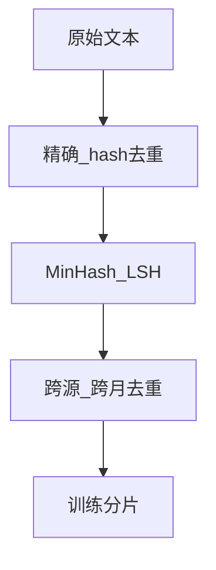

# 数据清洗与去重

## 要解决的问题

原始 crawl 含 HTML 噪声、 boilerplate、乱码、近重复与完全重复段落。不去重则模型浪费算力记忆重复 n-gram，并放大**记忆化与泄露**风险；不清洗则 tokenizer 与 loss 被垃圾字符主导。目标是在可接受成本下，将语料变为**干净、近似独立同分布**的训练流。

## 核心概念

| 类型 | 手段 | 复杂度 |
| --- | --- | --- |
| **格式清洗** | 去 HTML、unicode 规范化、控制字符 | 低 |
| **启发式过滤** | 长度、符号比、行重复、脏词表 | 低～中 |
| **精确去重** | 行级 / 文档级 hash（MD5、SHA） | 中 |
| **模糊去重** | MinHash + LSH、SimHash、后缀数组 | 高 |

设文档 $d$，指纹 $h(d)$。精确去重保留首个 $h$，丢弃其余；模糊去重若 $\text{sim}(d_i,d_j)>\tau$ 则只保留代表元。

全局 dedup 常用 **MinHash** 估计 Jaccard：

$$
J(A,B) \approx \frac{|\cap_{i=1}^{k} h_i(A) \cap h_i(B)|}{k}
$$

## 方法/算法

推荐 pipeline 顺序（与 [Dolma](https://arxiv.org/abs/2402.00159)、FineWeb 实践一致）：

1. **规范化**：NFKC、统一换行、可选小写（多语言需谨慎）。
2. **段落切分**：按空行或 `\n\n` 得 segment，便于行级 dedup。
3. **精确 dedup**：对 segment 做 hash 集合；对整篇文档再做 document-level hash。
4. **模糊 dedup**：对 segment 计算 MinHash 签名 → LSH 桶内比对，阈值常用 0.7～0.9（需在小样本上调）。
5. **跨快照去重**：多个月份 CC 合并时，对 URL+正文联合去重，避免月度增量重复。

## 工程实践

- **工具**：datatrove、deduplicate-text-datasets、Google `datasketch`、Spark `dropDuplicates`。
- **算力**：模糊去重最吃 CPU/RAM；可对长文档先 **sketch 子采样** 再全量比对。
- **可观测**：报告 dedup 前后 token 数、唯一文档率、最长重复簇大小。
- **与质量过滤关系**：清洗去重后仍要做 [3.1.3 质量过滤](./03-quality-filtering.md)，二者不可互换。

## 代表工作

- C4 清洗规则：https://arxiv.org/abs/1910.10683
- The Pile deduplication 说明：https://arxiv.org/abs/2101.00027
- Dolma pipeline：https://arxiv.org/abs/2402.00159
- FineWeb 去重与过滤：https://arxiv.org/abs/2406.17557
- 大规模模糊去重实践（GPT-3 技术报告）：https://arxiv.org/abs/2005.14165

## 局限与注意点

- **过度去重**：高阈值会删掉合法引用、模板化新闻，损害多样性。
- **近重复≠无价值**：问答站、许可证文本重复率高但语义仍可能有用，需分源策略。
- **多语言**：中文无空格分词，行级切分规则要与 [分词](../02-tokenization/06-multilingual-tokenization.md) 策略一致。
- **顺序依赖**：先质量过滤再全局 dedup 可省算力，但可能漏掉「低质但重复」样本，需 A/B。

## 去重强度与效果（经验）

| 策略 | 典型 token 保留率 | 风险 |
| --- | --- | --- |
| 仅精确 | 70%～90% | 近重复残留 |
| + 模糊 0.8 | 50%～70% | 误删引用 |
| 跨月全局 | 再降 10%～20% | 算力成本高 |

## 实践检查清单

- [ ] 报告 segment 级与 document 级去重贡献
- [ ] 抽样检查被删簇是否含高价值模板（许可证、API 文档）
- [ ] 中文语料单独验证切分规则

## 小结

去重是**降低记忆化与算力浪费**的第一道杠杆；阈值应在小样本上对比 PPL 与 benchmark 后再全量运行。

## 相关章节

- 上一节：[3.1.1 数据来源](./01-data-sources.md)
- 下一节：[3.1.3 质量过滤](./03-quality-filtering.md)
- 混合：[3.1.4 数据混合](./04-data-mixture.md)
- 参考：[预训练数据准备 pipeline](../../../../docs/01-llm-intro/05-training/01-dataset)
