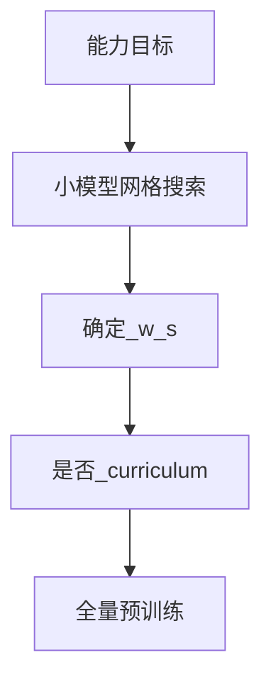

# 3.1.4 数据混合与配比

## 要解决的问题

多源语料（网页、书籍、代码、维基、对话）**统计性质差异巨大**。若按自然出现频率训练，模型会偏向短网页、重复模板；若某一领域过少，则代码、数学、推理能力受限。数据混合要回答：各源 token 占比多少、是否随训练步数变化（curriculum）、如何用小规模实验外推全量 recipe。

## 核心概念

设源 $s \in \mathcal{S}$，目标混合权重 $w_s$，$\sum_s w_s = 1$。实际实现常用 **重采样**：从源 $s$ 抽样概率 $\propto w_s / |D_s|^{-\alpha}$，$\alpha=0$ 为按自然量，$\alpha=1$ 接近均匀（The Pile 等经验）。

| 策略 | 含义 |
| --- | --- |
| **静态 mixture** | 全程固定 $w_s$ |
| **Data curriculum** | 前期通用语料，后期加代码/数学/指令 |
| **Upsampling** | 提高低资源源（书籍、论文）权重 |
| **Downsampling** | 压低网页占比 |

训练 token 预算 $D_{\text{total}}$ 与 Chinchilla 最优参数量 $N$ 见 [3.4.2](../04-scaling-laws/02-chinchilla-scaling-laws.md)；混合影响的是**有效能力分配**而非 FLOPs 公式本身。

## 方法/算法

调参流程建议：

1. **定义能力目标**：通用语言、代码、数学、多语、安全风格各占优先级。
2. **代理实验**：在 100M～1B 参数模型上扫 3～5 组 $w_s$，看 HellaSwag、HumanEval、GSM8K 子集。
3. **记录 per-source loss**：若某源 loss 长期高于其他源，可能权重过低或质量差。
4. **课程学习（可选）**：前 80% step 高网页+书籍，后 20% 提高 code/math（LLaMA、DeepSeek 等技术报告常见描述，具体比例因厂而异）。

## 工程实践

- **实现**：多路 `IterableDataset` 按权重随机选源；或用预混好的 shard 列表。
- **可观测**：每 1k step 记录各 `source` 的 token 计数与 loss 滑动平均。
- **与 SFT 区分**：预训练 mixture 是无标注文本；指令数据属于后训练（第四部分）。
- **参考**：[预训练数据准备](../../../../docs/01-llm-intro/05-training/01-dataset) Data Scheduling 小节。

## 代表工作

- The Pile 子集权重：https://arxiv.org/abs/2101.00027
- LLaMA 2/3 数据混合（技术报告）：https://arxiv.org/abs/2307.09288
- Dolma 配方：https://arxiv.org/abs/2402.00159
- DeepSeek-V3 数据策略（见本仓库 [技术报告](../../08-technical-reports/01-deepseek/01-deepseek-v3.md)）

## 局限与注意点

- **小模型外推不全可靠**：1B 上最优 mixture 未必等于 70B 最优（个人理解，需全量验证）。
- **源间重复**：混合前必须 [去重](./02-cleaning-deduplication.md)，否则高权重源放大重复。
- **评测泄漏**：提高某 benchmark 同源数据会虚高分数，需污染检测。
- **算力固定时**：多加代码源常需减少网页 token，总 $D$ 不变则通用能力可能略降。

## 延伸说明
每次只改一个源的 $w_s$，否则无法归因 benchmark 变化。
## 实践检查清单
- [ ] source loss
- [ ] curriculum
- [ ] 代理模型

## 小结

本节核心：source loss 与全链路 curriculum 协同；上线前用检查清单做回归。

## 配比示例（示意，非官方 recipe）

| 源 | 权重 $w_s$（示意） | 说明 |
| --- | --- | --- |
| 网页 | 0.55 | 基座容量 |
| 书籍 | 0.10 | 长文与叙事 |
| 代码 | 0.15 | HumanEval 相关 |
| 维基 | 0.08 | 事实陈述 |
| 论文 | 0.07 | STEM |
| 对话/论坛 | 0.05 | 口语（需过滤） |

## 与 Scaling 联动

在 [Chinchilla](../04-scaling-laws/02-chinchilla-scaling-laws.md) 固定 $D$ 下，混合是**分配有效 token 到能力维度**；改变 $w_s$ 不改变 FLOPs，但改变下游曲线。

## 相关章节

- 上一节：[3.1.3 质量过滤](./03-quality-filtering.md)
- 下一节：[3.1.5 版权](./05-data-licensing.md)
- 规模：[3.4.4 数据-参数权衡](../04-scaling-laws/04-data-parameter-tradeoff.md)
- 多任务目标：[3.3.5 多任务预训练](../03-pretraining-objectives/05-multitask-pretraining.md)
