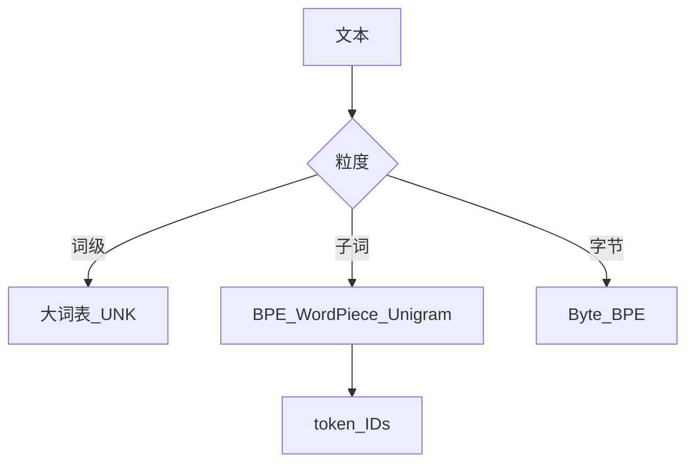

# 字符级、词级、子词级分词

## 要解决的问题

神经网络需要将文本映射为离散 ID 序列。粒度太粗（词级）会导致**超大词表、大量 UNK**；太细（字符级）则序列过长、建模效率低。子词（Subword）在词表大小、序列长度、跨语言泛化之间取得平衡，成为 LLM 预训练的事实标准。

## 核心概念

| 粒度 | 词表规模 | 序列长度 | OOV | 典型场景 |
| --- | --- | --- | --- | --- |
| **字符** | 很小（~100） | 很长 | 无 | 早期 RNN、拼写纠错 |
| **词** | 很大（10⁵+） | 短 | 严重 | MT 传统系统 |
| **子词** | 32k～256k | 中等 | 罕见词可分解 | GPT、LLaMA、Qwen |

设文本 $x$ 经编码器 $E$ 得 token 序列 $(t_1,\ldots,t_T)$，解码 $D$ 满足 $D(E(x)) \approx x$（可能丢失空格细节，取决于实现）。

**压缩率**：平均每 token 字符数（bytes-per-token）影响训练 FLOPs 与推理成本；英文 GPT-4 类约 4 字符/token，中文常更低，见 [3.2.6 多语言](./06-multilingual-tokenization.md)。

## 方法/算法

选型决策树：

1. **语种**：多语优先 SentencePiece / BPE；中文避免纯空格分词。
2. **词表大小 $V$**：增大 $V$ 降低序列长度但增大 embedding 与 softmax 开销；$V \approx 32\text{k}\sim 128\text{k}$ 常见。
3. **字节级**：从 UTF-8 字节出发可覆盖任意 Unicode，见 [3.2.5](./05-byte-level-bpe-tiktoken.md)。
4. **与目标函数一致**：因果 LM 在 token 边界预测下一 token；分词错误会改变监督信号。

## 工程实践

- **训练分词器**：在 10GB～100GB 代表语料上学习 merges，与预训练数据分布尽量一致。
- **特殊 token**：`<|endoftext|>`、`<|im_start|>` 等需预留 ID，后训练模板依赖固定编号。
- **工具**：`tokenizers`（Rust）、SentencePiece、`tiktoken`。
- **指标**：编码速度、词表覆盖率、下游 PPL；变更词表等于**新模型**，不可与旧 checkpoint 混用。

## 代表工作

- Sennrich et al. 子词 NMT：https://arxiv.org/abs/1508.07909
- BPE 原始：https://arxiv.org/abs/1508.07909
- GPT-2/GPT-3 字节 BPE 实践：https://arxiv.org/abs/2005.14165

## 局限与注意点

- **分词泄露**：评测时同一字符串不同切分可能改变难度（算术、拼写任务）。
- **空格与标点**：BPE 是否保留前导空格影响代码、Python 缩进。
- **词表≠语义**：子词边界无语言学保证，「词」可能被拆碎。

## 延伸说明
embedding 参数量 $\approx V \times d_{model}$，增大 $V$ 需同步评估 softmax 开销。
## 实践检查清单
- [ ] BPT
- [ ] UNK
- [ ] 子词

## 小结

本节核心：BPT 与全链路 UNK 协同；上线前用检查清单做回归。

## 词表规模与算力（估算）

设 hidden $d$，序列长 $T$，词表 $V$：

| 组件 | 参数量级 |
| --- | --- |
| Embedding | $V \cdot d$ |
| LM head（tie 可省） | $V \cdot d$ |
| Transformer 层 | $\approx 12 L d^2$ |

增大 $V$ 降低 $T$ 但总参数可能上升；需在目标 GPU 上做 **tokens/s** 实测。

## 相关章节

- 下一节：[3.2.2 BPE](./02-bpe.md)
- [3.2.3 WordPiece](./03-wordpiece.md) · [3.2.4 SentencePiece](./04-sentencepiece-unigram.md)
- 预训练目标：[3.3.1 CLM](../03-pretraining-objectives/01-causal-lm.md)
- 数据：[3.1.1 来源](../01-pretraining-data/01-data-sources.md)
