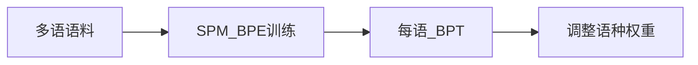

# 3.2.6 多语言分词与中文处理

## 要解决的问题

多语 LLM 需在**数十种语言**上保持合理压缩率与建模效率。中文无空格、日文混合书写、阿拉伯语变形等使英语-centric BPE 失效；若分词过碎，上下文窗口浪费在「单字 token」上，长文档推理成本上升。

## 核心概念

| 现象 | 影响 |
| --- | --- |
| **中文单字 token 过多** | 英文 BPE 词表中文本 BPT 低 |
| **语种不平衡训练** | 分词器偏向高频语（英/中） |
| **共享词表** | 一种 SPM/BPE 服务所有语 vs 语别专用表 |
| **规范化** | 全角/半角、繁简、NFKC 影响 merges |

压缩率示意（个人理解，具体因词表而异）：

| 语言 | 相对英文 tokens/字符 |
| --- | --- |
| 英文 | 1.0× |
| 中文 | 常 1.5～2.5× 更多 token |
| 代码 | 符号密集，变化大 |

多语训练应使 [数据混合](../01-pretraining-data/04-data-mixture.md) 与分词训练语料**语种比例一致**。

## 方法/算法

实践路线：

1. **统一 SentencePiece**：在 100+ 语混合语料训练 128k～256k 词表（mT5、Qwen 等路线）。
2. **中文增强**：提高中文子集权重；或预先用 jieba 仅作分析（**不建议** jieba 硬切进训练，与端到端子词冲突）。
3. **繁简与标点**：训练前统一繁简（可选）与全角标点；保留中文标点 merges。
4. **评测**：用每语 `tokens_per_char` 监控；中文专用 benchmark（C-Eval、CMMLU）对切分敏感任务做对照。
5. **专用中文词表（较少）**：字级初始化 + 子词 merges，适合纯中文产品。

## 工程实践

- **Qwen / GLM / DeepSeek**：技术报告均强调多语 SPM 或 byte-BPE + 中文数据上采样。
- **推理**：同一 tokenizer 处理多语输入；系统提示可用英文而用户输入中文，无硬切换。
- **工具**：`sentencepiece`、`tiktoken`（多语 byte 仍可用）、`transformers` 的 `AutoTokenizer`。
- **与 docs**：[预训练数据准备](../../../../docs/01-llm-intro/05-training/01-dataset) 中文语料表。

## 代表工作

- mT5 / MT5：https://arxiv.org/abs/2010.11934
- XLM-R：https://arxiv.org/abs/1911.02116
- Qwen2 技术报告：https://arxiv.org/abs/2407.10671
- LLaMA 3 多语扩展：https://arxiv.org/abs/2307.09288

## 局限与注意点

- **翻译腔与码混**：中英 code-switch 在共享词表下可能被切成奇怪片段，属数据问题多于分词器 alone。
- **罕见汉字**：字节级可覆盖；纯 BMP 词表可能 UNK 罕见字。
- **法律与内容**：多语毒性过滤需分语规则，见 [3.1.3](../01-pretraining-data/03-quality-filtering.md)。
- **词表扩大≠中文更好**：还需中文 token 量与 [Chinchilla 配比](../04-scaling-laws/02-chinchilla-scaling-laws.md)。

## 延伸说明
每周统计各语 `tokens_per_char`，发现漂移时调整 [3.1.4](../01-pretraining-data/04-data-mixture.md) 而非只扩词表。
## 实践检查清单
- [ ] CJK
- [ ] SPM
- [ ] 上采样

## 小结

本节核心：CJK 与全链路 SPM 协同；上线前用检查清单做回归。

## 相关章节

- 上一节：[3.2.5 Byte-level BPE](./05-byte-level-bpe-tiktoken.md)
- 数据混合：[3.1.4](../01-pretraining-data/04-data-mixture.md)
- 中文 benchmark：[7.1.3 多语评测](../../07-evaluation/01-benchmarks/03-multilingual-chinese-benchmarks.md)
- 层级：[3.2.1](./01-tokenization-levels.md)
