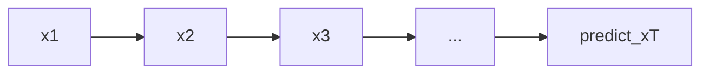

# 因果语言建模（CLM）

## 要解决的问题

预训练需要**可扩展的自监督信号**：无需人工标注即可从海量文本学习。因果语言建模（Causal LM, CLM）通过预测「下一个 token」，迫使模型学习语法、事实关联、世界知识与长程依赖，并成为 GPT、LLaMA、Qwen 等 **Decoder-only** 模型的标准目标。

## 核心概念

对序列 $x=(x_1,\ldots,x_T)$，模型参数 $\theta$ 最大化：

$$
\mathcal{L}_{\text{CLM}} = -\sum_{t=1}^{T} \log p_\theta(x_t \mid x_{<t})
$$

训练时使用**因果掩码**（causal mask），位置 $t$ 只能 attend 到 $\le t$ 的位置。推理时自回归解码同一分布。

| 目标 | 注意力 | 代表架构 |
| --- | --- | --- |
| CLM | 单向 | GPT、LLaMA、Mistral |
| MLM | 双向 | BERT |
| Prefix LM | 前缀双向 + 后缀因果 | PaLM、UL2 部分 |

## 方法/算法

实现要点：

1. **Shift labels**：输入 `tokens[:-1]`，预测 `tokens[1:]`，交叉熵在有效位置求平均。
2. **packing**：多条样本拼进固定长度，用 attention mask 或 `cu_seqlens` 防止跨样本 attend（FlashAttention 变长支持）。
3. **loss 归一化**：按 token 平均 vs 按样本平均会影响有效学习率。
4. **特殊 token**：BOS/EOS 是否计入 loss 需在 recipe 中固定。

与 [分词](../02-tokenization/01-tokenization-levels.md) 结合：监督在 subword 边界，改变 tokenizer 即改变任务难度。

## 工程实践

- **框架**：PyTorch + FlashAttention、`transformers` `CausalLM`。
- **指标**：训练 loss（≈ 交叉熵 nats/bits）、验证 PPL $=\exp(\mathcal{L})$。
- **长上下文**：位置外推（RoPE scaling）不改变 CLM 形式，只改最大长度。
- **参考**：[预训练介绍](../../../../docs/01-llm-intro/05-training/02-pre-training) 中 decoder-only 小节。

## 代表工作

- Radford et al. GPT：https://cdn.openai.com/better-language-models/language_models_are_unsupervised_multitask_learners.pdf
- Brown et al. GPT-3：https://arxiv.org/abs/2005.14165
- Touvron et al. LLaMA：https://arxiv.org/abs/2302.13971

## 局限与注意点

- **双向上下文不可用**：同一参数下，理解任务有时不如 MLM（需更大规模弥补）。
- **曝光偏置**：训练只看左上下文，推理仍左到右，属固有设定而非 bug。
- **填充方向**：batch padding 时 mask 掉 pad 的 loss。
- **与对齐**：CLM 预训练不保证指令遵循，需 [SFT](../../04-post-training-alignment/01-sft/01-sft-overview.md)。

## 延伸说明
packed 序列需在 attention mask 阻断跨样本注意力；FlashAttention varlen 需 `cu_seqlens`。
## 实践检查清单
- [ ] causal mask
- [ ] shift labels
- [ ] PPL

## 小结

本节核心：causal mask 与全链路 shift labels 协同；上线前用检查清单做回归。

验证 PPL 时 held-out 集须使用与训练一致的 packing 与 mask 规则。

## 相关章节

- 下一节：[3.3.2 MLM](./02-masked-lm.md)
- [3.3.4 FIM](./04-fim.md)（代码填空变体）
- Transformer：[2.2 Decoder](../../02-transformer/02-transformer-details/03-architecture-paradigms.md)
- 推理：[5.1.1 自回归解码](../../05-inference-deployment/01-inference-basics/01-autoregressive-decoding.md)
