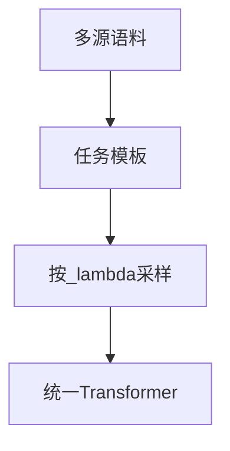

# 3.3.5 多任务预训练

## 要解决的问题

单一 CLM 目标在超大规模下已极强，但**显式混合多种监督格式**（去噪、问答、分类、翻译片段）可提升样本效率与下游零样本迁移。多任务预训练在「仍属预训练、非有标注 SFT」阶段，用统一模型与词表学习多种 token 布局与任务 token。

## 核心概念

| 范式 | 做法 |
| --- | --- |
| **T5 text-to-text** | 一切任务转为文本到文本 |
| **UL2 模式混合** | Causal / Prefix / Span 用特殊 mode token |
| **GPT-3 语境学习** | 不显式任务 token，靠 CLM + 提示 |
| **ExT5 / mT0** | 继续扩任务集与语言 |

损失一般为各任务损失的加权和：

$$
\mathcal{L} = \sum_k \lambda_k \mathcal{L}^{(k)}
$$

$\lambda_k$ 可按任务 token 数或固定比例设定。

## 方法/算法

构建 multitask 语料：

1. **启发式构造**：从维基抽 QA、从平行语料抽翻译对、从网页抽标题-正文；
2. **模板化**：`Task: {name}\nInput: ...\nOutput: ...`（Flan 风格在预训练后期更常见）；
3. **采样**：每 step 按 $\lambda_k$ 抽任务，防止大类任务淹没小类；
4. **与 SFT 边界**：含大量人工标注对话的 stage 通常称 SFT 而非 pretrain（命名因团队而异）。



## 工程实践

- **数据管道**：比纯 CLM 多 3～5× 工程复杂度（任务 ID、长度截断策略）。
- **评测**：除 PPL 外需分任务 valid loss；零样本用 BIG-bench、MMLU 子集。
- **工业趋势**：LLaMA 3、Qwen 等以 **纯 CLM + 高质量 mixture** 为主，Flan 式 multitask 更多在后训练（见 [指令微调](../../04-post-training-alignment/02-instruction-tuning/01-flan-t0-self-instruct.md)）。
- **参考**：[预训练](../../../../docs/01-llm-intro/05-training/02-pre-training) 目标函数讨论。

## 代表工作

- Raffel et al. T5：https://arxiv.org/abs/1910.10683
- Tay et al. UL2：https://arxiv.org/abs/2205.05131
- Chung et al. Flan-T5：https://arxiv.org/abs/2210.11416
- Muennighoff et al. T0：https://arxiv.org/abs/2110.00861

## 局限与注意点

- **任务间干扰**：低质量合成 QA 可能损害通用 PPL（待验证）。
- **推理格式**：用户若不按训练模板写 prompt，零样本下降。
- **算力**：同 token 数下，Span/Enc-Dec 常比 CLM 更慢。
- **与涌现**：[3.4.5](../04-scaling-laws/05-emergent-abilities.md) 讨论的能力未必依赖 multitask 标签。


## 延伸说明
记录每个 task 的 $\lambda_k$ 与有效 token 占比，防止大类任务淹没。
## 实践检查清单
- [ ] Flan
- [ ] T0
- [ ] text-to-text

## 小结

本节核心：Flan 与全链路 T0 协同；上线前用检查清单做回归。


## 任务模板示例（T5 风格）

```
translate English to German: ...
summarize: ...
```

模板字符串占用 token 预算；过长模板会降低有效内容密度。

## 相关章节

- [3.3.1 CLM](./01-causal-lm.md) · [3.3.3 Prefix/Span](./03-prefix-lm-span-corruption.md)
- 数据混合：[3.1.4](../01-pretraining-data/04-data-mixture.md)
- 指令微调：[4.2 Flan](../../04-post-training-alignment/02-instruction-tuning/01-flan-t0-self-instruct.md)
- Scaling：[3.4.1 Kaplan](../04-scaling-laws/01-kaplan-scaling-laws.md)
