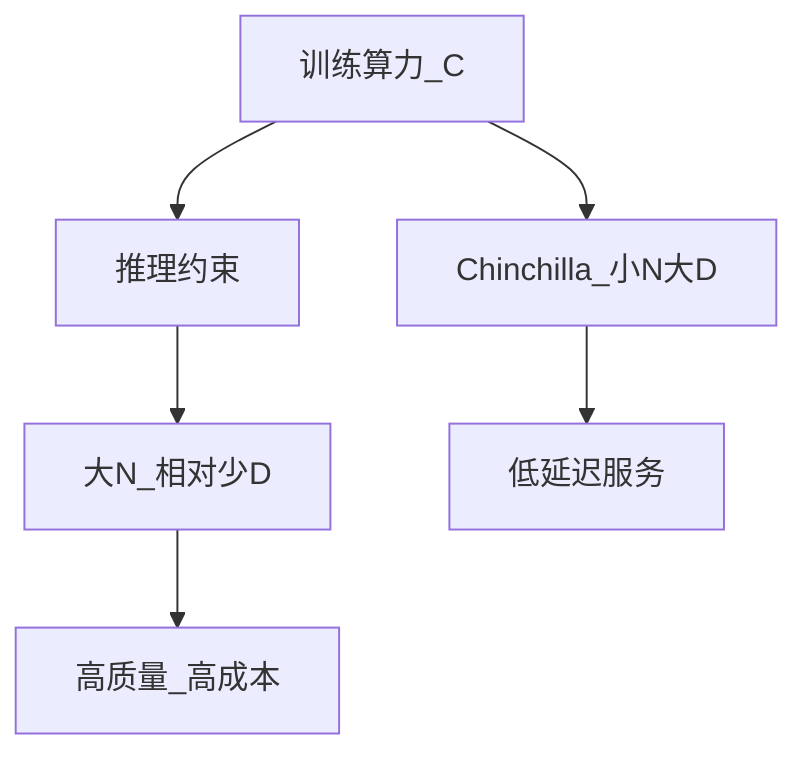

# 3.4.3 计算最优 vs 推理最优

## 要解决的问题

Chinchilla 回答「**固定训练算力**下如何配 $N$ 与 $D$」，但产品更关心「**固定推理预算**下哪个 checkpoint 最好用」。训练 compute-optimal 模型往往参数较小；部署时可能更想要**大参数、相对欠训练**的模型，因同延迟下宽模型有时更强。需在训练账单与 serving 成本间显式权衡。

## 核心概念

| 目标 | 优化变量 | 典型场景 |
| --- | --- | --- |
| **Compute-optimal** | 最小化训练 loss @ 固定 $C$ | 研究、单次预训练 |
| **Inference-optimal** | 最大化任务质量 @ 固定延迟/显存 | API、边缘设备 |

推理成本粗估（自回归 decode）：

$$
\text{Latency} \propto N_{\text{active}} \times T_{\text{out}}, \quad
\text{Memory} \propto N + T \cdot d_{\text{kv}}
$$

训练多吃的 token（更大 $D$）**不增加**推理参数，但增加训练时间与数据工程成本。

## 方法/算法

决策框架：

1. **若训练一次、推理亿万次**：可接受「过训练」小模型（Chinchilla）降低单次推理参数。
2. **若推理必须最强、训练只做一次**：可能选 $N_{\text{large}}$ + 次优 $D$（Gopher 类）。
3. **蒸馏**：训练大 teacher、部署小 student，解耦两阶段最优。
4. **MoE**：训练大总参数、推理仅激活子集，见技术报告章节。

## 工程实践

- **API 定价**：按 token 计费时，BPT（[分词](../02-tokenization/05-byte-level-bpe-tiktoken.md)）与 $N$ 共同决定毛利。
- **量化与剪枝**：[第五部分推理](../../05-inference-deployment/03-quantization/01-quantization-basics.md) 可弥补选大 $N$ 的劣势。
- **SLA**：P99 延迟固定时，profile 不同 checkpoint 的 quality-latency 曲线。
- **开源权重**：Hugging Face 上 7B/13B 常比 70B Chinchilla-optimal 更易部署，生态选择影响「实际最优」。

## 代表工作

- Hoffmann et al. Chinchilla（compute-optimal）：https://arxiv.org/abs/2203.15556
- Sardana & Frankle 等关于 over-training 与推理：https://arxiv.org/abs/2301.04209（Inference-aware scaling，概念参考）
- DeepSeek-V3 / MoE 推理叙事：本仓库 [DeepSeek-V3](../../08-technical-reports/01-deepseek/01-deepseek-v3.md)

## 局限与注意点

- **缺少统一公式**：推理最优 $N,D$ 依赖硬件（A100 vs H100 vs NPU）、批大小、量化位宽。
- **测试时计算**：[第六部分](../../06-reasoning-test-time-compute/02-test-time-compute/01-o1-o3-paradigm.md) 改变「推理」定义。
- **多租户**：连续批处理下 throughput-optimal 又与单请求 latency-optimal 冲突。
- **环境成本**：大模型训练碳排放与「更大 $N$」政策考量。

## 延伸说明
在目标 TPS 下扫 checkpoint，画 quality–latency 曲线再定发布版本。
## 实践检查清单
- [ ] 蒸馏
- [ ] MoE
- [ ] 量化

## 小结

本节核心：蒸馏 与全链路 MoE 协同；上线前用检查清单做回归。

## 决策矩阵（示意）

| 约束 | 倾向策略 |
| --- | --- |
| 训练预算固定 | Chinchilla 小 $N$ 大 $D$ |
| 单次推理质量优先 | 较大 $N$、相对少 $D$ |
| 边缘部署 | 小 $N$ + 量化 + 蒸馏 |

产品期应重新测量，训练期最优 ≠ 上线最优。

## 相关章节

- [3.4.2 Chinchilla](./02-chinchilla-scaling-laws.md)
- [3.4.4 数据-参数权衡](./04-data-parameter-tradeoff.md)
- 推理：[5.1.4 延迟指标](../../05-inference-deployment/01-inference-basics/04-latency-metrics.md)
- 量化：[5.3.1](../../05-inference-deployment/03-quantization/01-quantization-basics.md)
